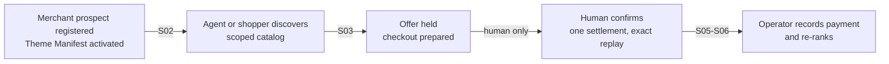
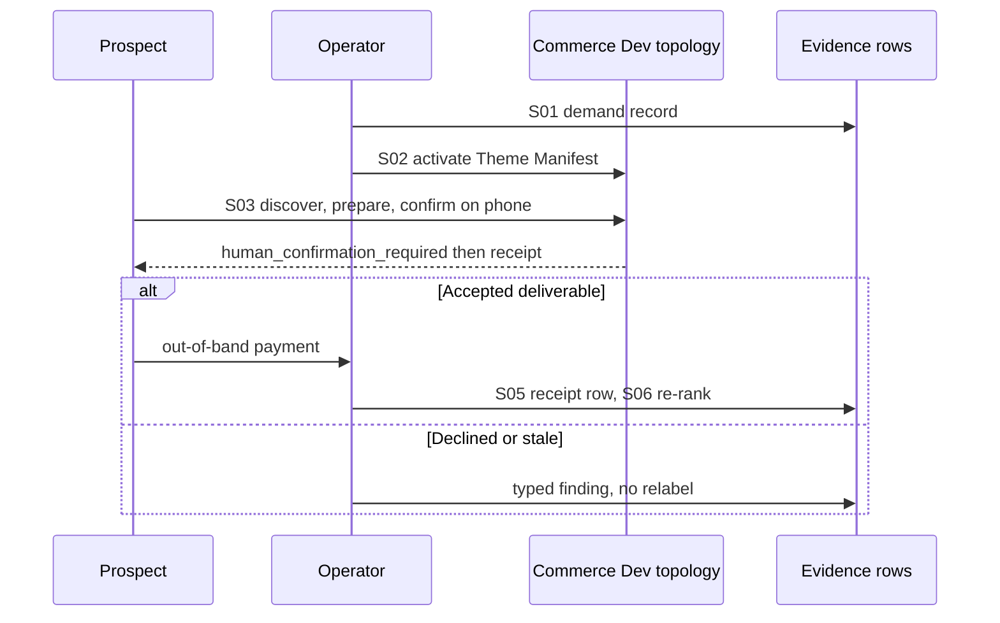
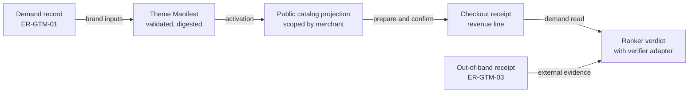
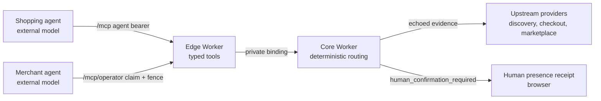
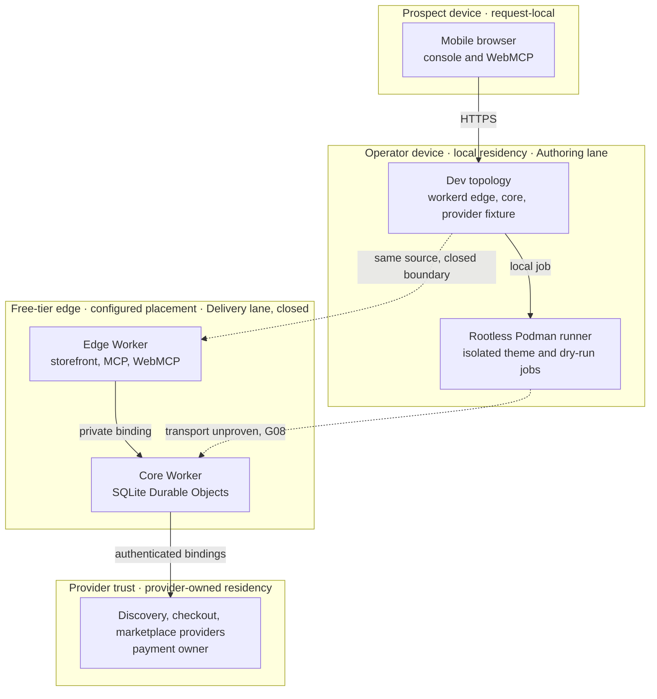

# Reference implementation — Agentic Commerce OS solopreneur MVP-to-GTM sprint

## Current scope and ownership — reference implementation (1.2.0)

The 2026-09-12 operator direction supersedes 1.1.0's deferred-checkout release: enable and
verify sandbox payment, never actual payment. The implementation owner is
[`edge-commerce-agent-mvp@0.6.0`](prd-tad-adr-mvp-gtm-edge-commerce-agent.md), which records the
exact source, acceptance checks, authorized public release and provider verification. This
sprint consumes that capability; it does not redefine its checkout or release contracts.

This artifact owns the **first collected dollar and learning loop** below. Its local rung is
`dev-proven` from S04 and S07 checks; delivered rung stays `undocumented`: a test payment does not satisfy
AC-M01's priced prospect, AC-M03's prospect timing, or AC-M04's actual collection. The separate
sandbox capability is production-verified within its explicitly scoped implementation owner.

The original 1.0.0 sprint survives as the basis of these uncompleted criteria; 1.2.0 rebinds its
five roles and removes the conflicting local-first contract. Historical evidence rows remain
unchanged and explicitly dated. The [evidence companion](prd-tad-adr-mvp-gtm-handoff.md) consumes
`PRD-TAD-ADR-COMMERCE-MVP-GTM-001@1.2.0` and the sandbox owner by exact revision.

All concrete vendor and repository choices in this document belong to this reference implementation.
The shared [authoring guideline][guideline] is pinned at version 2.6.0, source
`c83b43bd7fd018e0ac41629787e0e713db9a1e13`; no schema is inferred from this file's name.

## Identity and opening directive

Stable locator `docs/prd-tad-adr-mvp-gtm-20260909T1320Z-solopreneur-mvp-gtm.md`; continuity `PRD-TAD-ADR-COMMERCE-MVP-GTM-001` at `1.2.0` binds [PRD](#prd), [TAD](#tad), [ADR](#adr), [MVP](#mvp) and [GTM](#gtm). TAD consumes exactly PRD `1.2.0`; ADR binds exactly TAD `1.2.0`; MVP and GTM consume those criteria and decisions. Joins resolve by these IDs and the exact revisions in the [grounding record](#codebase-grounding-record--reference-implementation), never by filename.

```yaml
directive_id: "DIR-GTM-01"
context: "Commerce at 50cc1d7e1a81af4ca89c2c4584bc50aee89ec55f has a deployed sandbox and tested role/verifier contracts; ER-SB-01–07 prove a test mechanism, while ER-GTM-01–03 still lack a prospect and actual collection"
intent: "Reach one real, recorded first dollar and one measured learning loop with the smallest change, reusing built capability and keeping every money, deploy and demand claim separately evidenced"
directive: "Specify the sprint slice, bind each acceptance criterion to an owner check, rank monetization by distance to first dollar, decide the contested transport and collection choices, and keep every boundary closed"
role: "solo-founder-ai-orchestrator"
action: "the solo-founder-ai-orchestrator specifies the solopreneur MVP-to-GTM sprint"
outcome: "one combined PRD/TAD/ADR whose criteria, steps, decisions and evidence are joined by continuity ID"
subject: "solo-founder-ai-orchestrator"
verb: "specifies"
object: "solopreneur-mvp-gtm-sprint"
```

Five lenses apply to every decision below: min-viable-max-value (concierge before self-serve), TCO-zero (free tiers, FOSS runner, zero new services), token economics (deterministic zero-model read routes; caller-owned agent tokens), harness-first (every agent action passes an existing typed MCP/WebMCP contract) and concurrency-safe (one scoped lane, one writer per capability, provenance keys above).

## Codebase grounding record — reference implementation

Read-only inspection on 2026-09-09 of clean canonical checkouts; a `confirmed` disposition proves the cited revision only and grants no lifecycle, delivery or demand authority. Volatile facts (provider policy, live routes, secrets) refresh at their consuming transition.

| Source owner | Exact revision | Responsibility consumed here |
|---|---|---|
| agentic-commerce-os | `4774a4fc1543c4bcb1b912fe79c78c61384efc7c` | Control plane, checks, release controller, Podman runner; the only write target of this sprint |
| agentic-os | `0580b20b48f01eb95dd2a40f3806199b5354f3a9` | Lifecycle lane/land/reap, invocation catalog, ranker with `verifyDemandEvidence` option, composition lock |
| agentic-canvas-os | `954de91689abc1ab99a783e54f5ca7ac61387449` | Admission provider v3 / receipt v2; monetization grounding pattern |
| agentic-graph | `4e9056ce12fc68a19ddec1381f2aee8b76de36ae` | Discovery, checkout and marketplace providers; x402 payment owner; parent PRD baseline `1acbbcc3` |
| huijoohwee.github.io | `8bca42dd6af33d35d9a2195887ceb82ff7b96442` | Guidelines `2.5.0`, templates, rapid MVP sprint profile, CID contract |
| huijoohwee | `b7b6c39ce0b5844a43042026a910f7552477c8ff` | Generated projection only; zero authored edit targets from Commerce |
| GameXR | `7609bebd4b72efa2038b9f222e22ca56d13370ed` | Optional spatial client; not a sprint dependency |
| commerce-agents (external) | `fd4d59224ab96b43c6dc6888207c67b3bd5a24cf` | Architecture inspiration only: role separation, host-handoff checkout, staged merchant writes. No code, prompt, schema, fixture or dependency imported |

| Claim | Disposition | Evidence and consequence |
|---|---|---|
| G01 Core owns registry, route, checkout, theme, claim and derived-ledger Durable Objects | confirmed | `src/core/*`, [runtime API][api]; consumers call these owners |
| G02 Take-rate markup is implemented, configured at 250 bp, capped at 1,000 bp, idempotent | confirmed | `src/core/take-rate.ts`, `wrangler.core.jsonc`, `test/domain/take-rate.property.test.ts`; mechanism, not demand |
| G03 Demand-evidence read exists but counts registered agent identifiers, not external payers | confirmed | `src/core/revenue-ledger.ts` `demandEvidence()` reports `externalPrincipalDistinction: unvalidated`; a payer record must come from outside the ledger |
| G04 Theme Manifest activation (Template Pack) exists with 64 KiB / 500-id / 280-char bounds | confirmed | `src/shared/theme-manifest.ts`, `test/browser/template-pack.spec.ts`, `check:template-pack` |
| G05 Backend MCP never forwards settlement; only a signed human-presence receipt settles | confirmed | `src/edge/human-confirmation.ts`, `test/shared/human-confirmation.test.ts` |
| G06 WebMCP page tools reuse the same `StorefrontActions` as the console | confirmed | `src/edge/client/webmcp-tools.ts`, `test/browser/webmcp.spec.ts`; browser support is origin-trial per the [register][dbr] |
| G07 Offline drafts reconcile; offline never implies settlement | confirmed | `src/edge/client/local-store.ts`, `test/shared/local-store.test.ts` |
| G08 A Free/FOSS production execution transport is complete | contradicted | `scripts/isolated-process.ts` runs locally only; the release controller still targets the paid container path ([pipeline G08][pipeline]) |
| G09 An independent evaluator is enrolled | absent | `docs/verification-baseline.json` `trustedDispatchIssuers: []`; `npm run check` stays red by design |
| G10 A paid transaction, named payer or WTP signal exists | absent | `npm run feature:rank` → `no-admissible-candidate`; ledger reports `reportedAs: capability` |
| G11 The production prefix route serves a verified candidate | unverified | [register][dbr] `servingCandidateVerified: false`; `mirror-to-delivery` closed |
| G12 The OS ranker admits a code-owned demand verifier | confirmed | `agentic-os/src/rank.mjs` option `verifyDemandEvidence`; Commerce may supply the adapter (ADR-G04) |
| G13 Invocation routes are declared once | confirmed | `config/capability-token-map.json` projects the pinned OS catalog; this document declares no route |
| G14 The external reference separates shopping and merchant roles, hands checkout to the host and stages merchant writes | confirmed | Public README at the pinned revision; used as abstract grounding only (ADR-G02) |
| G15 Provider policy (squash, linear history, required check) is currently observed | unverified | `agentic-os doctor` in the authoring session reported provider observation unavailable; recheck before land |

G08–G11 block production self-serve, not the concierge first dollar. G10 blocks any `demand-validated` claim until S01/S05 produce evidence. G09 keeps the terminal gate red; source checks remain the sprint's local evidence.

## PRD

**Continuity:** `PRD-TAD-ADR-COMMERCE-MVP-GTM-001` · PRD `1.2.0`.

### Problem, personas and journey stage

A solo operator has a control plane that can discover offers, hold them, require a human to confirm, settle through the payment owner and record a markup — and no one has paid for any of it. Building further without a payer repeats the pattern the ranker already refuses. The sprint therefore sells the nearest built capability as a service, records real evidence, and only then widens.

| Persona | Job to be done | Sprint stage |
|---|---|---|
| **Merchant prospect** (micro-seller, solo brand) | Get a polished, agent-discoverable storefront without building or hosting one | Register → Discover |
| **Shopper-agent principal** (person delegating to an agent) | Let an agent find and hold an offer while retaining the only authority to pay | Discover → Engage → Complete |
| **Solo operator** (this project's founder) | Learn whether anyone pays, at zero incremental spend, without losing work across devices and agents | Every stage; owns Learn |

### Pain-point-to-feature mapping

All pain points are `unvalidated`: no user quote, ticket or payment is recorded in any owner repository. Ordering follows recorded WTP evidence magnitude first (none exists, so all tie) and then proximity to what is built, per the guideline's ranking rules; a price signal recorded in S01 reorders this table in the next revision.

| ID / feature | Pain point → hook → break → fix → close | Reuse-or-build (min-time-resource-max-value) |
|---|---|---|
| PP-1 / F-GTM-1 **Agent-ready storefront setup** (Must) | Micro-sellers cannot make their catalog discoverable and buyable by agents → "Your storefront, discoverable by agents, live for review in one sitting" → without it the seller is invisible to agent traffic and pays a developer or waits → operator authors one Theme Manifest, activates it over the public catalog projection, walks the prospect through it on a phone → prospect pays a fixed setup fee and receives the themed storefront plus its MCP/WebMCP discovery | Reuse G04, G06, `GET /s/{merchantId}`; build nothing |
| PP-2 / F-GTM-2 **Human-only settlement** (Must) | A principal will not let an agent pay unsupervised → "Agents discover, humans decide" → an autonomous charge is unrecoverable trust loss → existing signed presence receipt, blocker-set digest, exact replay → one money effect per confirmation, replay returns the same receipt | Reuse G05, F02/F03; build nothing |
| PP-3 / F-GTM-3 **Demand evidence the ranker can read** (Should) | The operator cannot tell a built feature from a paid one → "Rank only what a payer has touched" → without it effort goes to elegance, not revenue → join the existing demand read to the existing ranker through a code-owned verifier adapter → `feature:rank` admits or refuses on real evidence | Reuse G03, G12; build ≤200 lines adapter (ADR-G04) |
| PP-4 / F-GTM-4 **Free-tier production activation** (Should) | Self-serve is impossible while the only execution transport is a paid container plan → "Same isolation, zero subscription" → hosting cost blocks GTM beyond concierge → Podman runner on an owned host with an authenticated transport, release controller migrated → merchant storefronts serve from the declared route | Reuse `scripts/isolated-process.ts`, release controller; build transport + rollout migration (ADR-G05) |

### User stories and acceptance contract

Each row is one criterion `AC-Mnn` and its condition `VCC-Mnn` (stated check plus observable outcome plus constraint). A named check is a starting point; a passing subset proves only what it exercised.

| Criterion | Given → when → then; constraint | Owner check (Evidence Reference host) | Join |
|---|---|---|---|
| AC-M01 / VCC-M01 | Given a real prospect conversation, when demand is recorded, then one named prospect, current workaround cost, acceptance criterion and stated price signal exist in `ER-GTM-01`; a persona or unpriced signup is not evidence | Reviewer inspects `ER-GTM-01`; no code | S01 / ADR-G01 |
| AC-M02 / VCC-M02 | Given the prospect's brand inputs, when the Theme Manifest is validated and activated in Dev, then `GET /s/{merchantId}` renders it and every scoped agent is registered; an invalid asset preserves the prior activation | `npm run check:template-pack`; `npm run test:browser` (template-pack spec) | S02 / F-GTM-1 |
| AC-M03 / VCC-M03 | Given a mobile browser on the Dev topology, when the prospect walks discovery → offer → prepare → confirm, then `human_confirmation_required` is returned to any agent path and the console reaches the confirmation surface in ≤5 actions and ≤10 minutes | `npm run test:e2e:dev`; timed walkthrough recorded in `ER-GTM-02` | S03 / F-GTM-2 |
| AC-M04 / VCC-M04 | Given an accepted deliverable, when the setup fee is collected out of band, then the receipt reference, amount, currency and acceptance note are recorded in `ER-GTM-03` separately from any platform mechanism result | Reviewer inspects `ER-GTM-03`; payment is external | S05 / ADR-G03 |
| AC-M05 / VCC-M05 | Given `ER-GTM-03`, when PP-1's label is upgraded, then it reads `demand-proven` for exactly that prospect and `feature:rank` is re-run with the adapter; one payer never proves market demand | `npm run feature:rank` (OS) with the Commerce adapter; diff of this document | S06 / ADR-G04 |
| AC-M06 / VCC-M06 | Given the shopping and merchant role profiles, when either role acts, then every shopping action resolves to an agent MCP tool and every merchant write carries claim, lease and fence; no new tool or store exists | `test/shared/edge-mcp.test.ts`; `test/domain/authoring-claim.property.test.ts`; `check:invocation-surface` | S04 / ADR-G02 |
| AC-M07 / VCC-M07 | Given an owned Podman host and exact authorized versions, when the release controller activates, then bindings, storage transition, route readback and recovery receipts match and no paid container configuration is present | `test/domain/production-release-safety.test.ts`; live owner receipts (absent) | S08 / ADR-G05 |
| AC-M08 / VCC-M08 | Given any discovery, readiness, catalog or receipt read, when it is served, then zero model calls occur and the caller's cost log is the only token record | `check:webmcp`; `check:invocation-surface`; provider zero-model assertions (Graph owner) | TAD harness flow |
| AC-M09 / VCC-M09 | Given this sprint's diff, when checks run, then authored files stay ≤600 lines, no developer path or credential literal is present, and `package.json` dependencies are unchanged | `npm run check:authored-limits`; `git diff --stat -- package.json` | Budgets |

PRD→TAD coverage 9/9 criteria; TAD→PRD 9/9 steps (S01–S09); Directive→RAO 9/9. Ratios measure linked coverage, not passed conditions.

### Success metrics and economics

| Metric | Baseline (2026-09-09) | Target / evidence |
|---|---|---|
| Readiness rung (local / delivered) | `spec-complete` / `undocumented` for this sprint spec | Recomputed only from `ER-GTM-*`; production stays `undocumented` until G08–G11 close |
| TTV steps (prospect, first storefront view) | Unmeasured | ≤5 actions; clean mobile browser; `ER-GTM-02` |
| TTV elapsed (prospect) | Unmeasured | ≤10 minutes from link to confirmation surface |
| TTV (operator, offer to invoice) | Unmeasured | ≤40 operator hours total sprint clock; ≤2 hours per themed storefront after the first |
| Token cost / month | Deterministic routes 0 model calls; agent usage unmeasured | Read routes remain 0; caller-owned agent tokens logged per session, ceiling stated at dispatch |
| Monthly TCO | No paid plan; hardware/electricity unmeasured | Zero incremental spend; free-tier quotas verified before any activation |
| ROI score | Unscored (no impact/reach inputs) | Compute after `ER-GTM-03`; until then ordering is dependency and reuse based |
| Revenue / payer / WTP | None recorded | One collected setup fee with acceptance; recorded separately from mechanism proof |

### Priority, scope and dependencies

**Must:** F-GTM-1, F-GTM-2 (both reuse; zero code). **Should:** F-GTM-3 adapter; F-GTM-4 transport and rollout migration; recurring hosting fee after activation. **Could:** self-serve merchant onboarding; shopping/merchant role UIs; Stream 1 external volume. **Won't (this increment):** listing fees and issuance-as-a-service (segments absent, parent Non-Goals), autonomous cart re-derivation, real-time markup resettlement, any new orchestration framework, second ledger or store, paid plan, copied external code.

**Min-viable scope:** one prospect, one Theme Manifest, one Dev-lane walkthrough, one out-of-band invoice, one evidence row. **Out of scope:** production route, payee configuration, evaluator enrollment, merchant self-signup. **Dependencies:** rootless Podman and a verified `workerd` for Dev ([container runtime][cr]); distinct local secrets in `.dev.vars`; the pinned OS package. **Open questions:** the prospect's segment and price; whether the hosting fee is monthly or per-release; the always-on host for F-GTM-4; evaluator enrollment owner. None authorizes guessing.

### Monetization — ordered by distance to first dollar

| Rank | Stream (parent numbering) | Unvalidated assumptions between today and one payment | Unbuilt infrastructure | Status |
|---|---|---|---|---|
| 1 | Stream 4 setup fee — concierge Template Pack from the Dev lane | One: a merchant pays a fixed fee for a themed, agent-discoverable storefront reviewed on their phone | None | `mechanism-proven` (G04/G06); demand `unvalidated` |
| 2 | Stream 4 recurring hosting fee | Two: rank 1 plus continued value after handover | Free-tier production activation (G08–G11) | `Should` |
| 3 | Stream 1 take-rate on routed checkouts (250 bp) | Three: two external principals transact twice, production rail with a real payee, routed agent traffic | Production activation; owner payee; provider deployment | `mechanism-proven` (G02); `Could` |
| 4 | Streams 2/3 listing fee, issuance-as-a-service | Segment does not exist | Third-party registration | `Won't (this increment)` |

`mechanism-proven` and `demand-validated` are tracked independently; collected payment is recorded a third time in `ER-GTM-03`. A test settlement, price conversation or unpaid pilot never counts as revenue.

### Demo skeleton (F-GTM-1, budget 5 minutes)

| Beat | Bound | Observable result |
|---|---|---|
| Hook | 30 s | Prospect opens `GET /s/{merchantId}` on a phone and sees their brand, palette and catalog scope |
| Probe | 60 s | Agent tool `commerce.catalog.merchant.read` returns the same scoped catalog; WebMCP tools appear in a supporting browser |
| Reveal | 90 s | Prepare a checkout; any agent path returns `human_confirmation_required`; the console shows the exact amount and expiry — VCC-M03 holding |
| Confirm | 60 s | Prospect confirms; replaying the same confirmation returns the identical receipt |
| Close | 60 s | Operator states the setup fee and delivery terms; no live settlement is claimed |

### Domain-object rubric

Domain object: **a governed agent-to-human commerce transaction** (offer → held → human-confirmed → settled → receipt/readback). Levels declared here: L1 offer discoverable by an agent; L2 held offer watched for change; L3 human-only confirmation with exact replay; L4 settlement collected from an external payer; L5 repeat paid use. Attained locally: **L3** (`dev-proven` source, G04–G07). Next unpassed: L4, blocked by G10 (no payer) and, for platform-rail settlement, G11 and the Graph payee. No higher level is claimed.

## TAD

**Continuity:** `PRD-TAD-ADR-COMMERCE-MVP-GTM-001` · TAD `1.2.0` consumes PRD `1.2.0`; decisions ADR `1.2.0`.

### Journey-to-system mapping and sprint RAO steps

Steps S01–S09 are independently closable task nodes within `DIR-GTM-01`; Role is Subject, the first verb and target in Action give SVO, Outcome is the referenced criterion. Sprint clock: 40 operator hours in 10 working days, reallocated at each dispatch and never raised. Per task: ≤3 correction iterations, circuit-breaker on no reduction in open blockers across 2 cycles, token ceiling stated at dispatch. External waits state blocker and recheck condition, never an ETA.

| Step / stage | Role and action (SVO) | Input → output / component | Prerequisite → outcome |
|---|---|---|---|
| S01 / Design | Operator records demand | One priced conversation → `ER-GTM-01` row | none → AC-M01. Failing to find a prospect is a typed finding, not a pivot |
| S02 / Build | Operator authors the offer | Brand inputs → validated Theme Manifest activated in Dev; `ThemeDeployment` DO | S01 → AC-M02 |
| S03 / Verify | Evaluator times the walkthrough | Dev topology + phone → `ER-GTM-02` (steps, elapsed, screenshots) | S02 → AC-M03 |
| S04 / Verify | Operator declares role profiles | Existing tool tables → shopping/merchant allowlists recorded in ADR-G02 | none → AC-M06; zero code |
| S05 / Launch | Operator delivers and invoices | Accepted walkthrough → out-of-band receipt in `ER-GTM-03` | S03 → AC-M04 |
| S06 / Learn | Ranker re-evaluates | `ER-GTM-03` + adapter → `feature:rank` verdict; PP-1 relabelled | S05 → AC-M05 |
| S07 / Build (Should) | Commerce supplies the verifier adapter | Demand read + receipt reference → `verifyDemandEvidence` result | S01 → enables S06 automation; ADR-G04 |
| S08 / Launch (Should) | Release owner activates within free tier | Podman transport + exact versions → route readback receipts | G08–G11 closure → AC-M07 |
| S09 / Close | Lane owner lands and observes | Exact diff → protected PR, `reap` classification, separate cleanup receipts | Every step → pipeline T05/T06 |

### Five flow patterns

**Diagram GTM-J1** · Class: Journey stage map · Notation: flowchart LR · Version: 1 — 2026-09-09 · Surface: markdown-canvas
**Caption:** A prospect is registered by the operator, shoppers and agents discover, only a human completes, and the operator learns from recorded payment.



| GTM-J1 node | Journey inventory / acceptance |
|---|---|
| register | PP-1 onboarding; AC-M01/M02 |
| discover | F01/F-GTM-1 discovery; AC-M08 zero-model reads |
| engage | F02/F06 preparation and offer watch |
| complete | PP-2; AC-M03 confirmation, F03 replay |
| learn | AC-M04/M05; monetization evidence |

**Diagram GTM-W1** · Class: User workflow · Notation: sequenceDiagram · Version: 1 — 2026-09-09 · Surface: text-only
**Caption:** The concierge loop stays in the Dev lane; payment is external and recorded separately; failure preserves evidence.



| GTM-W1 participant | Happy / alternate / error inventory |
|---|---|
| Prospect | Reviews, confirms, pays; may decline without any platform mutation |
| Operator | Authors manifest, invoices, records; never settles on the prospect's behalf |
| Commerce Dev topology | Renders, prepares, refuses agent-side settlement; invalid manifest keeps prior activation |
| Evidence rows | Append-only rows in this document's Evidence table; a missing row blocks relabelling |

**Diagram GTM-D1** · Class: Data flow · Notation: flowchart LR · Version: 1 — 2026-09-09 · Surface: markdown-canvas
**Caption:** Demand, offer, receipt and ranking data stay in their existing owners; the receipt reference is the only new datum and it lives outside the runtime.



| GTM-D1 node | Data inventory / residency |
|---|---|
| demand | Prose row; this repository's Git history |
| manifest | ≤64 KiB JSON; `ThemeDeployment` Durable Object, configured placement |
| projection | Derived read; request-local, `no-store` |
| receipt | `CheckoutSession` and `RevenueLedger` Durable Objects; provider settlement remains upstream |
| verdict | OS ranker JSON; caller-owned output file |
| payment | Reference only (no account or personal data); artifact stays with the operator |

**Diagram GTM-H1** · Class: Orchestration / harness flow · Notation: flowchart LR · Version: 1 — 2026-09-09 · Surface: markdown-canvas
**Caption:** External shopping and merchant agents call existing typed MCP contracts; the control plane runs no model and the caller owns every token.



| GTM-H1 node | Harness inventory / input → output / cost and fallback |
|---|---|
| shopper | Session objective → agent tool calls; agentic loop max 3 iterations, breaker on repeated `human_confirmation_required`; tokens caller-owned |
| merchant | Staged intent → operator tool calls; every write needs claim, lease, fence; rejected write is a typed error, no retry without new claim |
| edge | Bearer or session → validated tool arguments; 0 model calls; typed invalid-argument error |
| core | Routed request → at most one dispatch plus one fallback; 0 model calls; fail closed on evidence drift |
| providers | Bound request → echoed evidence; owner cost logs; unknown outcome held for reconciliation |
| human | Exact visual facts → signed receipt; absent anchor closes settlement |

**Diagram GTM-T1** · Class: Runtime topology · Notation: flowchart TB · Version: 1 — 2026-09-09 · Surface: markdown-canvas — reference implementation
**Caption:** The sprint runs on the operator device and free-tier edge; production activation and the owned execution host are the Should-tier delta.



| GTM-T1 node | Role · type · lane | Residency / status |
|---|---|---|
| dev | Executor · local runtime · Authoring | Operator device; `dev-proven` locally, delivered `undocumented` |
| podman | Executor · container runner · Authoring | Operator device; local proof only |
| edgew / corew | Gateway / Router · Workers · Delivery | Configured free-tier placement; route unverified (G11) |
| graphp | Gateway · upstream services · Delivery | Provider-owned; deployment evidence external |
| phone | Actor · browser · — | Request-local; no credentials held |

### Component specifications — reference implementation

| Component (owner) | Responsibility (SVO) | Interfaces / configuration | FOSS / vendor | VCC → Evidence |
|---|---|---|---|---|
| Theme deployment (`src/core/theme-*`, `src/shared/theme-manifest.ts`) | Core activates one validated manifest per merchant | `commerce.theme.deploy`, `POST /v1/operator/merchants/{merchantId}/theme`; bounds in source | MIT owner code on a free-tier serverless runtime | VCC-M02 → `check:template-pack`, browser spec |
| Storefront console + WebMCP (`src/edge/client/*`) | Edge renders the scoped console and registers page tools | `GET /`, `GET /s/{merchantId}`, three page tools over `StorefrontActions` | MIT; browser API at origin-trial stage | VCC-M03/M08 → `test:e2e:dev`, `check:webmcp` |
| Human confirmation (`src/edge/human-*`) | Edge validates exact visual facts and a signed presence receipt | `POST /v1/human/checkouts/{id}/confirm`; `HUMAN_CONFIRMATION_TRUST_ANCHOR_JSON` public variable | Ed25519 verification in owner code | VCC-M03 → `human-confirmation.test.ts` |
| Role profiles (this document, ADR-G02) | Document maps two roles to existing tool sets | Shopping = agent tools; merchant = operator tools; no code | — | VCC-M06 → existing MCP and claim tests |
| Demand verifier adapter (Should; `scripts/`) | Script verifies a receipt reference and demand read for the OS ranker | `verifyDemandEvidence(candidate) → { verifierId, receipt }`; ≤200 lines | Node ESM, zero dependencies | VCC-M05 → `feature:rank` output |
| Podman transport (Should; `scripts/isolated-process.ts`, release controller) | Runner executes bounded jobs; controller activates versions | Existing `IsolatedExecutor` contract; new authenticated transport | Apache-2.0 Podman, owner code | VCC-M07 → release-safety test, live receipts |

No component here is AI-powered; the harness contract (typed input, typed output, cost log, fallback) is owned by the calling agent and by upstream providers. Token budget for every control-plane route: 0 prompt + 0 completion tokens.

### Integration contracts and invocation register

Commerce consumes `commerce.discovery-provider/v1`, `commerce.checkout-provider/v1`, `commerce.marketplace-provider/v1` and `commerce.agentic-os-admission-provider/v3` exactly as the [composition owner][techstack] records. The **Invocation Register** for every `/`, `#`, `@` and tool identity is `config/capability-token-map.json` projected over the pinned OS catalog ([runtime API][api]); this document declares no route, so it raises no `orphan-route` or `ambiguous-route`. Every discovery and read route costs zero tokens; approval-gated operator tools route through `/mcp/operator` with claim and fence.

### Quality attributes

| Attribute | Scenario → requirement | Pattern | Validation |
|---|---|---|---|
| Performance / TTV | Prospect on a phone → ≤5 actions, ≤10 min to confirmation surface | Reuse console; no new hop | Timed walkthrough `ER-GTM-02` |
| Security | Agent attempts settlement → refused; merchant write without fence → refused | Existing human-presence and claim/fence owners | Existing suites (VCC-M03/M06) |
| Token cost | Any read route → 0 model calls | Deterministic routing and projections | `check:invocation-surface`, `check:webmcp` |
| Offline | Connection loss mid-authoring → drafts survive, settlement disabled | Local-first store, replay on reconnect | `local-store.test.ts` |
| TCO | 12 months → zero incremental spend per deployment model | Free-tier serverless plus owned FOSS host; variants in ADR-G05 | Quota inventory before activation |
| Device reach | Mobile-first browser, no native API | Same console for default and merchant themes | `test:browser` |
| Concurrency | Two devices author one merchant → one writer per semantic scope | `AuthoringClaim` lease/fence; scoped OS lanes | `authoring-claim.property.test.ts`; lane provenance |

### Deployment strategy and deploy boundary register

The Deploy Boundary Register is owned by [`docs/deploy-boundary-register.json`][dbr]; this sprint opens none of its boundaries. The concierge first dollar is delivered from the Dev lane (`deployLane: Dev`). Promotion `mirror-to-delivery` stays `closed` pending exact-candidate human authorization and rollback disposition; `sandbox-executor-to-delivery` and `take-rate-live-billing` stay `closed`. Rollback remains the release controller's forward-recovery contract ([production runtime][prod]); this document adds no rollback path.

| Boundary (register id) | This sprint | Opening evidence still required |
|---|---|---|
| `sandbox-to-mirror` | Lane lands by protected PR (S09) | Integration receipt |
| `mirror-to-delivery` | Not opened | G08–G11 receipts; operator instruction |
| `agent-registration-to-routable` | Prospect's scoped agents registered in Dev only | Admission receipt bound to each registry entry |
| `take-rate-live-billing` | Not opened; markup remains Dev evidence | Live provider, external-principal settlement |

### Diagram register

| Diagram | Class | Notation / surface | Projects | Nodes / edges / clusters | Version |
|---|---|---|---|---|---|
| GTM-J1 | Journey stage map | flowchart LR / markdown-canvas | yes | 5 / 4 / 0 | 1 |
| GTM-W1 | User workflow | sequenceDiagram / text-only | no | 0 / 0 / 0 | 1 |
| GTM-D1 | Data flow | flowchart LR / markdown-canvas | yes | 6 / 5 / 0 | 1 |
| GTM-H1 | Orchestration / harness flow | flowchart LR / markdown-canvas | yes | 6 / 5 / 0 | 1 |
| GTM-T1 | Runtime topology | flowchart TB / markdown-canvas | yes | 6 / 6 / 4 | 1 |

### Component inventory

| Layer | Component | File / module | Local rung | Delivered rung |
|---|---|---|---|---|
| Edge | Storefront console, WebMCP, human confirmation | `src/edge` | `dev-proven` | `undocumented` |
| Core | Theme deployment, checkout session, revenue ledger, authoring claim | `src/core` | `dev-proven` | `undocumented` |
| Execution | Podman runner, sandbox executor adapter | `scripts/isolated-process.ts`, `scripts/sandbox-podman-executor.ts` | `dev-proven` (local) | `undocumented` |
| Release | Production controller | `scripts/production-release` | `dev-proven` (dry) | `undocumented` |
| Learning | Demand verifier adapter | `scripts/demand-evidence-verifier.mjs` | `dev-proven`; ER-SB-02 and historical verifier checks in the handoff | `undocumented` |
| Specification | This document | `docs/` | `spec-complete` | `undocumented` |

## ADR

**Continuity:** `PRD-TAD-ADR-COMMERCE-MVP-GTM-001` · ADR `1.2.0` binds PRD/TAD `1.2.0`. Parent decisions DR-1..DR-11 and ADR-1..ADR-6 remain in force; nothing here reopens them.

| Decision | Context, decision, alternatives | Rationale, consequences, recovery |
|---|---|---|
| **ADR-G01 — Concierge before self-serve** · Accepted 2026-09-09 | No payer exists and production is closed. Decision: sell the Template Pack as an operator-delivered service from the Dev lane and collect a fixed setup fee. Alternatives: (1) wait for production activation, then self-serve signup; (2) free pilots until traction. FOSS alternative: not applicable — no software is selected; the same Markdown/Git evidence trail is used | Shortest path to a real dollar with zero code; separates demand evidence from mechanism proof. Cost: operator hours per merchant; delivery is not yet a public route. Recovery: a declined prospect is a typed finding; the manifest is discarded with no runtime effect |
| **ADR-G02 — Roles as profiles over existing contracts** · Accepted 2026-09-09 | The external reference separates a shopping agent from a merchant agent, hands checkout to the host and stages merchant writes (G14). Decision: express both roles as allowlists over the existing agent and operator tool tables — shopping = agent tools; merchant = operator tools where every write carries claim, lease and fence and `commerce.checkout.confirm` always returns `human_confirmation_required`. Alternatives: (1) an external agent-orchestration SDK — rejected by DR-7; (2) a new role service with its own store — rejected as duplicate owner; FOSS alternative: any MCP-conformant client implements the profile without new server code | Reuses G05/G06/G13; the "switch off what you lack" pattern maps to `catalogScope` and tool allowlists rather than prompt bytes. No prompt, skill, schema or fixture is copied; the reference remains inspiration under the clean-room policy of the parent (ADR-4). Consequence: role UX lives in the calling agent; this repository ships no prompt |
| **ADR-G03 — First dollar collected out of band** · Accepted 2026-09-09 | The platform rail (Graph x402 through the checkout provider, DR-2) has no production payee or paid receipt. Decision: collect the setup fee by ordinary invoice and bank transfer or equivalent; record the reference in `ER-GTM-03`; never enter it into the revenue ledger, which stays a derived markup projection. Alternatives: (1) route the fee through the platform rail — blocked by G10/G11; (2) a hosted invoicing service — unnecessary dependency; FOSS alternative: a plain PDF invoice from any office suite | Keeps money truth outside a mechanism that is not yet production-verified; avoids a second ledger. Consequence: Stream 1 evidence and Stream 4 evidence remain distinct rows |
| **ADR-G04 — Demand evidence joins the OS ranker** · Accepted 2026-09-09 (Should) | `feature:rank` refuses every candidate for missing demand (G10) and accepts a code-owned verifier (G12). Decision: Commerce supplies a ≤200-line adapter that verifies a receipt reference plus the demand read and returns verifier identity and receipt; the catalog stays OS-owned. Alternatives: (1) a second ranking document — duplicate owner; (2) manual judgement — unauditable; FOSS alternative: the adapter is plain Node ESM with zero dependencies | One evidence path from payment to ranking; self-attested or stale receipts still fail. Consequence: small new script; no OS change needed because the option already exists |

### ADR-G05 — Free-tier production execution transport (selection pipeline) — reference implementation

**Status:** Accepted for Phase 1; Phase 2 pair left unresolved pending Evaluator. **Date:** 2026-09-09.

Stage 1 constraints (from parent policy): zero paid plans/add-ons/overages; FOSS software; isolation for untrusted merchant input in self-serve; no new runtime dependency in this repository.

| Candidate | Disposition |
|---|---|
| A — Existing container sandbox on the edge provider's paid plan | `fail-paid-plan` |
| B — Rootless Podman runner on an owned always-on host with authenticated Workers-to-host transport | `pass` |
| C — No isolated executor; operator-authored manifests validated by `theme-manifest.ts` bounds only | `pass` (Phase 1 only; fails isolation constraint once merchants author input) |
| D — Paid or hybrid VM subscription | `fail-paid-plan` |

Stage 2 outranking (B vs C, criteria from governing requirements): isolation of untrusted input — B better; ops burden and uptime responsibility — C better; time-to-first-dollar — C better (zero build); TCO — equal at zero spend, B adds unmeasured electricity; concurrency-safety — equal. Neither Pareto-dominates; the pair is **incomparable** and routes to Stage 3.

Stage 3 argumentation: a1 "Phase 1 input is operator-authored, so isolation adds no protection yet" (supports C for Phase 1; source: ADR-G01). a2 "Self-serve merchants supply untrusted assets and copy, so a runner is mandatory before the boundary opens" (supports B for Phase 2; attacks C beyond Phase 1; source: parent R11). a3 "B's transport and rollout are unproven, so B cannot be selected as delivered" (attacks B now; source: G08). Accepted: a1 and a2 are unattacked; a3 attacks only B's delivery status. **Verdict:** C for Phase 1 (this sprint); B is the only admitted Phase 2 candidate but remains unselected until an independent Evaluator records transport and rollout evidence. The author holds arguments a1–a3, so the Phase 2 verdict is explicitly not self-graded.

| TCO dimension (12 months) | Managed / serverless free-tier edge (chosen for Workers) | Provisioned / self-managed FOSS host (B) | Hybrid / consolidated (B host also serves Dev and CI) |
|---|---|---|---|
| Infrastructure | $0 within quotas; unknown quota blocks activation | Existing hardware; electricity unmeasured | Same host; fixed cost amortized across workloads |
| Egress | $0 assumed; verify at activation | Unverified network cost | Unverified |
| Tokens | 0 model calls on control-plane routes | 0 | 0 |
| Ops burden | Near-zero | Patching, uptime, recovery owned by operator | One host's burden, not one per workload |
| Vendor risk | Medium (single edge provider) | Low (FOSS runner) | Low / Medium |

## MVP

`PRD-TAD-ADR-COMMERCE-MVP-GTM-001@1.2.0`: the dependency-closed first-dollar slice is
AC-M01 → AC-M02/M03 → AC-M04 → AC-M05, implemented through S01–S06 and ADR-G01–G04.
S04 is independently source-proven; S07's adapter exists, but independent verifier enrollment
and authentic receipts remain absent. Neither fact closes the prospect or payment prerequisites.
The demo skeleton and ER-GTM-01–03 define the next evidence; no synthetic row substitutes for them.
The public sandbox owner supplies rehearsal capability only, with its own release receipts.

## GTM

`PRD-TAD-ADR-COMMERCE-MVP-GTM-001@1.2.0`: consume the PRD's ranked streams and AC-M01/M04/M05.
Concierge setup remains the nearest built path; no existing payer segment or high WTP is verified.
Record a priced conversation before selecting a customer-specific offer; record actual collection
and accepted delivery before revenue; create a successor Context after each result. No outreach,
invoice or real payment is authorized by this document. ER-GTM-01–03 remain pending.

## Division of work — reference implementation

The seven-repository partition is owned by the [composition owner][techstack]; this table states only the sprint's single writer per capability and what each other owner is consumed for at its pinned revision. No sibling repository is edited by this sprint; a needed sibling change is a named follow-up.

| Capability touched | Single writer (this sprint) | Consumed owner, read-only | Follow-up outside this lane |
|---|---|---|---|
| Sprint specification, evidence rows | agentic-commerce-os (this lane) | Guidelines and templates (site `8bca42d`) | none |
| Theme deployment, console, confirmation | agentic-commerce-os (no code change) | — | none |
| Demand verifier adapter (Should) | agentic-commerce-os `scripts/` | OS ranker option `verifyDemandEvidence` (`0580b20`) | none; OS unchanged |
| Ranking catalog and verdict | agentic-os | Commerce adapter output | Catalog entry for F-GTM-1 if the OS owner accepts it |
| Admission, discovery, checkout, marketplace | agentic-canvas-os, agentic-graph | Pinned contracts | G09 lifecycle-verifier migration (Canvas + Commerce owners) |
| Production transport and rollout (Should) | agentic-commerce-os release owner | Podman runner (existing) | Independent evaluator enrollment |
| Publication mirror, spatial client | huijoohwee, GameXR | — | none |

## Concurrent collaboration and work-tree integrity

This revision was authored in one path-scoped OS lane (`worktree_id` above) reserving exactly this file and `README.md`; overlapping scopes wait rather than merge. `agentic-os doctor` and `status` ran before the lane opened; the lane lands by `agentic-os land`, is classified by `reap`, and retirement or cleanup needs separate receipts. Any second writer on this document must carry its own `worktree_id`/`agent_id`; an irreconcilable claim routes to the Evaluator, never to last-write-wins. No cross-work-tree lock or wait is introduced.

## Roadmap

| Phase | Feature | Reuses | New | Priority rationale / prerequisite |
|---|---|---|---|---|
| 1 (this sprint) | F-GTM-1, F-GTM-2 concierge first dollar | Theme deployment, console, WebMCP, human confirmation, Dev topology | Evidence rows only | Zero code, one unvalidated assumption; prerequisite S01 |
| 2 | F-GTM-3 authentic demand-verifier use | Implemented `scripts/demand-evidence-verifier.mjs`, demand read and OS ranker option | Independent enrollment and authenticated receipt readers | Adapter source is proven; paid ranking still requires `ER-GTM-03` |
| 3 | F-GTM-4 free-tier production activation, recurring hosting fee | Podman runner, release controller, register | Authenticated transport, rollout migration, evaluator enrollment | Enables self-serve and Stream 4 recurring; prerequisites G08–G11, ADR-G05 Phase 2 verdict |
| 4 | Stream 1 external volume; shopping/merchant role UX (F24) | Take-rate, routing, role profiles | Demand-gated role surfaces | Only after two external principals transact twice (parent R3.11) |
| Won't (this increment) | Streams 2/3, autonomous cart re-derivation, real-time resettlement, new framework or store | — | — | Segment absent or forbidden by parent decisions |

## Verification, evidence and maintenance

**Evidence references** (append-only; rows are added by later revisions, never edited in place):

| ID | Invocable check | Recorded result | Surface | Scope |
|---|---|---|---|---|
| ER-GTM-00 | `npm run check:authored-limits`; `npm run check:terminology`; site `check-diagram-canvas-render.mjs` on this file | 2026-09-09 at lane head: limits `ok` (301 files, 0 findings); terminology `ok` (0 findings); diagrams 5 (4 projecting), 23 nodes / 20 edges / 4 clusters, no findings, 0 tokens | Authoring | VCC-M09 and diagram register counts for this revision |
| ER-GTM-01 | Reviewer inspection of the demand record | pending | Authoring | AC-M01 |
| ER-GTM-02 | Timed mobile walkthrough (`npm run test:e2e:dev` plus manual timing) | pending | Authoring (Dev lane) | AC-M03 |
| ER-GTM-03 | Out-of-band receipt reference and acceptance note | pending | External | AC-M04; only this row can relabel PP-1 |

**Historical 2026-09-09 applicable-rule trace:** 12/12 selected artifact-bearing rules link to an artifact — `directive-grammar-cid#1,#7` (opening directive; S01–S09), `artifact-continuity-authoring-seam#1,#3,#5,#6,#8` (frontmatter joins; one combined document; grounding record; 9/9 coverage; evidence table), `flow-patterns#1,#2` (five diagrams and inventories), `readiness-ladder#3` (separate rungs), `pain-point-to-feature-mapping#1` (PP table), `monetization#3` (first-dollar ordering). This is a bounded slice, not an exhaustive conformance audit; the site's guideline checker validates the shared set, not consumer specifications, so join review is manual.

**Current revision checks:** shared metadata parser and five-role joins pass; 27 local links/anchors
resolve across the three documents; authored limits, terminology and convergence pass. The diagram
projection contains 23 nodes / 20 edges / 4 clusters for this file. This is bounded source evidence;
full Integration Gate is required on the published candidate. Static rendering results are in the
implementation owner's alignment record.

**Maintenance:** re-derive rungs and the PP ordering whenever an `ER-GTM-*` row lands; bound revision cycles to 3 with the stated circuit-breaker; refresh grounding revisions at each consuming transition; record a successor ADR before implementing ADR-G05 Phase 2. A green documentation check proves this document's bounded contract, not any deployed behavior or demand.

[parent]: https://github.com/huijoohwee/agentic-graph/blob/1acbbcc3b06534f9712f5b05b781010f749fa842/docs/documents/agentic-graph-agentic-commerce-platform-prd-tad-adr.md
[techstack]: https://github.com/huijoohwee/agentic-os/blob/0580b20b48f01eb95dd2a40f3806199b5354f3a9/guides/TECH-STACK.md
[features]: https://github.com/huijoohwee/agentic-os/blob/0580b20b48f01eb95dd2a40f3806199b5354f3a9/guides/FEATURES.md
[pipeline]: https://github.com/huijoohwee/agentic-os/blob/0580b20b48f01eb95dd2a40f3806199b5354f3a9/guides/PRD-TAD-ADR-MVP-GTM-PREFLIGHT.md
[api]: ./runtime-api.md
[prod]: ./production-runtime.md
[cr]: ./container-runtime.md
[dbr]: ./deploy-boundary-register.json

[guideline]: https://github.com/huijoohwee/huijoohwee.github.io/blob/c83b43bd7fd018e0ac41629787e0e713db9a1e13/guidelines/prd-tad-adr-mvp-gtm-guidelines.md
