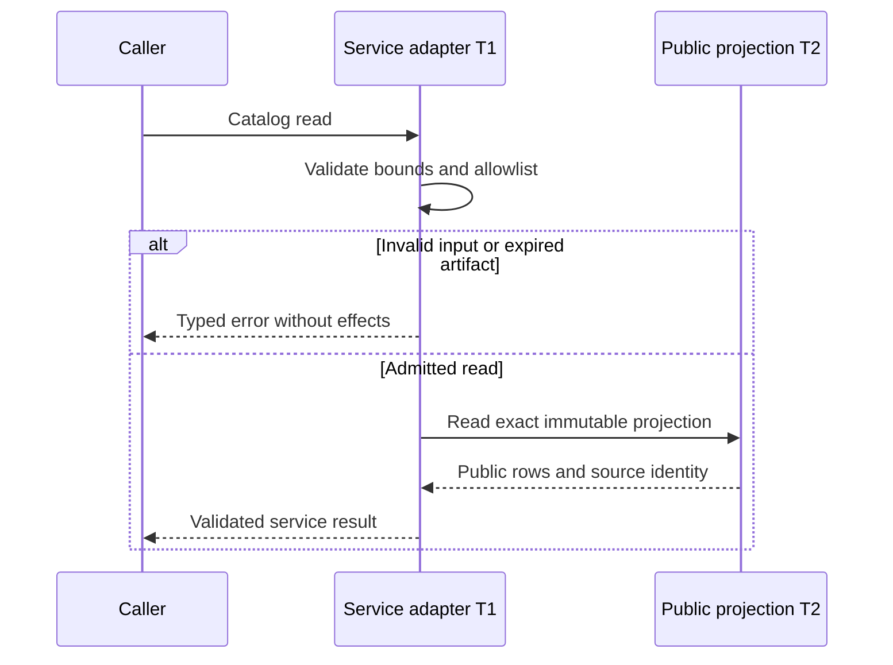
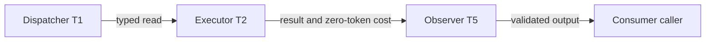
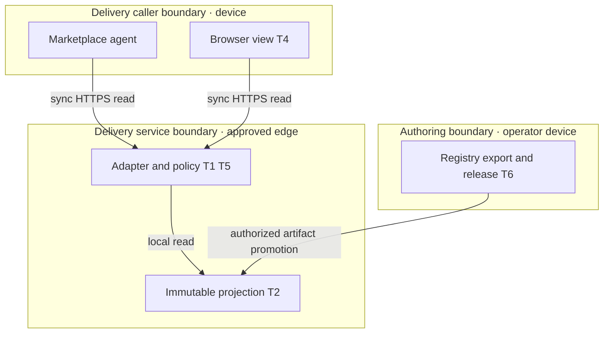
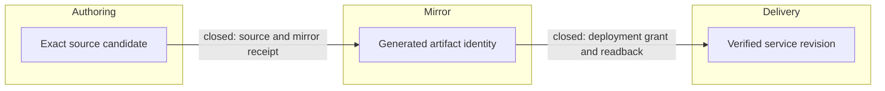

# Reference implementation — Commerce A2MCP services

The operator offers **services owned by `agentic-commerce-os`** through an agent marketplace. `agentic-graph` remains an upstream capability/payment owner where required. The product is not a renamed Graph endpoint. The authorized next local increment is the free Workspace Program Pack; the catalog and paid merchant launch-pack paths retain their separate admission and demand gates. A2MCP means the marketplace's agent-to-MCP/API service category here.

The user subsequently authorized implementing recommendations. This revision records the R1 catalog foundation and the implemented R2W Workspace Program Pack with live UI/MCP proof; it is not a hosted activation or payment grant. Account enrollment, listing submission, outreach, payment and deployment still require their applicable exact evidence and authority. No paid dependency or external message is introduced.

## Continuity and directive — reference implementation

**Join J1:** `PRD-TAD-ADR-COMMERCE-A2MCP-001@0.3.0`. All section references below consume J1 unless an external revision is explicit. PRD owns scope/criteria; TAD consumes PRD; ADR binds TAD; MVP/GTM and venture projections consume these three. A changed criterion requires a coherent five-role revision. Authoring source: [PRD–TAD–ADR–MVP–GTM guideline 3.3.0][guideline], pinned by W1 and its digest.

This document owns the proposed A2MCP integration. It supersedes preliminary recommendations in the [evaluation companion at 9671532][assessment], while preserving its dated observations. It consumes the existing [first-dollar owner][first-dollar] at `PRD-TAD-ADR-COMMERCE-MVP-GTM-001@1.2.0` and
[native implementation owner][implementation] at `edge-commerce-agent-mvp@0.6.0`; it does not redefine
merchant publication, ordinary shopper confirmation, authoritative money, or global lifecycle rules.

**CID-D1:** Context: G01–G08 establish native reusable components and unavailable public Commerce MCP; customer WTP and a live marketplace integration are unverified. Intent: an agent obtains a useful Commerce result with bounded cost and explicit authority. Directive: specify the smallest native A2MCP service and its acceptance, release and first-dollar boundaries. Role: Commerce product owner. Action/SVO: the Commerce product owner specifies the A2MCP service contract. Outcome: local MCP invocation passes the named checks and the joined artifact records implementation versus unresolved delivery evidence.

**0:** available source and sandbox evidence, no proved A2MCP customer outcome. **1:** one consenting pilot user completes marketplace discovery → Commerce invocation → real catalog result within a seven-day observation window after authorized activation. Payment and repeat demand are later, separately evidenced outcomes. No customer/pilot identity is invented.

## Grounding and evidence — reference implementation

Native base C1 = Commerce `b74536dbcfb49c93f8606a2b57fa4145c320a37c`; G1 = Graph `e113e0e5fc8ec158ba15fa4dfc3e22b1b1a4d56e`; O1 = OS `8bd5c314c23e30bc16de9a0fbb0a4349c3273638`. Guideline W1 is the exact website revision/digest in frontmatter. Sources are inspected inputs, not new dependency pins. Current source and deployed source are different; bind them before any activation.

| ID / claim | Disposition | Inspected native owner / check / evidence boundary |
|---|---|---|
| G01 Commerce owns service presentation and routing | confirmed | C1 `README.md`, `src/edge/mcp.ts`: 13 agent and 9 operator tools; not a live-service assertion |
| G02 A deterministic public projection exists | confirmed | C1 `src/core/public-catalog.ts::projectPublicCatalog`; active rows, four allowlisted fields, stable ordering; `test/workers/public-catalog.property.test.ts` is the owning runtime check |
| G03 Merchant launch-pack logic exists | confirmed | C1 `public/local-first/launch.js::{evaluateLaunch,reviewLaunch,exportLaunchPack}` and `test/local-first/merchant-launch.test.mjs`; output `commerce.merchant-launch/v1` explicitly grants no publication/payment authority |
| G04 Browser search is purely read-only | contradicted | C1 `src/edge/client/storefront-actions.ts::searchCatalog` can establish a session and dispatch intent routing when rows lack offers; do not expose it as the free read service |
| G05 The public Commerce MCP is ready | contradicted | ER02: initialize returned 501; C1 `src/local-first/worker.ts` refuses non-checkout POSTs |
| G06 Graph proves Commerce marketplace delivery | contradicted | ER03 proves only Graph search/fetch; G1 public MCP, local graph analysis and payment owners are separate surfaces |
| G07 Existing x402 equals compatible paid fulfillment | unverified | G1 `agenticCommerceX402.ts` returns a readiness resource; XRPL paid resource is travel requote; ER04 is a test-network challenge only |
| G08 A marketplace listing, paid customer or qualifying video exists | absent in reviewed evidence | No authenticated account search performed; absence of evidence is not proof of global nonexistence |
| G09 The target allows free endpoints or paid x402 calls | confirmed as published contract | X1/X2, official pages read 2026-09-25; client authentication, method and schema acceptance still need an actual integration check |

| Evidence | Named check / recorded result / surface |
|---|---|
| ER01 | 2026-09-25 `GET https://airvio.co/agentic-commerce-os/readyz`: 200, local-first/Stripe sandbox, `realMoney:false`; source `0162872948dbf27d9811daea9e59ffc0b81f9cf3`, Worker `5a4375b1-bc96-4570-a801-655b6640ff17`; delivery |
| ER02 | Same date POST `/agentic-commerce-os/mcp`, JSON-RPC initialize: 501 `checkout_deferred`; delivery |
| ER03 | Same date Graph MCP initialize/tools/list/search/fetch: 200, seven tools, fetched `PROMPT-PRESETS.md` (27,593 characters); official MCP SDK replay also succeeded; delivery, upstream only |
| ER04 | Same date GET `/api/payments/commerce/x402`: 402, base64 v2 `payment-required`, `eip155:84532`, USDC amount `1000`; no settlement/fulfillment test; delivery |
| ER05 | C1 `npm run test:unit -- test/shared/edge-mcp.test.ts test/shared/webmcp-tools.test.ts test/shared/human-confirmation.test.ts`: 11 passed; authoring, adapters/mocks only |
| ER06 | O1 `npm run check`: evaluators and four selected safety suites passed (28 tests); authoring, not all suites |
| ER07 | C1/G1 assessment candidates PR72 `d54f34cf472a097094f6fa2e37fbd9c32d92dc30` and PR73 `9671532ddeb7d049cace6112214465fde9ff15dd`: Integration Gate succeeded; source review, not merged/deployed proof |
| ER08 | Current live Commerce page visually says sandbox/no real money; connected browser found zero WebMCP tools; delivery observation on 2026-09-25, not all-browser conformance |
| ER09 | This document's metadata/link/budget audit and diagram projection check: results recorded in the authoring checkpoint below; authoring only |

External sources: [X1 ASP tutorial](https://www.okx.ai/tutorial/asp), [X2 A2MCP guide](https://web3.okx.com/onchainos/dev-docs/okxai/howtomcp), [X3 registration](https://web3.okx.com/onchainos/dev-docs/okxai/registerasp), [X4 seller SDK](https://web3.okx.com/onchainos/dev-docs/payments/service-seller-sdk), [X5 WebMCP draft](https://webmachinelearning.github.io/webmcp/). X1–X4 specify the selected reference channel, not universal platform requirements. Evidence refresh is event-driven: changed source, API contract, serving identity or account policy invalidates the affected claim.

## PRD — reference implementation

**Vision:** turn a merchant's structured Commerce capability into a discoverable, callable service with an understandable result. Primary pilot user: agent-assisted developer/operator evaluating merchant capabilities. Proposed buyer: small merchant preparing an agent-readable offer. Beneficiary: the merchant's customer. Current workaround: manually inspect catalogs and assemble offer JSON. This pain is **unvalidated**: the task establishes operator interest, not external demand or WTP.

| Pain / feature / priority | Hook → break → fix → close | Reuse versus build / WTP |
|---|---|---|
| P1 / F1 catalog discovery / Must in R1 | “Find the merchant's capabilities” → public remote Commerce call fails → bounded public projection → actual result and provenance | Reuse G02; add only public transport/profile and approved snapshot handoff; WTP unknown, free acquisition hypothesis |
| P2 / F2 merchant launch pack / Won't R1; proposed R2 Must | “Prepare an agent-readable offer” → manual assembly/review → validate and export the exact draft → downloadable reviewed-local pack | Reuse G03; add headless contract only if authorized; $1 pilot hypothesis, no live publication |
| P3 / F3 integrated demonstration / Must in R1 | “Can my agent use this?” → endpoint presence is mistaken for integration → invoke through the selected channel → URL plus repeatable 90-second video | Reuse F1 and native client; no separate demo backend; demand unvalidated |
| P5 / F5 Workspace Program Pack / Must in R2W | “Prepare a reusable program” → manually translate source and diagrams → one native conversion → four verified portable files | User-selected local increment, reuse native Block codecs; WTP unknown, free preview before $1 experiment |
| P4 / F4 paid fulfillment / Won't R1; proposed R3 Must | “Will I receive what I paid for?” → challenge-only proof → verified settlement and exact delivery → same receipt on replay | Reuse payment owner; extend approved fulfillment mapping, never another ledger; fees/support economics unknown |

**Stories:** F1: as a pilot user, obtain real public capabilities without authorizing effects. F2: as a merchant, receive an exact reviewed launch pack without publishing it. F3: as a reviewer, repeat the demonstrated integration from its URL. F4: as a buyer, receive one agreed artifact per paid request.

| Criterion / scope | Given → when → then | VCC: stated check and constraint | Design / decision |
|---|---|---|---|
| AC01 / F1 | Given an approved, unexpired catalog, when a client calls the service, then only active public rows plus revision provenance are returned | V1: protocol client + projection fixtures return expected schema, stable ordering and exact allowed fields; zero provider dispatch/model calls | T1,T2 / A1,A2 |
| AC02 / F1 | Given malformed, excessive or stale input/state, when invoked, then a bounded explicit error replaces results | V2: negative matrix for schema, 16 KiB request, 100-row/256 KiB result limits, expiry, cancellation and 5-second deadline; no effects | T1,T2,T5 / A2 |
| AC03 / F1 | Given public access, when privileged tools, credentials or arbitrary URLs/paths are supplied, then no private capability executes | V3: discover/call allowlist, unknown-tool, cross-origin and injection tests; ordinary agent/operator routes retain authentication | T1,T5 / A1,A2 |
| AC04 / F3 | Given the authorized service, when a clean target-channel client invokes it, then a real Commerce result is observed | V4: retain actual channel invocation/result, public service or Agent ID URL and a ≤90-second working-product video; direct Graph calls and synthetic fixtures do not qualify | T1,T6 / A1,A4 |
| AC05 / F1,F3 | Given phone/desktop users or absent browser tool support, when they review or lose connectivity, then ordinary controls explain availability and retain local drafts | V5: 390px and 1280px keyboard/browser walkthrough; no remote-call success or checkout approval while offline; no horizontal overflow | T4,T5 / A2 |
| AC06 / F2, R2 | Given valid merchant terms and an exact reviewed draft, when a pack is requested, then its content digest, estimates and no-authority flags match the native export | V6: existing merchant-launch suite plus proposed browser/headless equivalence and changed-draft rejection; ≤10-second execution, no publication | T3,T4 / A3 |
| AC07 / F4, R3 | Given a valid paid request, when verified/settled once, then its exact artifact and receipt are delivered and replayed without another charge | V7: invalid proof, expiry, cross-request substitution, concurrent retry and interrupted-settlement checks with independent payment readback; no unapproved real spend | T3,T7 / A5 |
| AC09 / F5, R2W | Given supported Python, when a user or MCP client requests a Workspace Program Pack, then four digest-bound files preserve exact source without executing it | V9: native codec, tamper/timeout/cancellation tests, REST/MCP equivalence, live UI and native Canvas topology; 32 KiB source, 256 nodes, 5s child deadline | T8 / A6 / ER12–14 |
| AC08 / all releases | Given an exact protected candidate and effect-specific grant, when activated, then identity, service result and retained recovery predecessor are read back | V8: consumer release/readback/rollback checks; source CI alone never establishes delivery | T6 / A4 |

**Current R2W scope:** AC09 and the local portions of AC05; free conversion plus live UI, REST and MCP. This supersedes the earlier Workspace Pack deferral. R1 catalog admission and AC04/08 public delivery remain open. General Python execution, a remote Graph workspace controller and payment are Won’t this increment.

**R1 scope:** F1+F3, AC01–05 and AC08, one service and one actual catalog. Should: optional browser tool parity after its host is available. Could: query filters after usage evidence. Won't this increment: F2/F4 implementation, negotiated A2A, arbitrary Graph execution, LLM generation, uploads, new wallet, operator mutation exposure, automated shopper confirmation, second registry/ledger or new marketplace UI.

| Success metric | Baseline | Target / window / evidence |
|---|---|---|
| F1 time to first result | Remote Commerce initialize fails, ER02 | ≤3 caller actions and ≤2 minutes on a clean client; V4 after activation |
| F1 latency / reliability | Unmeasured for proposed service | p95 ≤2 seconds over 20 warm reads; absolute deadline 5 seconds; 20/20 valid-result/error contracts, V1/V2 |
| F2 time to reviewed pack | Local workflow exists; timing unmeasured | ≤5 user steps/5 minutes, ≤10 seconds server work; R2 V6 |
| F3 repeatable proof | No target-channel recording | One reviewer repeats the ≤90-second demo with its cited URL; V4 |
| F4 fulfillment | Unproven | ≤30 seconds after confirmed settlement under defined provider timeout; ambiguous outcomes remain pending; R3 V7 |
| Serving tokens / incremental cash spend | No model needed for G02/G03; account costs not audited | 0 model tokens/request and $0 authorized new spend in R1; account quota/license proof before hosting |
| Benefit / ROI | WTP, baseline effort and support cost unknown | Measure before/after same task; no ROI ratio until measured cost denominator exists |

Open questions: named pilot and payer, actual catalog owner and freshness SLA, channel authentication/ request compatibility, verified free hosting headroom, paid-provider fees, data jurisdiction. Each blocks only its dependent baseline/effect; documentation and local deterministic rehearsal can continue.

## TAD — reference implementation

**Approach:** expose a least-privilege service profile over native domain contracts. Proposed URL: `https://airvio.co/agentic-commerce-os/services/mcp`; it is not implemented on the public Worker. The implemented loopback service uses the same path at `http://127.0.0.1:5192/agentic-commerce-os/services/mcp`. Keep existing `/mcp` agent authentication and `/mcp/operator` privileges unchanged. Do not make either anonymous. If the target accepts only a simple HTTP API, use one contract-only `/services/catalog` adapter over the same handler, selected by observed compatibility; do not implement both speculatively.

| Component / responsibility | Exact owner / reuse decision | Smallest delta / checks / current evidence |
|---|---|---|
| T1 service transport validates and dispatches one tool | `src/edge/mcp.ts::handleCatalogMcpRequest`, SDK transport; extend-owner | Implemented separate allowlist with only `commerce.catalog.public.list`, strict empty input and no Core/provider dispatcher. ER10 proves local V1–V3; original agent/operator handlers preserved |
| T2 catalog projector returns sanitized capabilities | `src/core/public-catalog.ts::{projectPublicCatalog,createPublicCatalogArtifact,readPublicCatalogArtifact}`; extend-owner | Implemented native projection, source/input/output digests, strict artifact fields and 24-hour expiry. Real admitted snapshot remains missing; fixtures prove local contract only |
| T3 launch exporter derives reviewed artifact | C1 `public/local-first/launch.js`; reuse via declared module contract | Retain local review semantics; R2 headless adapter supplies explicit draft/review input. No generic package extraction. V6; source proof G03 |
| T4 browser view projects native actions | C1 `src/edge/client/webmcp-runtime.ts`, local-first UI; retain-local | Preserve existing design tokens/controls; R1 page can link service result, optional tools reuse safe T2 reader. Do not reuse G04's provider-dispatch behavior. V5 |
| T5 policy bounds input, data and effects | `src/local-host/catalog-service.ts::startCatalogService` plus native HTTP/MCP owners; extend-owner | Implemented one loopback process with 4 slots, rolling 60/minute limit, 5s body deadline, cancellation and strict Host/origin/credential refusal. No global or multi-host quota claim |
| T6 release controller admits exact runtime | C1 `scripts/local-first-release/`, existing protected workflows and `docs/production-runtime.md`; reuse/extend-owner | A new service route changes the profile: update owner checks and seek its exact release grant, never inherit asset-only authority. V8 |
| T8 Workspace Pack | Graph `workspaceProgramPack.ts` + `mcp/workspace-program-pack.ts` owns conversion; Commerce `src/local-host/workspace-program-pack.ts` owns the pinned protocol reader, `workspace-pack-host.ts` owns REST/MCP and `public/local-first/workspace-pack.*` owns presentation | Native parser/JSON/Markdown/Block reuse; no sibling imports. Extract `src/shared/local-http-body.ts` for two existing local hosts and remove the old copy. ER12–14 / A6 |
| T7 payment owner verifies and journals settlement | G1 payment Worker + shared payment contracts; defer | R3 compatibility/fulfillment mapping through declared protocol, not sibling source import. V7; ER04 is insufficient |

T1–T7 current proposed-product local/delivered rungs are **undocumented/undocumented**. Reused parts retain their own bounded evidence; their maturity is not transferred to this service. Local T2 export, T1 adapter and T5 host are implemented. Remaining order: admitted snapshot → target-compatible hosted admission/quotas → T4 review → T6 exact release proof; T7 is a later independent seam. Runtime responses may return upstream; build dependencies stay acyclic.

### Service contracts and data lifecycle

R1 advertises the existing `commerce.catalog.public.list` identity with empty object input and no additional properties; omitted MCP arguments normalize to `{}`. Output consumes T2 `{ok, revision, digest, agents}`; each row contains only `agentId`, `declaredCategory`, `declaredCapabilities`, `trustStatus`. The literal trust status `declared-and-present` is a declaration, not independently verified quality, safety or current price. The transport adds `commerce.public-catalog/v1`, a source revision, epoch-millisecond generation/expiry times, full artifact digest and request ID. Native MCP `structuredContent.result` holds the envelope; text content serializes the same value. The native projection schema stays unchanged.

The operator derives an immutable public artifact from an existing admitted registry snapshot; T2 remains the sole projector and the registry remains authoritative. Record full-output digest, source revision and projection version separately from the input snapshot digest. Implemented freshness ceiling: 24 hours; expiry returns unavailable, never stale-as-current. The loopback process admits one immutable artifact at startup and rechecks expiry/digest on each request; restart to replace it. Hosted publication remains a separate release change. There is no second editable catalog, crawler or background refresh loop. If a valid source snapshot cannot be obtained, R1 is blocked; a test fixture is local proof only.

Implemented local limits: request ≤16 KiB; complete MCP output ≤256 KiB and ≤100 rows; declared capabilities bounded by their upstream schema; 5-second deadline; concurrency initially ≤4 and ≤60 requests/minute per service. These are per-process application ceilings, not hosting quota claims. Snapshot export currently accepts ≤100 total registry rows and <500,000 input bytes; it never truncates larger input. Stop at the lower actual quota. Rate-limit before work; cancel on disconnect; the service performs no automatic retry; callers may retry one idempotent read after the stated delay. Responses contain typed errors for invalid input, unsupported method/tool, stale snapshot, quota and unavailable dependency. Never turn an error into HTTP 200 success or expose provider errors/secrets.

Data residence: source registry remains with its current owner; public artifact is immutable on the existing delivery surface; private drafts stay in the browser in R1. No private draft or credential is sent to the marketplace. R2 would accept explicit merchant input only, minimize logs to IDs/digests/ status/timing and choose a stated retention policy before pilot activation. R1 operational logs: 7-day maximum proposed retention, no prompt/body/cookie storage; operator deletion/exit uses the native owner. A public artifact may be copied by callers; removing a listing cannot recall those copies.

### Ecosystem and invocation contracts

| Participant / job | Value exchanged / payer | Owner / interface / trust | Evidence gap / cost, privacy and exit |
|---|---|---|---|
| Pilot user and calling agent | Find merchant capabilities; free | T1 public read, no effect authority | Actual target invocation absent; caller model costs external to service, not silently subsidized |
| Merchant / proposed buyer | Obtain reviewed launch pack; proposed $1 | T3 R2 explicit draft/review contract | WTP absent; private drafts never public catalog; export remains portable |
| Operator / seller | Curate real service availability and support | T2 artifact admission, T6 release, protected operator route | Account, catalog source, quota and legal recipient unverified; can withdraw public service |
| Developer / integrator | Stable schema, bounded errors and migration | T1/T5 native tool identity and version | SDK handshake local first, target conformance next; no new SDK or developer portal |
| Provider | Supply authoritative execution/payment results | T7/versioned private protocol, R3 | Costs/license/fees and recovery proof required; replace adapter without moving ledgers |
| Assurance mechanism | Judge exact VCC results | Independent CI and provider readback, T6 | No self-issued production verdict; fixtures do not certify operations or law |

| Existing register join / capability | Surface and mode | Owner / authority / proposed change |
|---|---|---|
| `catalog.public.list`; `/tool.route`, `#mcp`, `@mcp-gateway` | Existing authenticated MCP; proposed public service MCP/API is read-only | T1/T2; reuse `config/capability-token-map.json` and upstream invocation owner; new profile must receive an explicit mapping, never invented aliases |
| Browser catalog inspection | Visual UI supported in native profiles; optional WebMCP depends on host | T4; original `commerce.catalog.search` can route providers (G04), so it is not automatically equivalent to public metadata reads |
| `commerce.offer.select`, `commerce.checkout.initiate` | Browser select/prepare only; not R1 service tools | Native `StorefrontActions`; retain ordinary human-confirmation boundary |
| `commerce.theme.deploy` | Operator-only MCP/HTTP; not marketplace exposed | Existing operator claim/fence/version requirements stay intact |
| Merchant pack / proposed R2 | Local export exists; remote tool name/schema admission pending | T3; use native schema and register only after capability-map review; no fake current MCP tool |
| Skills and command entrypoints | Native CLI: `npm run build:catalog`; `npm run catalog -- export` or `serve`; no A2MCP skill declared | CLI exports from an explicitly selected snapshot or serves a validated artifact on loopback only; discovery grants no authority |

Developer journey: inspect schema and version → local fixtures → official SDK handshake → authorized target call → sanitized request/result evidence → error/reconciliation read → support → announced version retirement. Preserve old schema while observed consumers migrate; any compatibility shim must name those consumers and removal trigger. No broad abstraction without two proved consumers.

### Five flows, diagram inventory and quality

All diagrams below are version 1 at J1, authored as Mermaid under this reference implementation. Primary projection target: 2D Renderer: D3 Graph; secondary: Markdown Preview. Read/render model tokens are zero. The projection check passed; all six Mermaid diagrams rendered in a local browser. Desktop visual review passed; the 390-pixel preview rendered all six but needs zoom for long labels. The primary D3 consumer and complete accessibility review remain unverified.

**Diagram D1** · Class: Journey stage map · Notation: flowchart LR · Version: 1. **Caption:** the pilot completes a Commerce read before considering a later merchant service.

| D1 node | Journey / requirement |
|---|---|
| j1,j2,j3,j4 | Discovery, selection, result, review respectively; AC01/04/05; R2 next action is explicit reviewed pack; R3 payment is separately gated |

**Diagram D2** · Class: User workflow · Notation: sequenceDiagram · Version: 1. **Caption:** invalid or unavailable requests stop before any provider action.

| D2 participant | Workflow / requirement |
|---|---|
| C,S,P | Caller, T1 and T2; AC01–04; R2 substitutes explicit reviewed-draft/export contract; R3 uses value-moving states below |

**Diagram D3** · Class: Data flow · Notation: flowchart LR · Version: 1. **Caption:** public data is derived from the authoritative registry, never from private browser drafts.

| D3 node | Data owner / requirement |
|---|---|
| d1,d2,d3,d4 | Existing registry, T2, T6 published artifact, T1 envelope; AC01–03/08; R2 data remains explicit/private, R3 stores payment evidence only in T7 |

**Diagram D4** · Class: Orchestration / harness flow · Notation: flowchart LR · Version: 1. **Caption:** deterministic validation replaces model orchestration; the service cannot call a paid model.

| D4 node | Harness contract / requirement |
|---|---|
| h1,h2,h3,h4 | Dispatcher accepts empty object; executor returns T2 schema; observer records request ID/status/latency/bytes/zero model tokens; consumer receives result or typed refusal; AC01/02 |

No AI execution pipeline is selected. Sequential orchestration has one execution and zero internal retries. If a future model is admitted, it requires a new typed harness, token/cost log and fallback decision; user-supplied text is data, never an instruction to dispatch tools. R2 deterministic execution has the same bounds with a 10-second ceiling; R3 unresolved settlement forbids blind retry.

**Diagram D5** · Class: Runtime topology · Notation: flowchart TB · Version: 1. **Caption:** the public adapter exposes a projection while privileged owners stay behind their boundaries.

| D5 node / cluster | Placement / owner / requirement |
|---|---|
| n1,n2 / clients | Caller and T4, device; no provider secrets; AC03/05 |
| n3,n4 / delivery | T1/T5 and T2, approved existing hosting; region/account proof required; AC01–03 |
| n5 / authoring | T6, device/operator; release command cannot bypass protected workflow; AC08 |

**Diagram D6** · Class: Lane & deploy boundary · Notation: flowchart LR · Version: 1. **Caption:** code review, mirror publication and service activation require distinct evidence.

| D6 node / cluster | Owner / requirement |
|---|---|
| a / la; m / lm; v / ld | T6 source, generated mirror, deployed identity; AC08; no authored edits to generated mirrors |

| Diagram | Class / surface | Projects | Nodes / edges / clusters expected | Version |
|---|---|---|---|---|
| D1 | Journey / primary+secondary | yes | 4 / 3 / 0 | 1 |
| D2 | Workflow / secondary only | no | 0 / 0 / 0; three sequence participants | 1 |
| D3 | Data / primary+secondary | yes | 4 / 3 / 0 | 1 |
| D4 | Harness / primary+secondary | yes | 4 / 3 / 0 | 1 |
| D5 | Runtime / primary+secondary | yes | 5 / 4 / 3 | 1 |
| D6 | Lanes / primary+secondary | yes | 3 / 2 / 3 | 1 |

Quality checks join AC01–08: bounded load and cancellation; no credential forwarding; exact origin and input schemas; content digests and freshness; no secret/PII logs; screen-reader labels/keyboard access and text equivalents; local draft portability; explicit offline unavailability; schema/version retirement. Catalog descriptions may contain hostile instructions: emit as untrusted data and never execute them. Server policy enforces restrictions regardless of tool annotations or client behavior.

### Value-moving flow, gates and recovery

R1 has no value-moving effect. The following R3 contract is deferred, not inherited payment authority.
| Phase | Owner / invariant | Failure and evidence |
|---|---|---|
| Intent / authorization | T3 binds artifact request digest; T7 binds payer/payee, network, asset, integer amount/precision, fee, expiry and idempotency | Changed facts require new authorization; authentication is not payment permission |
| Challenge / submission | T7 emits compatible x402 v2 challenge and accepts signed proof only through its verified contract | Invalid/expired/wrong-network proof delivers nothing; never expose wallet secrets |
| Uncertain outcome | Existing payment journal records pending/unknown and exact provider reference | Status readback only; no new charge or payout attempt until reconciled |
| Settlement / fulfillment | Independent provider evidence precedes paid delivery; one request key maps to one request digest and artifact | Atomic reservation/journal; simultaneous retries replay one terminal receipt; different request under same key refuses |
| Reversal / recovery | Payment owner defines explicit refund/cancel semantics and actor grant | Source rollback does not reverse money; failed delivery after settlement needs tracked recovery, not fabricated success |

Policy inputs are versioned schema, serving revision, public snapshot identity/expiry and owner grants; outputs are allow/deny/pending with typed reason and immutable evidence reference. Business permission, technical authentication and jurisdiction-specific obligations are separate. No legal compliance claim is made from passing fixtures. Merchant-of-record, territory, tax/refund and retention decisions remain with the operator and relevant qualified reviewer before real commercial activation.

| Boundary | From → to | Required evidence / operator instruction | Recovery / state |
|---|---|---|---|
| Source integration | Authoring → protected source | Exact candidate + Integration Gate + protected review; no merge grant inferred | Retain published lane; closed |
| Generated publication | Authoring → mirror | Existing Graph-owned mirror controller receipt; no current publication instruction | Regenerate previous exact source; no direct mirror edit; closed |
| Service activation | Mirror → delivery | Commerce T6 controller, quota/license verification, current baseline and human release grant; none for new profile | Retain prior compatible artifact/config; run owner rollback/readback; closed |
| Marketplace identity/listing | Operator account → external catalog | Authorized identity, reviewed service facts, endpoint conformance; no submission instruction | Delist via owner account if authorized, preserve receipt; closed |
| Real payment | Approved buyer intent → settlement | T7 exact payment grant and verified supported rail/fees; none | Owner reconciliation/refund, never generic Git rollback; closed |

Consumer release/rollback owners: `docs/production-runtime.md`, `scripts/local-first-release/`; upstream mirror/payment effects use their own controllers. Unknown storage compatibility or partial activation requires preservation and readback, not force rollback. Docs-only authoring needs no runtime deployment; whether a later source candidate changes published artifacts must be checked by T6.

## ADR — reference implementation

**Constraint set:** K1 Commerce owns the customer contract; K2 zero new paid plans/overages/spend; K3 FOSS application runtime/dependencies; K4 bounded deterministic read with no privileged effects; K5 existing source owners and acyclic dependencies; K6 target-channel proof cannot be replaced by local fixtures. Hosted marketplace/platform services are external dependencies, not claimed to be FOSS. Unknown cost/license fails the dependent deployment gate; local FOSS rehearsal remains possible.

| ADR / proposed decision | Constraints and alternatives | Argument / tradeoff / recovery / revisit |
|---|---|---|
| A1 Commerce public service profile | Narrow native profile: pass K1–K6 at design level, runtime proof pending. Direct Graph listing: fail-K1. Anonymous existing agent/operator MCP: fail-K4. New marketplace platform: fail-K5 | Native public contract preserves the target product and limits authority. Additional adapter costs remain measurable. Remove only new profile if withdrawn; revisit on actual protocol incompatibility |
| A2 immutable native catalog projection first | Reviewed T2 projection: pass design constraints. Reusing `searchCatalog` wholesale: fail-K4 due to G04. Full Core deployment: cost/authority unverified, fail-K2 for activation now. Browser-only execution: fail-K6 for remote integration | Metadata utility is narrower than live offers; freshness and actual source snapshot are dependencies. Do not invent catalog. Retain native full profile; revisit when user needs verified live prices |
| A3 native launch export before new generation | Direct G03 reuse/contract adapter: pass local constraints. Independent exporter or generic shared package: fail-K5 absent duplicate-behavior evidence. LLM generation: fail-K2/K4 | Existing digest/review contract is nearest-built; no automatic publishing. R2 adapter must prove byte/error/effect parity. Restore prior export contract if mismatch; no existing exporter removed |
| A4 local rehearsal before hosted activation | Existing FOSS local runtime: pass rehearsal. Existing edge free quota: eligibility unverified, fail-K2 activation until checked. New paid hosting: fail-K2. Self-hosted public node: uptime/security cost unverified | Local cannot satisfy remote eligibility. Hosted alternatives remain incomparable pending quota/operations evidence. No winner declared; independent evaluator resolves with actual account facts |
| A5 free acquisition, later $1 pack trial | Free R1: pass current scope. Paid x402 now: fail-K2/K6 until fee/rail/fulfillment proof. Negotiated escrow: fail-K4/scope. Manual concierge pack: technically viable later with explicit outreach/payment grant | Catalog and pack solve different jobs; no claim free reads validate paid demand. $1 versus higher fee remains unresolved until priced interviews. Stop after failed economics; no silent plan upgrade |

Outranking uses constraint-first Pareto comparison, not a weighted score. For R1, the narrow native profile is the sole currently admissible design after K1/K4 exclusions; no invented comparison is needed. Local and hosted models serve different acceptance stages and remain incomparable for final delivery. Contested price/hosting argument graph: G03 supports native pack reuse; absent WTP attacks the $1 claim; G02 supports cheap reads; ER02 and absent quota proof attack immediate hosted readiness. Independent evaluator verdict is **pending**; proposed choices are not self-adjudicated winners. Selection budget: one 30-minute evidence pass, ≤4,000 authoring tokens, ≤3 revisions; reopen only on new relevant evidence, stop after two cycles without reduced uncertainty.

| Deployment model | Infrastructure / egress / model cash | Ops / license / 12-month treatment |
|---|---|---|
| Local FOSS on existing device | No new resource purchased; model $0; energy/device cost unknown | Lowest local proof cost; device availability not public SLA; 12-month TCO unknown, not $0 claimed |
| Existing managed edge within verified free quota | Proposed incremental $0 ceiling; actual quota/egress unknown; model $0 | Must hard-stop before overage; hosted platform proprietary; 12-month account audit pending |
| Self-managed public FOSS runtime | Software license free; hosting/network cost unknown; model $0 | More security/uptime work; no hardware/network purchase authorized; compare only after measured ops |

Five lenses: minimal value = one real metadata result; TCO = no new spend and explicit hosted audit; tokens = deterministic zero-model serving; harness = schema/policy/result/cost evidence; concurrency = immutable artifact identity and native claims for authoring/effects. Expected savings remain unmeasured.

## MVP — reference implementation

MVP additionally consumes AC09 for authorized R2W; ER12–14 prove local pack conversion and live UI. Public channel acceptance remains open. R1 consumes AC01–05/08, T1/T2/T4/T5/T6 and A1/A2/A4 at J1. Local V1–V3 now have ER10 evidence; actual admitted catalog, V4 target invocation and V8 hosted activation remain open; R2W adds a separate local video and UI proof, not target-channel acceptance. R2/R3 V6/V7 remain deferred. Local/delivered rungs stay undocumented/undocumented pending independent baseline and full service acceptance.

**Domain object:** a merchant service invocation and its exact result. Four maturity dimensions—Core Requirements & Functionality; Innovation & Theme Alignment; Technical Execution & Integration; Usefulness & Agentic Experience—are all unassessed for the target integration. No contiguous level is claimed. T1/T6 and missing real pilot evidence block an end-to-end score; reuse G02/G03, do not infer the service score from Graph tests. Next evaluator check is V4 in the actual intended environment.

| Roadmap phase / rank | Reuse, owner and smallest delta | Prerequisite → exit VCC | Active bounds / external wait / stop and recovery |
|---|---|---|---|
| R0 grounded authoring / current | Product owner; this document and G01–09 | User document request → metadata/trace/diagram check; no implementation authority | 15-minute initial estimate; 25-minute cap; byte cap refreshed from 40 to 60 KiB for required flows/projections; <600 lines, 1 file, 0 runtime modules, ≤30k authoring-token estimate; actual tokens unavailable |
| R1 free native discovery / technical priority | T2 existing projector + T1 public profile + T6 artifact checks; engineering owner | Approved scope, real catalog source, K2/K3 proof → V1–V5/V8 and actual target result | Two 60-minute sprints, ≤7 files/3 runtime modules/40 KiB added (refreshed from 6 files/24 KiB for host build, SDK negative matrix and handoff); planning file ≤64 KiB/<600 lines; <500 kB chunk, ≤16k authoring-token estimate, 0 serving tokens/$0 new spend; stop/re-scope on drift |
| R2W Workspace Program Pack / selected local increment | T8 native Graph codec and Commerce offer UI; engineering owner | User scope selects this before the unvalidated merchant pack; V9 and local V5 → four files and native Canvas proof | Two 45-minute sprints; refreshed cap 14 files/6 runtime modules/64 KiB added code+tests; joined Commerce document cap refreshed to 80 KiB for evidence reconciliation; each file <600 lines/chunk <500 kB; no new dependencies, 0 serving tokens/$0 new spend; exact authoring tokens unknown |
| R2 native merchant pack / nearest paid hypothesis | T3 export and T4 review; product/engineering owner | Named priced need + R1 learning or an independently authorized local pilot → V6 and accepted deliverable | Two 60-minute sprints, ≤5 files/2 modules/16 KiB/12k authoring tokens; $0 new spend; no sale claim; recover by disabling only new adapter |
| R3 paid A2MCP / conditional | T7 verified rail and artifact binding; payment owner | R2 demand + fee/license/authority proof → V7/V8 + first collected/fulfilled receipt | First 45-minute feasibility pass only, 0 runtime edits; subsequent exact plan required; account/facilitator approvals rechecked on evidence change, no completion ETA |

The order follows nearest-built capability because no validated WTP exists. A real stronger pain signal may change it through a successor; low implementation cost never outranks observed buyer value. Pipeline order: owner schema/check → exact export or versioned contract → consumer pin → adapter → affected conformance → source release → owner deployment/readback. Always-load delta is zero; service adapter lazy-loads within native module/chunk caps. No new dependencies are presumed available.

| Demo beat | R1 F1/F3 action and acceptance | Bound |
|---|---|---|
| Hook | State the real merchant capability question | 10s |
| Probe | Open authorized marketplace service/Agent ID and inspect input | 15s |
| Reveal | Actual Commerce read returns public rows + provenance, V1/V4 | 25s |
| Inspect result | Show native Commerce result and explain declared trust; no fabricated live prices | 25s |
| Close | Show service URL, available modes and limits | 15s |

Total 90s. R2/R3 later use the same 10/15/25/25/15 bounds with their own Reveal V6/V7: exact pack, then verified paid artifact/receipt and replay. These R1/R2/R3 channel demos remain planned; R2W has a separately labelled local recording. No video exists yet. A fixture or sandbox receipt cannot replace the actual channel invocation or actual collected-payment evidence.

### Planning record — 2026-09-25

| PRD-TAD-ADR-MVP-GTM | CID | RAO | Updated Date |
|---|---|---|---|
| `PRD-TAD-ADR-COMMERCE-A2MCP-001@0.3.0` | C: G01–09 at C1 and assessment 9671532 · I: reviewable native service contract · D: Implement recommendations within the revised R1 local bounds; preserve separate delivery gates. | R: Commerce engineering · A: Engineer implements and verifies the local public catalog service · O: V1–V3 local proof plus delivery gaps · check: ER10/ER11 | 2026-09-25 |

This is the document's handoff row, not a duplicate private task board. Future execution RAO nodes are one independently closable VCC each: V1 projection/protocol; V2 refusal/bounds; V3 authority; V4 channel demonstration; V5 browser/offline; V6 pack; V7 payment; V8 activation/readback. Each inherits the exact PRD/TAD/ADR join and narrows its roadmap budget. No autonomous indefinite loop.

## GTM — reference implementation

GTM consumes J1's pain, features and A5. Existing segment evidence is the operator's request; no named external prospect has been recorded. Proposed beachhead: small merchants/integrators already assembling structured offers. Initial geography is undecided, not inferred from the operator timezone.

| Stream / distance rank | Proposed payer / mechanism | Demand / collection / next test |
|---|---|---|
| S1 merchant launch-pack pilot / 1 among paid hypotheses | Merchant, fixed deliverable; $1 trial A5; local native exporter exists | Unvalidated; no payment evidence; obtain explicit priced response and acceptance criterion before build expansion |
| S2 agent-ready merchant setup / 2 | Merchant, reviewed catalog/theme setup using existing owners | Source preparation exists; full runtime/activation conditions add work; no collected amount evidenced |
| S3 pay-per-call pack generation / 3 | Repeat merchant/integrator, T3+T7 | Mechanism unproven for this service; requires R3 receipts and demand, not just 402 |
| S0 free catalog read / acquisition, not revenue | Pilot agent user, F1 | Target-channel delivery unproven; measure completed result and return use; never count a free call as WTP |

Rank is a provisional distance ordering, not a buyer-value verdict: pack reuse is nearer than hosted setup or payment integration. “Do nothing”, manual JSON and native local exporter are customer alternatives. Differentiation hypothesis is agent-callable, bounded, reviewed output with provenance; whether that beats free manual/local use must be observed. No competitor market-share claim is made.

Acquisition → activation → retention: after outreach authorization, invite at most five relevant pilot users; offer one exact task, record baseline steps/minutes, then result quality and support minutes. Within seven days after activation seek ≥3/5 completed tasks and ≥2 users voluntarily returning. For paid discovery, separately seek ≥2/5 explicit acceptance responses to the exact $1 scope before R2 expansion. These are decision thresholds, not forecasts; one accepted price is not collection. Continue if outcomes meet target and no authority/data incident occurs; pivot on usefulness but price rejection; stop after two bounded cohorts with <2 useful completions or if zero-spend limits cannot hold.

Delivery/support: one solo operator handles at most five active pilots; no 24/7 SLA. Publish support availability before launch; triage by request ID, reproduce without private bodies, disable failing service on integrity incidents, reconcile paid unknowns with T7. Supplier outage returns unavailable. Retention is repeat accepted outcomes, not tool-list views. Owner capacity/hiring trigger: >2 hours/week support for two weeks prompts scope reduction before any hiring or paid tooling. No hire is budgeted.

### Market, obligations, economics and capital

Why now is an operator hypothesis based on X1/X2 providing an agent-service channel, not market demand evidence. Two independent sizing methods are specified but data is absent: M1 bottom-up = verified reachable merchants × observed annual purchase frequency × accepted price; M2 top-down = cited relevant merchant population × agent-service adoption × attainable segment share × annual spend. TAM/SAM/SOM values are **unknown**, not zero or fabricated. Geography, sources, overlap and confidence ranges must be reconciled before market-size claims. Market research owner revisits after pilot definition.

| Assumption ID / date 2026-09-25 | Input / source / disposition | Sensitivity or missing evidence |
|---|---|---|
| H1 | Price = USD 1 per accepted launch pack; A5 operator test hypothesis | No buyer acceptance; quote/payment currency and precision must be explicit |
| H2 | Illustrative monthly fulfilled units Q: downside 0, base 10, upside 50; planning assumptions | Not demand forecasts; replace with actual cohort counts |
| H3 | Per-order provider/network fee f, support minutes t and opportunity cost w/hour unknown | Must not assume f=0 or hide labor; zero-spend activation refuses unknown operator charges |
| H4 | Fixed cash operating cost O and initial cash B0 unknown; no new spend authorized | Existing account bills/device cost not audited; cash floor F=0 is a planning constraint |
| H5 | Serving model tokens = 0 for F1/F2 deterministic paths; G02/G03 design | Caller-agent token costs separate; regression test prohibits model egress |
| H6 | Acquisition cash cost A and buyer repeat rate r unknown | LTV:CAC, payback and retention forecasts not computable yet |

Unit economics: cash contribution/order = H1 − f; fully loaded contribution = H1 − f − t×w/60. Break-even fulfilled units = O/(H1−f) only if denominator >0. Recognition requires accepted delivery; advance receipts are deferred revenue until fulfillment. First-dollar evidence requires an actual transfer receipt plus accepted artifact; neither sandbox totals nor invoices suffice.

Illustrative linked statements for fully delivered/prepaid orders, no debt/tax/capex/working-capital changes assumed (these omissions prevent commercial forecasting): income revenue Q×H1, COGS Q×f, operating result Q×(H1−f)−O; cash closing B0 + same operating result; balance sheet cash equals closing equity B0 + result, liabilities 0. Unfulfilled prepayments instead increase cash and matching deferred revenue, not profit. R3 must replace these assumptions with actual settlement timing, refunds and tax.

| Scenario / projection only | Revenue / COGS | Operating cash change | Cash-floor runway |
|---|---|---|---|
| Downside H2 Q=0 | 0 / 0 | −O | (B0−F)/O if O>0; unknown inputs |
| Base H2 Q=10 | 10 / 10f USD | 10(1−f)−O | Defined only when net burn positive; otherwise no cash depletion in this simplified model |
| Upside H2 Q=50 | 50 / 50f USD | 50(1−f)−O | Same formula and limitations; capacity/support H3 may invalidate it |

The model is an **incomplete discovery sketch**, not a sourced financial forecast. Actual revenue, collected cash, balance sheet and runway are unmeasured for this service. Bootstrap/no external funding is the proposed capital decision; no investment ask, dilution or capital purchase. The only present allocation is bounded operator time R0/R1; further spending would require changing the zero-spend scope. Entity, IP/content ownership, region, terms/refund policy and merchant-of-record are unresolved; operator and qualified reviewer must settle applicable obligations before audience claims or real payments.

## Venture projections — reference implementation

All three projections consume J1; they introduce no requirements or numbers. They are separately addressable subsections in this bounded file. Audience: prospective pilot reviewer. Decision sought: consent to one bounded free task, later an exact priced offer. Audience publication is not authorized.

### Pitch deck projection, revision 0.3.0

| Slide / roles covered | Projects / evidence status | Bound |
|---|---|---|
| 1 Problem + who pays | PRD P1/P2, GTM proposed merchant; unvalidated | 20s |
| 2 Market + why now | GTM M1/M2 and X1/X2; sizing unknown, hypothesis only | 15s |
| 3 Solution + Reveal | R1 demo Reveal V1/V4; no current target-channel proof | 25s |
| 4 Why us/team + competition | T1–T7 reuse, solo operator, native/manual alternatives; source grounded, differentiation unvalidated | 20s |
| 5 Traction + economics | ER01–08, H1–H6; no A2MCP collection evidence, model sketch | 20s |
| 6 Roadmap + ask | R1 pilot with no funding ask; deferred paid phases | 20s |

All twelve roles covered in six slides; total 120 seconds. No deck file or successful presentation is claimed. Replace Reveal with real V4 evidence before presenting a working-product claim.

### Business plan projection, revision 0.3.0

Purpose/customer/problem → PRD; market/timing → GTM M1/M2; offer/alternatives → A5 and S0–S3; acquisition/retention → GTM pilot cohort; delivery/suppliers/capacity → TAD ecosystem and GTM support; organization/IP/legal → GTM obligations; risks/recovery → TAD gates and findings; finance/capital → H1–H6 and linked statements; milestones → sole roadmap R0–R3. Missing market, legal and actual cost evidence blocks an investor/customer assurance claim, not completion of this discovery document.

### Financial model projection, revision 0.3.0

Consume H1–H6 and the three scenario formulas above. Inputs belong to GTM; TAD owns resource caps. No spreadsheet is requested; this Markdown model is the declared projection. ADLC Cost Ledger: R0 authoring estimate 15 minutes/cap 25; R1 local implementation estimate two 60-minute sprints; actual active minutes and tokens unavailable; guideline-reading token cost included in ≤30k authoring estimate, not measured. Source CI duration and cost await this exact candidate's receipt; prior PR CI is not charged as measured current work. New paid tools/resources purchased: none. Account bill, energy, sunk device cost and operator labor remain unknown. Later ledger lines must bind candidate/run, duration, token/CI/provider cost and avoidable-block cost to exact receipts; no cost-saving claim is earned by missing measurements.

## Coverage, findings and authoring checkpoint — reference implementation

Coverage decisions are separate from maturity. All source anchors below consume J1. “Covered” means the required decision record is present, not that its market or runtime assertion has been validated.

| Domain | Decision / source role | Evidence or gap / owner / next check |
|---|---|---|
| C01 | covered / PRD | Personas/pain hypotheses; product owner obtains named need before baseline |
| C02 | deferred / GTM market | No sourced sizing/geography; research owner completes M1/M2 after segment selection |
| C03 | covered / PRD+ADR+GTM | Service tiers, alternatives, H1; product owner validates priced response |
| C04 | covered / PRD+TAD | Journeys/criteria/mobile/offline; QA consumes ER10 for local V1–V3; V4–V6 remain open |
| C05 | covered / TAD | Components/contracts/six diagrams; engineering owner checks native integrations |
| C06 | covered / TAD+ADR | Bounds/privacy/cost/license gates; ER10 validates local V2/V3; operator must verify hosted quota |
| C07 | covered / ADR | A1–A5 alternatives/recovery; independent evaluator resolves pending price/hosting |
| C08 | covered / MVP | Smallest slice/demo/evidence register; evaluator runs V4 before promotion |
| C09 | covered / GTM | Cohort/acquisition/retention decisions; product owner records real pilot outcomes |
| C10 | covered / TAD+GTM | Capacity/support/supplier incidents; operator dry-runs refusal/recovery |
| C11 | deferred / GTM obligations | Entity/region/terms unknown; operator and qualified reviewer before commercial activation |
| C12 | deferred / GTM model | Symbolic three-statement sketch only; finance owner obtains H3/H4/H6 then recomputes |
| C13 | covered / ADR+GTM | Bootstrap/no external ask; operator rechecks if capital requirement changes |
| C14 | covered / MVP+TAD | Scope/budgets/effect gates; release owner binds exact future receipts |
| C15 | deferred / Venture projections | Draft registers exist; research/finance gaps prevent audience-ready claims; writer regenerates after evidence |
| C16 | covered / MVP+GTM | Continue/pivot/stop thresholds; product owner writes successor from actual cohort |

**Coverage:** 16/16 dispositioned; 12/16 applicable domains covered; 4 deferred; 0 not applicable. Authoring-rule coverage is reported as linked obligations, not a blanket conformance certification. The parent, diagram and canvas full rule-by-rule audit remains a named check for baseline acceptance; ER09's mechanical checks do not replace it. Advisory counts and whole-set ratios are not measured.

| Finding Type | Severity | Rule anchor (rule text) | Artifact reference | Evidence excerpt | Remediation |
|---|---|---|---|---|---|
| pain-point-not-validated | major | pain-point-to-feature-mapping#3 (label pain until evidence) | J1 PRD P1/P2 | “This pain is unvalidated” | Specification change: product owner binds a priced need before implementation baseline |
| unimplemented-guideline | major | venture-record-pitch-deck-business-plan--financial-model#6 (two cited sizing methods) | J1 GTM M1/M2 | “TAM/SAM/SOM values are unknown” | Specification change: research owner records two sourced estimates and reconciliation |
| scenario-set-incomplete | major | venture-record-pitch-deck-business-plan--financial-model#5 (linked statements/scenarios) | J1 GTM H1–H6 | “incomplete discovery sketch” | Specification change: finance owner supplies actual inputs and cash timing before financial audience use |
| unimplemented-guideline | major | rule-identity--classification#3 (report rule coverage and advisory count) | J1 coverage | “whole-set ratios are not measured” | Locally reproducible check: baseline evaluator enumerates applicable parent/diagram/canvas rules and audits linked artifacts |
| render-proof-absent | major | dual-target-portability#5 (verify both consumers) | J1 D1–D6 | “primary D3 consumer and complete accessibility review remain unverified” | Locally reproducible check: render in the registered D3 consumer and verify zoom/labels/accessibility before a dual-target render-ready claim |

Known findings: 0 blocker, 5 major, 0 minor; all other reviewed types have zero recorded occurrences, not a claim of exhaustive evaluation. Baseline sign-off remains pending current grounding, independent review and the missing evidence above. No runtime-ready or higher claim is made. At most three alignment cycles; two cycles without reduced blockers stop for an explicit successor decision.

**Implementation checkpoint (2026-09-25):** local artifact export and narrow MCP invocation are implemented; the existing agent/operator and checkout routes retain their contracts. ER10: `npm run test:unit -- test/shared/catalog-service.test.ts test/shared/edge-mcp.test.ts test/shared/webmcp-tools.test.ts test/shared/human-confirmation.test.ts` passed 22 tests; `npm run typecheck` passed. `npm run build:catalog` produced a 14,380-byte bundle; the existing lockfile supplies external SDK dependencies, with no new dependency. CLI export → loopback serve → official SDK initialize/list/call returned the synthetic fixture and excluded its private field. This is local protocol evidence, not an actual admitted catalog or OKX delivery.

ER11: catalog predecessor PR77 at `c28570e9ee06be631c92b08a010d8dfde808ef53` has a successful Integration Gate ([run 36095863760](https://github.com/huijoohwee/agentic-commerce-os/actions/runs/36095863760), observed 2026-09-25T04:52Z). Its earlier authored-limit fixture findings were corrected without weakening the scanner. The full-platform local dev profile still requires a verified Podman workerd override; the new explicit Workspace Pack profile runs only this bounded Node service.

Current source lane: `agent/device-0232231d4a19/workspace-program-pack`, admitted successor of PR77. New candidate publication and integration are recorded by the native release wrapper; they do not establish a protected merge or runtime activation. The Graph lane has the same semantic scope on G1, with four admitted files; its unrelated canonical demo edit is preserved.

### Local rehearsal commands — reference implementation

Run from the admitted Commerce checkout with its installed lockfile. `SNAPSHOT` is an absolute path to an operator-selected native registry JSON export; `ARTIFACT` is a new absolute output path; `REVISION` is the exact source's 40-hex revision. Never export credentials or private snapshot files to the marketplace. Export excludes private fields and refuses altered input digests, duplicate IDs, excessive rows or an existing output file.
```sh
npm run build:catalog
npm run catalog -- export --snapshot="$SNAPSHOT" --source-revision="$REVISION" --out="$ARTIFACT"
npm run catalog -- serve --artifact="$ARTIFACT" --port=5192
```
Connect a Streamable HTTP MCP client to `http://127.0.0.1:5192/agentic-commerce-os/services/mcp`; initialize → list tools → call `commerce.catalog.public.list` with `{}`. The host is headless and loopback-only; it does not expose a browser page or remote gateway. Stop with SIGINT/SIGTERM. Captured stdout contains request ID/status/bytes/duration/zero model tokens, never request bodies or credentials; the operator owns any capture/retention. No catalog fixture is installed by default.

### Implemented R2W Workspace Program Pack — reference implementation

PRD F5/V9 targets tutors, script authors and agent developers who want one portable program in four representations. This pain and the $1 hypothesis remain unvalidated. The user selected Python/Block + Canvas, so R2W precedes merchant-pack monetization on scope and near-built reuse, not invented buyer evidence. Commerce owns the service/offer; Graph owns conversion and existing Editor Workspace/Canvas. Free local delivery proves a mechanism, not a sale.

TAD T8 contract: `commerce.workspace.program-pack.create` takes exactly `{title, source, sourceDigest}`. Source is supported procedural Python, ≤32,768 UTF-8 bytes; title is 1–80 ASCII letters/digits/space/dot/underscore/hyphen beginning with an alphanumeric. Source SHA-256 must match. No URL, path, command, package or credential input is accepted. Graph receives the same fields plus schema `agentic-graph.workspace-program-pack/v1` through a one-request stdin/stdout adapter; the adapter is not itself a separate MCP server.

Graph adapter candidate `d23fc95330d5dce1326050705480b3c2776d5fe3` and its [supplier checkpoint](https://github.com/huijoohwee/agentic-graph/blob/d23fc95330d5dce1326050705480b3c2776d5fe3/docs/documents/prd-tad-adr-mvp-gtm-workspace-program-pack.md) own the compiled protocol. Graph reuses `parseLearningPython`, `programTree` and `programCodec::{renderProgramJson,applyProgramJson,renderProgramMarkdown,applyProgramMarkdown}`. It proves exact source round trips, then emits `program.py`, native `workspace-program/v1` `program.json`, `program.md`, and D3-compatible Mermaid `canvas.md`. Canvas represents the program tree, not execution results; ≤256 nodes, encoded labels, no executable HTML/directives. The result binds every filename/type/byte count/content digest, request title/source digest, `execution:not-executed`, `roundTrip:exact` and one artifact digest. Canonical artifact bytes are `JSON.stringify` of the ordered unsigned envelope emitted by the owner; they are not generic sorted JSON.

Commerce opens a regular, non-symlink Graph bundle, verifies its operator-supplied SHA-256 and executes only those cached immutable bytes in a child with no inherited environment. The child has a 96 MiB V8 heap ceiling (not a total RSS sandbox), a 5s parent-enforced kill deadline, bounded stdout/stderr and disconnect cancellation. Buyer source is parsed, never executed. Operator code is trusted only after pin verification; no general OS sandbox claim. The bundle is loaded once, not fetched on requests. No source/body logs or persistent source store; browser draft/output memory is lost on reload. Explicit downloaded artifacts remain user-owned.

HTTP host: exact loopback Host/same-origin policy, no cookies/auth/encoded bodies; ≤96 KiB request, ≤220 KiB result, four active calls, 60 calls/minute/process and 6s whole-request deadline. `src/shared/local-http-body.ts` reuses catalog body limits/cancellation with explicit per-consumer byte limits. MCP uses the locked SDK's stateless Streamable HTTP transport and one tool. UI uses the same API, verifies digests, revokes stale download URLs and fences late results on input changes; input and code are rendered as text. No paid checkout is exposed.

| Invocation / meaning | Implemented surface / evidence |
|---|---|
| `commerce.workspace.program-pack.create` | REST `POST /agentic-commerce-os/services/workspace-pack/api` and MCP `POST .../mcp`, identical real output ER13 |
| Browser form | `GET .../workspace-pack/`; explicit create, four previews, digest inspection and Blob download links; ER14 |
| WebMCP same identity | Optional `navigator.modelContext.registerTool` uses the same HTTP API; unavailable in tested browser, fallback displayed; no live parity claim |
| `/workspace.program-pack #workspace.program-pack @source` | Intent notation only, no command parser/route installed; callers use the explicit schema above |
| `GET .../service.json` | Local readiness descriptor, free/device-session/loopback, `marketplaceListed:false`, `registryAdmission:not-claimed`; not a second admitted registry |

ADR A6 (accepted for local R2W) compares native versioned export, copied parser, browser automation as fulfillment and hosted arbitrary Python. Reuse the native export plus pinned contract adapter: smallest domain delta and reproducible output. Reject copied parser (duplicate owner), unbound browser state (nondeterminism) and arbitrary execution (scope/effect expansion). Extend the existing body-reader owner for two concrete consumers and remove its former local copy; no generic package. Rollback: stop the pack process/remove only its offer route, restore the previous reviewed bundle pin; no data migration, registry or payment reversal. Revisit after supported-profile drift or a verified customer needs broader semantics.

Five flows: user adds source → creates → reviews → downloads/imports; transport validates → pinned Graph child converts → strict Commerce reader verifies; source/digest → native AST → four deterministic files → ephemeral UI; operational failure/abort → kill child → release slot → explicit retry; value flow is free fulfillment with no settlement. Existing deployment/effect boundaries remain closed until protected-source and per-effect receipts are present.

| Evidence / VCC | Check and observed result (2026-09-25) |
|---|---|
| ER12 / V9 correctness and refusal | Commerce typecheck and focused workspace/catalog/MCP/WebMCP/confirmation suites: 27/27 tests pass. Graph workspace-pack plus existing native Block codec suites: 15/15 pass, including CRLF fidelity, tamper, excessive input/output, cancellation, real child deadline, markup escaping and deterministic output. These tests invoke mechanisms independently of document claims. |
| ER13 / V9 actual native integration | `npm run dev -- --workspace-pack`; official MCP SDK initialize/list/call → compiled native Graph converter; REST returns the identical actual pack. 194-byte sample, 21 nodes/20 edges, artifact `b254cb2427dff5f1ac389f1155cfc16c215e799c59cd2e6049ae9ab27ceb8718`. Bundle SHA-256 `03804bb127b8f83a87d1eff7472d065c8974d307fcac17f75899bf2c862de890` (41.1 KiB). |
| ER14 / local V5,V9 demonstration | Live browser created four files; invalid `import os` failed visibly. At 390px, document/client widths both 390. Native Graph imported `canvas.md`: D3 topology 21 MermaidNodes/20 pointsTo edges plus document structure, zero unresolved edges. Commerce WebMCP unavailable. CDP screen recording saved as 16-second WebM with captures slowed to one frame/second for review; source timing retained. Blob download event was not observable in this in-app browser, so that action is not certified. |

Private local evidence owner: workspace `.workspace/.artifacts/workspace-program-pack-20260925/` holds actual four files, `workspace-program-pack.json`, `mcp-proof.json`, `graph-canvas-proof.json`, desktop/mobile captures, `demo-frames.json` and `workspace-program-pack-demo.webm`. These are local review artifacts, not public submission URLs. Native release receipts bind source candidates; broad integration results must be read from that exact candidate, never borrowed from PR77.

Operator rehearsal (after native dependency installation): in the Graph lane, `npx --no-install esbuild mcp/workspace-program-pack.ts --bundle --platform=node --format=esm --target=node22 --tsconfig=canvas/tsconfig.json --outfile="$GRAPH_PACK_ADAPTER"`; compute SHA-256 into `GRAPH_PACK_ADAPTER_SHA256`. Export both absolute bundle path and exact digest in the Commerce shell, then `npm run dev -- --workspace-pack`. Open `http://127.0.0.1:5190/agentic-commerce-os/services/workspace-pack/`; MCP uses `.../mcp`. Standard `npm run dev` retains the platform profile and its preflight. Stop only the owned service with SIGTERM; restart/reload after source changes.

GTM/projection delta at J1: pitch Reveal is four files plus native Canvas, explicitly local; business-plan offer is a free Workspace Program Pack, future $1 after five observed tasks and two explicit price acceptances; financial-model H1 is a price experiment only, current recognized revenue/collected payment both zero. No model calls, package additions or new paid resources. Device cost, authoring tokens, full active time and hosted headroom remain unknown. Deployment is not needed for this local proof but is required for marketplace acceptance.

Prepared listing content: name `Workspace Program Pack`; category `A2MCP`; free price; description “Convert supported Python to exact Python, native Block/JSON, Markdown and a Canvas document without executing code”; request/output schema above. Public endpoint and Agent ID are deliberately unset. X2 requires public HTTPS; no callable OnchainOS tool/CLI or local skill was found in this session. No authenticated seller identity, admitted public offer or host quota receipt has been demonstrated. Local service readiness must never be substituted for catalog admission.

Next bounded action, product/engineering owner: release the two exact source candidates; inspect their native Integration Gates. Then admit the offer through the existing Commerce registry using an authorized identity and publicly reachable free-host service, retain deployed source/bundle identities, and submit through the actual seller account. Recheck on protected merge, host/registry receipt or authenticated identity availability; external waits have no ETA. Missing those receipts blocks publication only. $1 collection, target-channel execution and hosted rollback remain unproved; no production-ready rung is claimed.

[assessment]: https://github.com/huijoohwee/agentic-commerce-os/blob/9671532ddeb7d049cace6112214465fde9ff15dd/docs/prd-tad-adr-mvp-gtm-handoff.md
[guideline]: https://github.com/huijoohwee/huijoohwee.github.io/blob/ae3e4091d8ebef554e0ed416d7c62a11e7efb0ed/guidelines/prd-tad-adr-mvp-gtm-guidelines.md
[first-dollar]: https://github.com/huijoohwee/agentic-commerce-os/blob/b74536dbcfb49c93f8606a2b57fa4145c320a37c/docs/prd-tad-adr-mvp-gtm-20260909T1320Z-solopreneur-mvp-gtm.md
[implementation]: https://github.com/huijoohwee/agentic-commerce-os/blob/b74536dbcfb49c93f8606a2b57fa4145c320a37c/docs/prd-tad-adr-mvp-gtm-edge-commerce-agent.md
