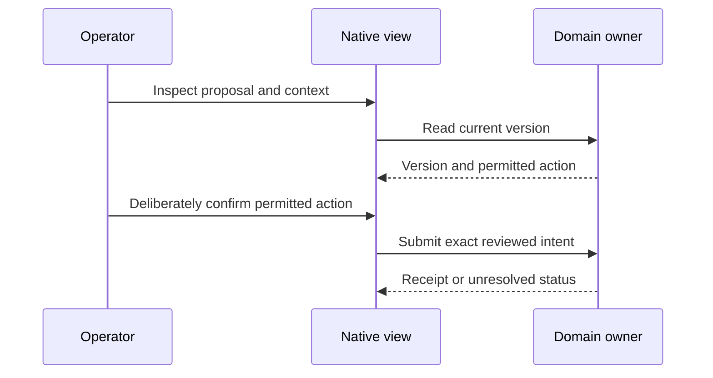
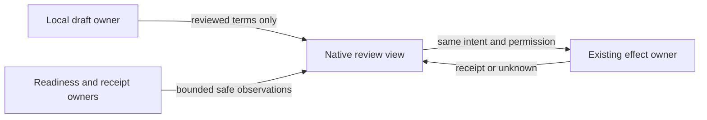
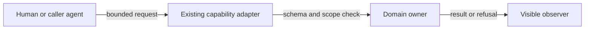
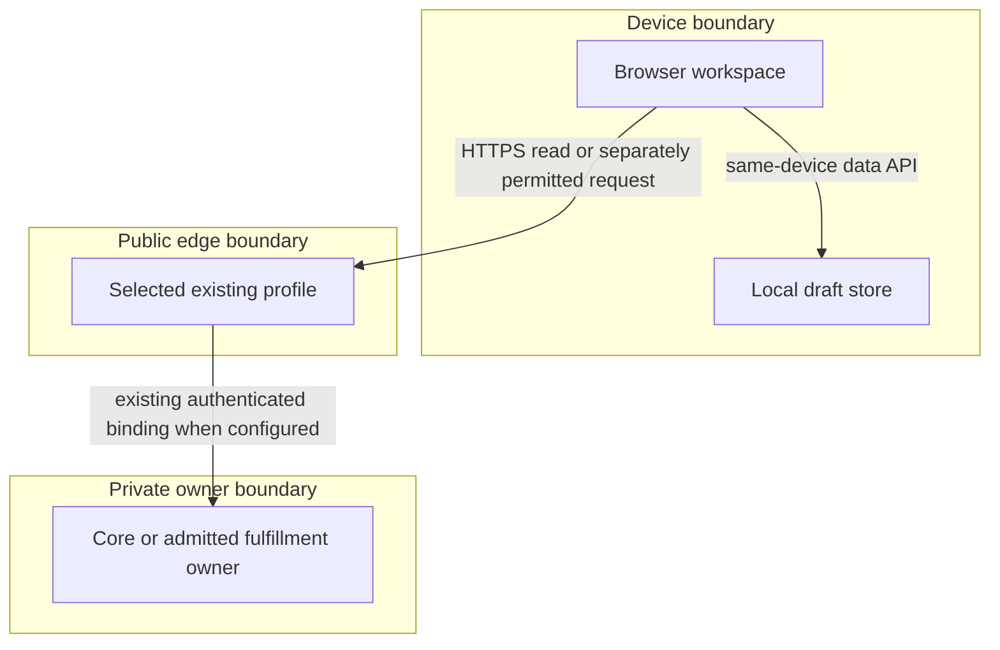

# Reference implementation — native commerce workspace increment

This on-demand companion extends the [product owner](prd-tad-adr-mvp-gtm-edge-commerce-agent.md)
at **`edge-commerce-agent-mvp@0.21.0`**. PRD, TAD, ADR, MVP and GTM below share that join.
The split preserves the <600-line limit and leaves dated sandbox evidence in its original owner.
No second platform, roadmap, capability registry or release controller is introduced.
The [first-dollar sprint](prd-tad-adr-mvp-gtm-20260909T1320Z-solopreneur-mvp-gtm.md)
remains the customer-validation and payment owner. The implementation disposition below distinguishes shipped source, local checks and remaining acceptance.

**Context:** the existing role console and invocation owners already serve local offers; Graph owns
reusable multi-dimensional table visuals. **Intent:** preserve one native list/detail experience.
**Directive CW-D11:** embed the native Graph table and record properties in Commerce.
**Role / action / outcome:** Graph UI and Commerce integration owners extract and consume one
portable rendering core, retaining host storage/effects and $0 new spend. The user selected
“Embed the native table in Commerce”; this covers source implementation and local verification.
Deployment, payment, outreach and complete workspace embedding retain their separate gates.

## Codebase grounding — reference implementation

S0 = Commerce Git commit `77bb835287909c3bc8c260a4304b131c0062258b`, inspected 2026-10-05.
Plan candidate `149b8b1035080e080f899ccd5666c8fbc5b7b8a2` / [PR118](https://github.com/huijoohwee/agentic-commerce-os/pull/118) grounds the native successor `agent/device-0232231d4a19/commerce-fidelity-ui`; canonical stays read-only.
Current baseline C0 is `9f2e6292ad77c52d480060453dde8087967ff02e`, protected in PR120 as `0204010637b0671a1b8a3415c0018c29d62aab85`; Graph G0 is `e551c50c7ad74a99af8a3169409aff36d31642bf`. These are source snapshots, not new runtime observations. Historical CW-D02–09 evidence is retained
below and in the exact predecessor document at S0; it is not re-dated or used to pass CW-D10.
Shared authoring: [guideline 3.4.0][guideline], [templates 1.5.0][templates], [verification][verification].
OS runtime source inspected at `38d0fa4a778316232e1bf34ae4e190db93ff3a6a`; the consumer
[package](../package.json) pins `44da26e7beb7d9aa5da271480f2e0ef34846dfaa`.
Package locks stay unchanged. The source-owned Graph browser artifact/CSS/provenance pin is new; its contract is documented in [runtime composition](commerce-graph-runtime.md#native-data-view-component--reference-implementation).

| ID / exact S0 source | Inspected behavior / disposition | Reuse decision, minimal delta and check |
|---|---|---|
| S1 [workspace.js](../public/local-first/workspace.js), [drafts.js](../public/local-first/drafts.js), [launch.js](../public/local-first/launch.js) | Existing local search, filters, pagination, offer preview, review and import/export; state is browser-local | extend-owner: add profile/project context around existing views; `test/local-first/workspace-browser.mjs`, `merchant-launch.test.mjs` |
| S2 [merchant-page.ts](../src/edge/merchant-page.ts), [merchant.client.js](../src/edge/client/merchant.client.js), [merchant-state.client.js](../src/edge/client/merchant-state.client.js) | Existing full-profile vendor/admin navigation, tab-memory operator session, local proposals and recovery | extend-owner: surface exact proposal/version and recovery action; `test/browser/merchant-workspace.spec.ts` |
| S3 [theme-deployment-store.ts](../src/core/theme-deployment-store.ts), [checkout-session.ts](../src/core/checkout-session.ts) | Existing durable fenced activation, checkout coordination and distinct effect owners | reuse: preserve CAS/claim and checkout semantics; `test/shared/theme-deployment.test.ts`, `test/e2e/dev-paid-loop.spec.ts` |
| S4 [worker.ts](../src/local-first/worker.ts), [readiness.ts](../src/edge/readiness.ts), [release-boundary-projection.ts](../src/core/release-boundary-projection.ts) | Existing local profile source/version response and full-profile exact route readiness; local project/environment views now present; authenticated release projection still absent | reuse: existing bounded readiness view; `test/local-first/readiness.test.mjs`, `test/domain/production-route-proof.test.ts` |
| S5 [mcp.ts](../src/edge/mcp.ts), [webmcp-runtime.ts](../src/edge/client/webmcp-runtime.ts), [capability-map.ts](../src/invocation/capability-map.ts) | Existing authenticated MCP, optional browser tools and upstream sigil coverage; discovery is not authority | reuse: existing schemas/handlers; `check:invocation-surface`, `check:webmcp` |
| S6 [workspace-pack.ts](../src/local-first/workspace-pack.ts), [fulfillment.ts](../src/local-first/fulfillment.ts), [workflow.js](../public/local-first/workflow.js) | Existing pack creation and session-bound workflow start/status/cancel/retry; pack conversion does not execute source | retain-local contracts: show existing service results distinctly; `test/local-first/workspace-pack.test.mjs`, `fulfillment.test.mjs` |
| S7 [local release](../scripts/local-first-release/deployment.mjs), [full release](../scripts/production-release/production-controller.ts), [rollback browser proof](../scripts/local-first-release/rollback-browser.mjs) | Existing independent profile controllers and retained recovery evidence | reuse: read receipt summaries, never provision from the view; `test/local-first/release.test.mjs`, `rollback.test.mjs` |
| S8 [native styles](../public/local-first/style.css), [full-profile styles](../src/edge/experience-styles.ts), [LICENSE](../LICENSE) | Native shell controls and MIT project license | retain shell identity; embedded tables use G1 native styles; browser accessibility and artifact provenance checks |
| G1 Graph G0: native `MarkdownDataViewTableView`, `MarkdownDataViewColumnsTableView`, `grph-shared/ui/themeTokens` | Existing row/column table structure and canonical UI/UX guide | extract one `MarkdownDataViewTableCore` plus plain-data browser adapter; generate pinned local CSS/module, never a second renderer |

| Non-native input claim / provenance | Disposition and native conclusion |
|---|---|
| Operator-supplied public project/environment screens, read 2026-10-04, suggest centralized status and activity | Confirmed as a navigation pattern only; S4/S7 provide native evidence owners; CW-01/02 are a local proposal, not a copied implementation |
| Operator-supplied admin link establishes complete back-office behavior | Unverified: authentication stopped at a second factor; no private admin data inspected. Ground CW-03/04 on S1–S3 instead |
| A new hosted platform or external commerce dependency is needed | Contradicted for the chosen increment: S1–S8 already provide reusable boundaries; new resource allocation is excluded |
| Existing native screens provide a complete commerce suite or multi-tenant control plane | Contradicted: source has bounded offers/themes/checkout; inventory, tax, returns, customer administration and tenant IAM are not established by these views |
| Attractive screens prove demand, production status or zero total cost | Unverified; separate customer, runtime and cost receipts are required |

External material supplies only abstract questions to investigate. It supplies no authored names,
links, assets, source, prompts, packages or runtime dependencies. No parity claim is made.

## PRD — reference implementation

### Buyer, pain and scope

**Vision:** one understandable workspace over portable commerce capabilities: prepare locally,
inspect the intended environment, request only permitted effects, and read the actual outcome.
The initial user and buyer is a solo service merchant; the beneficiary is their shopper. An integrator
and an operator are secondary users. Reachable prospects, geography and willingness to pay are unknown.

| Pain / evidence | Current workaround / measurable outcome | Rank and reason |
|---|---|---|
| CW-P1: offer preparation to reviewed handoff is fragmented; source-observed separation, buyer impact unvalidated | Move between local drafts, vendor proposals and admin; target ≤5 minutes to reviewed export | 1: closest existing buyer journey and setup-service offer; validate before building broader features |
| CW-P2: readiness and failures are easy to confuse across profiles; S2/S4 show different owners | Inspect runtime/API/release evidence manually; target ≤60 seconds to identify profile, source and next blocked action | 2: enables honest operation of the same offer; no proven support savings yet |
| CW-P3: integrations can overstate tool authority; S5 exposes differing surfaces | Read individual schemas and retry unsupported actions; target ≤15 minutes to first correct read/prepare invocation | 3: developer support after merchant comprehension; API breadth alone is not buyer value |

CW-01–CW-08 remain the requirement owners; CW-D10 refinements remain required and CW-D11 adds native reuse. Should: a priced prospect walkthrough of the existing
sandbox. Could: additional native read projections after observed need. **Won't this increment:**
managed infrastructure signup/provisioning, team IAM, organization billing, secrets editing, new SDKs,
new cart/order/ledger stores, inventory, tax, promotions, returns/refunds, shipping, subscriptions,
payouts, multi-currency expansion, autonomous payment, remote draft sync or new AI/model calls.

| VCC / story | Given → when → observable end state and constraint | TAD / ADR / stated acceptance check |
|---|---|---|
| CW-01: operator identifies active context | Given local, sandbox or full-profile evidence, when opening a workspace, then profile, merchant scope, source revision, observed time and unavailable capabilities are explicit; missing evidence says Unknown | W1,W3 / CW-A1,A2 / extend existing workspace/browser and readiness suites with all three profiles and absent evidence |
| CW-02: operator reads environment activity | Given an exact approved receipt or readiness response, when inspecting the selected environment, then source/version/result/next action are shown; stale or mismatched evidence never says deployed/ready | W3 / CW-A2 / extend readiness and production-route-proof cases; candidate/version mismatch, timeout and stale-cache cases must pass |
| CW-03: merchant prepares and resumes | Given a fresh profile, when creating/editing/reviewing/exporting one offer offline, then the exact saved revision survives reload and imports on a second device; private notes stay out of launch data | W1 / CW-A1,A3 / existing merchant-launch checks plus timed fresh-profile browser/export-import test at 360/768/1280 px |
| CW-04: admin recovers publication | Given two concurrent reviewers or an interrupted write, when resuming the proposal, then at most one reviewed version activates and unknown remains unresolved until readback; no silent retry/new intent | W2 / CW-A3 / existing merchant-workspace and theme-deployment tests extended for duplicate tabs, changed base and lost response |
| CW-05: shopper distinguishes outcomes | Given a draft, test checkout or execution result, when opening its details, then preview, test-payment verification and fulfillment each have separate state/receipt; redirects alone never establish success | W1,W2,W5 / CW-A2,A3 / existing checkout, fulfillment and workspace browser suites with incomplete/failed/pending outcomes |
| CW-06: human and agent use the same capability | Given any advertised surface, when invoking a supported read/prepare operation, then schema/result match its owner; tools cannot publish or confirm merely because a human UI can | W4 / CW-A4 / invocation/WebMCP tests plus negative effect tests; unsupported surfaces produce a reason, not an invented alias |
| CW-07: user operates across devices and abilities | Given keyboard, 200% zoom, touch and offline mode, when navigating/recovering, then all review fields/errors are perceivable, focus returns correctly, and actions retain ≥44 px targets; no horizontal page overflow at 360 px | W1,W2 / CW-A1,A3 / existing browser harness extended for dimensions, focus, text status, cancellation and offline reload; physical-device study separately required |
| CW-08: operator locates a merchant project | Given saved drafts, when searching projects and opening a detail, then a compact console shows only that merchant’s offers, original native preview, local storage and explicit environment observation; navigation works offline with no foreign assets or hosted-state invention | W1,W3 / CW-A5 / native workspace browser suite: grouping, filtering, escaped text, detail URL, history, keyboard focus, absent project and responsive offline reload |

### CW-D10/D11 acceptance refinements — reference implementation

F1–F5 retain D10 and F6/F7 add D11. Each consumes an existing CW criterion; none claims whole acceptance or a new registry.
Pain/hook/break/fix/close: CW-P1/P2 → review one real draft → status ambiguity → native state and hierarchy
refinement → exact review with a next action; CW-P3 → inspect one capability → raw arguments/results →
schema-led assistance → correct read. Reuse W1/W3/W4; buyer impact and WTP are still unvalidated.

| Refinement / parent criterion | Observable end state, constraint and named check to extend |
|---|---|
| F1 truthful collection states / CW-01,03,08 | Given delayed or rejected local storage, Shopper/Vendor/Admin distinguish loading, empty, no matches and failure; stale retained rows are labelled. Retry is explicit, never clears drafts or renders a failure as zero offers. Extend `test/local-first/workspace-browser.mjs` with delayed/rejected IndexedDB and successful retry. Target ≤60 s to identify the next action. |
| F2 readable native hierarchy / CW-07,08 | At 360/768/1280 CSS px and 200% text zoom, headings, offer amount/currency, revision and next action remain readable without page overflow; tables scroll within labelled regions. Computed text contrast ≥4.5:1 (large text ≥3:1), controls/focus ≥3:1; ≥44 px targets, keyboard focus, reduced motion and offline font fallback pass in the existing workspace browser suite. No external assets or appearance store. |
| F3 capability discoverability / CW-06,07 | Opening the existing tools panel identifies browser-local vs supplied snapshot vs runtime observation and read-only vs prepare; each of the four tools exposes required fields and its exact invocation, with usable controls when native WebMCP is absent. No auto-invoke on open; extend the workspace browser suite with all four tools, unsupported API and keyboard traversal. Target first correct local read ≤60 s; headless ≤15 min. |
| F4 recovery and result comprehension / CW-02,06 | Summaries use each existing result shape: project counts/list, offer review with revision/economics/human-review requirement, or environment observation; provenance is always visible, absent fields never invented, raw JSON remains inspectable. Errors retain their code and one safe next action; stale revision requires reopen/review, timeout/cancel remains unknown, schema drift disables tools. No automatic retry or intent substitution; extend browser and `workspace-invocation.test.mjs` negatives. |
| F5 private, equivalent handoff / CW-03,06 | For the same selected offer/revision, local UI, optional WebMCP, HTTP, MCP and sigil calls return equal `value` and deliberate provenance differences. Prepared snapshots expose only the selected scope, with field/offer counts visible before sharing; no private notes, cookies, persisted payload or automatic transmission. Extend existing parity tests and browser request assertions; invalid aliases, unknown properties, missing snapshots and cancellation still fail. |
| F6 native list/detail reuse / CW-03,07,08 | Vendor, Admin and project offer lists render through Graph's shared table core; selecting a record shows its property orientation through the same core and the existing edit/review action. Native wrappers also delegate to that core. Keyboard activation, labels, 360/768/1024/1280 px and 200% text resize pass; no duplicate table renderer/theme. |
| F7 bounded local composition / CW-01,03,06 | Lazy mount/update/destroy uses validated plain data and exact pinned local module/CSS. Loading, failure, stale state and disposal races remain explicit; offline after priming works. Generated provenance/byte checks pass; no Graph stores, media, remote calls or authority transfers. Existing MCP/WebMCP `/ @ #` behavior remains unchanged. |

F1/F2 rank first for the nearest offer-review journey, F3/F4 next for correct integration, F5 preserves
the same handoff boundary. Rank is provisional because no validated WTP differentiates these pains.
These outcomes fit the existing five flows: F1/F2 at J1–J3, F3/F4 at J3–J4 and H1–H4, F5 at D1–D4;
F6/F7 reuse the same journey/data flows inside T1 through the native component; T2–T4 effect ownership stays unchanged. No channel/catalog/inventory/order/fulfillment expansion is implied.

All eight VCCs retain **pending human acceptance**. Source checks below prove their named bounded paths,
not whole-product or physical-device acceptance. Acceptance needs surfaced check output and an independent evaluator mechanism.
TTV baselines are unmeasured; the target journey is open → draft → review → export → inspect environment.
A clean-browser stopwatch study precedes implementation baseline sign-off and any savings claim.
Discovery, rendering, local preparation and reads use zero model tokens; user-invoked agents retain their
own measured budgets. No language model decides readiness, prices, authority or financial success.

## TAD — reference implementation

TAD consumes exactly CW-01–CW-08 above; dependencies flow **portable contract → domain owner →
transport adapter → view**. A read projection has no write capability and creates no new truth store.

| Component / source | Single responsibility and smallest delta | Data, limit and recovery |
|---|---|---|
| W1 local workspace / S1,S8 | Reuse current hash navigation and editor; replace Vendor/Admin/project offer table construction with G1 list and selected-record properties | Existing IndexedDB revision checks, 100-draft and 8 MB backup limits; explicit export/import only; no identity/secret storage |
| W2 merchant/admin / S2,S3 | Extend existing proposal detail and unresolved-state controls; preserve operator session boundary | Existing 20-proposal cap and atomic consume; credentials in tab memory; reconnect/reload clears; preserve intent after unknown result |
| W3 environment projection / S4,S7 | Read selected profile/route/candidate and safe receipt summary; single observed runtime shared by local merchant groups, no organization tenancy | Existing ≤20 tab observations, ≤32 KiB readiness response and 5 s read deadline; explicit refresh only; failure cancels and preserves Unknown; no timer polling |
| W4 invocation projection / S5 | Reuse capability map, owner schemas and adapters; add no second dispatcher | Existing upstream sigil semantics; no new command tokens; cancellation propagates; secret values omitted from discovery |
| W5 result detail / S6 | Project existing pack, checkout and fulfillment results without conflating them | Preserve source digest, run/session identity and existing bounds; cancelled/unresolved result cannot be marked delivered |

**W3 contract boundary:** existing public observations cover profile/source/status; the richer authenticated projection remains proposed: profile, merchant identifier, candidate SHA, active version, evidence
reference, observation timestamp, status reason and permitted next action; absent values remain absent.
Prefer existing `/readyz` and `commerce.release.boundary.read` responses. Add fields to the owning
read projection only when the existing contract cannot represent them; version and test that change.
A browser may not fetch arbitrary pasted URLs, expose protected logs or enumerate another principal.
No public projection includes credentials, customer details, private repository data or unredacted logs.
Cached context is explicitly stale and never authorizes writes. No remote draft migration is planned.

### Invocation Register — reference implementation

This is a projection of S5/S6, not a new invocation register. Authoritative sigil mappings remain
`src/invocation/capability-map.ts` plus the admitted upstream catalog; unresolved mappings fail closed.
A URL/hash used for navigation is not automatically a `/`, `@` or `#` capability token.

| Capability identity / owner | Browser / HTTP / MCP | WebMCP and sigils / boundary |
|---|---|---|
| `commerce.merchant.catalog`, `commerce.merchant.theme.stage`, `commerce.merchant.proposals.read` / S2 | Existing browser actions; catalog uses public read; stage/queue are browser-local, no general MCP stage endpoint claimed | Existing optional WebMCP read/prepare; no publish tool, no newly invented sigil mapping |
| `commerce.catalog.search`, `commerce.offer.select`, `commerce.checkout.initiate` / S5 | Browser-only identities sharing shopper handlers; no identical MCP or sigil alias | Optional WebMCP read/select/prepare; human confirmation remains separate; these names require no upstream admission |
| `commerce.catalog.public.list`, `commerce.checkout.prepare`, `commerce.checkout.confirm` / S5 | Separate authenticated full-runtime MCP identities | Global token-map association required; checkout tools return visual-handoff/human-confirmation-required, not agent settlement; no implied browser-name equivalence |
| `commerce.release.boundary.read` / S4,S5 | Existing authenticated full-runtime MCP read; this specific browser projection remains proposed | WebMCP projection unsupported this increment; sigils only if admitted upstream; reads grant no deploy authority |
| `commerce.workspace.{projects.list,project.read,offer.review,environment.read}` / CW-D04 | Local-first runner, read-only HTTP and stateless MCP share `workspace-capabilities.js` | Optional native WebMCP; existing token-map `/ @ #` tuple; explicit snapshot required headlessly; no publish/payment authority |
| `commerce.workspace.program-pack.create` / S6 | Existing service `/api`, `/mcp`, `/service.json` under `services/workspace-pack`; deterministic preparation | Native WebMCP exposure not asserted; no effect execution; service mapping must not be invented |
| `commerce.theme.deploy` / S2,S3,S5 | Existing scoped operator action; visible review/claim/CAS path | Not exposed by merchant WebMCP; broad agent discovery never substitutes for operator scope or exact reviewed base |
| Deployment, payment confirmation, secrets and tenant membership | Existing owner controls outside the proposed projection | Unsupported autonomous effect in CW; no new CLI or skill. Skills may orchestrate admitted commands, never create authority |

### Native design adoption and failure policy

The [native design contract 1.1.0][design] binds one visual owner per surface. S8 `style.css`
owns the Commerce shell, `index.html` owns identity/action labels, and S1 owns local state.
Graph's existing [canonical UI/UX guide][graph-design] owns the embedded data view; do not add
`DESIGN.md`, a competing brand guide or a Commerce table palette. `grph-shared/ui/themeTokens`,
`selectedRowClasses` and native responsive/sticky-header primitives produce its generated CSS.
The portable mount runs inside a bounded host container; scoped native CSS isolates it from shell
selectors. Commerce supplies records, labels and callbacks, never duplicated table JSX or styles.
The same Graph core serves native row/column wrappers and Commerce list/property orientations.
Numeric values stay in native sources; module, CSS and provenance regenerate/pin together.
No remote fonts/media, appearance store, framework installation or runtime Graph connection is added.
Full-profile views and Graph application settings remain outside this bounded read-only adapter.
Selected contrast, keyboard/focus, text resize and offline checks cover affected consumers; physical
device/assistive-technology acceptance remains open. [Runtime composition](commerce-graph-runtime.md)
owns component bounds and recovery. Reverting the adapter/pin together preserves all saved drafts.

**CW-D10 owner deltas:** W1 `workspace.js` (`refresh`, `renderShop`, `renderTable`, `renderProjects`)
now has an explicit shared load/error projection; W1/S8 `style.css` and `index.html` retain semantic
colors, type, code typography, inline icons, labels and original monograms. Mode/palette preferences
are unsupported, not invented. Existing hard-coded chrome values consolidate only within touched
rules; functional text has a .8125rem floor, muted text and control boundaries use tested semantic colors.
W4 `workspace-tools.js` (`mountWorkspaceTools`, `run`) extends its existing form and result view from
`WORKSPACE_TOOLS`; `workspace-capabilities.js` keeps sole schema/validation/handler ownership.
No parallel parser, registry, SDK, store or effect handler. `workspace-service.ts` stays stateless.
Its descriptor now advertises the existing `api`/`mcp`/`invoke` URLs and an exact invocation example;
headless parity tests execute the example. No new route or authority is added.
F4 reuses `evaluateLaunch` reasons/contribution for the selected saved offer; focus the existing editor
for missing terms or non-positive contribution. Never recalculate economics in the presentation layer.
CW-D11 adds one lazy Commerce projection with no domain state; Graph owns the shared core and adapter. The existing host remains under 600 lines; rich Graph editing/media stays in its native wrappers.

| Failure or threat | Required behavior / owner check |
|---|---|
| Stale source/version, wrong route or misleading healthy process | W3 displays Unknown/blocked reason; never promote liveness into readiness; S4 route proof |
| Concurrent edits/publication or lost response | W1 revision rejection; W2 fenced CAS, unresolved record and readback; S2/S3 tests |
| Malformed imported backup, oversized payload or injected markup | Existing validation/byte caps, render text safely, preserve prior draft; S1 import/browser tests |
| Cross-origin request, CSRF, credential leakage or expired session | Existing session/auth/origin checks; no credential persistence/logging; S2/S6 and checkout tests |
| Offline, cancelled fetch or provider failure | Local draft remains usable; remote effects unavailable; no assumed payment/fulfillment; S1/S4/S6 tests |
| Free allowance or license unknown | Local existing-device/FOSS work continues; dependent hosted effect stays disabled until owner supplies exact eligibility/cost evidence |

### Five flows and inventories

All diagrams are CW design projections at version 0.21.0, dated 2026-10-05; topology is unchanged. Rectangles are native
components/stages; rounded nodes are people. No diagram asserts production readiness. Text inventories
provide the mobile/offline alternative; canvas projection is parse-only and consumes zero model tokens.

**Diagram CW-J** · Class: Journey stage map · Notation: flowchart LR · Version: 0.21.0
**Caption:** the merchant reaches a reviewed local offer before choosing any remote effect.

| Node | Stage / criterion |
|---|---|
| J1 | Profile and source / CW-01,02 |
| J2 | Existing editor and private data / CW-03,07 |
| J3 | Exact revision and permitted action / CW-03,04,06 |
| J4 | Preview, payment and fulfillment states / CW-05 |

**Diagram CW-W** · Class: User workflow · Notation: sequenceDiagram · Version: 0.21.0
**Caption:** only a reviewed request reaches the existing owner; an unknown result remains unresolved.

| Node | Happy / alternate / error path |
|---|---|
| U | Review and confirm / stay local / lacks authority, CW-03,04 |
| V | Match current version / cancel / preserve unresolved, CW-01,07 |
| O | Existing CAS receipt / already applied / stale version rejected, CW-04,05 |

**Diagram CW-D** · Class: Data flow · Notation: flowchart LR · Version: 0.21.0
**Caption:** draft content and runtime observations remain distinct inputs to the visible review.

| Node | Data and journey binding |
|---|---|
| D1 | Private draft, J2; omit private notes on export, CW-03 |
| D2 | Profile/source/time, J1/J4; no secrets, CW-01,02 |
| D3 | Presentation only, J3; no new ledger, CW-05,07 |
| D4 | Existing theme/checkout/fulfillment authority, J4; no cross-effect success inference, CW-04,05 |

**Diagram CW-H** · Class: Orchestration / harness flow · Notation: flowchart LR · Version: 0.21.0
**Caption:** an optional agent can discover and prepare only through the admitted owner contract.

| Node | Role / bound / journey binding |
|---|---|
| H1 | Caller at J1–J3; no automatic agent/model allocation |
| H2 | S5 dispatcher, CW-06; existing catalog limits and cancellation |
| H3 | S3/S6 executor; existing effect limits, no agent-created presence receipt |
| H4 | W1–W5 readback at J4; W3 proposed 5 s deadline, no retry loop |

**Diagram CW-T** · Class: Runtime topology · Notation: flowchart TB · Version: 0.21.0
**Caption:** the local browser remains useful alone; online profiles preserve their existing trust boundaries.

| Node | Residency / trust / criterion |
|---|---|
| T1 | User device; local-first UI and optional tools, CW-01,03,06,07 |
| T2 | IndexedDB; no automatic device sync, CW-03 |
| T3 | Selected edge profile; local-only use stays in T1/T2, never silently switch profile, CW-01,02 |
| T4 | Existing private core/relay; provider checkout remains separately owned, CW-04,05 |

## ADR — reference implementation

CW-A1–A4 retain their proposed broader acceptance scope; CW-A5 is accepted for this source increment; accepted EC decisions retain their historical scope.
Constraints are non-compensatory: native reuse, no foreign implementation, $0 new spend, FOSS offline
MVP, <600 lines/file, <500,000 bytes/chunk, race-safe owner effects and no duplicate registry/store.

| Decision | Alternatives and constraint/outcome | Consequence, recovery and revisit trigger |
|---|---|---|
| CW-A1 extend existing workspace | Pass: native extension or current manual views. Fail: copied platform/parallel app (ownership/source constraint). Native extension is preferred for CW-P1 only if study confirms friction | Small UI delta; retain old navigation until acceptance. Revert scoped view without deleting drafts; revisit after timed study |
| CW-A2 read-only environment visibility first | Pass: existing response/receipt projection or manual diagnostics. Fail: hosted control plane/provisioning (cost and effect scope). Projection reduces navigation steps; savings unmeasured | No create-environment/secrets/deploy buttons; show Unknown. Disable projection on contract mismatch; revisit with ≥2 operators needing the same missing action |
| CW-A3 preserve local/CAS/reconciliation semantics | Pass: native revision checks and explicit transfer. Fail: optimistic success, auto-sync or second ledger (race/owner constraints) | More explicit unresolved states; readback/review before retry. Keep persisted formats/pins compatible; revisit only after fault tests |
| CW-A5 derive compact console from drafts | Accepted: existing hash views, merchant grouping and native CSS. Rejected: a second project store, fabricated hosted environments or imported implementation. Preserve semantic density using original content | Up to 100 groups from the existing 100-draft cap; detail shows 10 recent offers. Unknown project gives recovery. Revert views/CSS only; revisit after measured navigation friction |
| CW-A4 reuse invocation owner | Pass: existing schema/handler adapters or contract-only adapter with equivalence proof. Fail: generic extraction/new SDK without two concrete consumers | No local sigil grammar fork; unsupported surfaces remain explicit. Revert adapter/pin together if bytes/errors differ; revisit after measured integration failures |

**CW-A11 / accepted for CW-D10:** extend existing native views and schema-driven assistance.
Direct reuse wins over a new headless engine, query API, design package or generic command palette:
the current four read handlers already cover the selected journey, while replacements add owners,
migration and unproven demand. Retain raw JSON as a disclosure for integrators, with a readable
summary for merchants. Preserve exact input/result bytes and owner error codes across adapters.
Revert only changed views/tests on comprehension or parity regression; draft schemas, reviewed
revisions and effect permissions stay intact. Revisit only on observed buyer need for a missing read.

**CW-A12 / accepted for CW-D11:** the user selected an in-page native table. Extract G1 once for its native row and column wrappers plus Commerce; host callbacks keep editing/review in existing owners. A full-app iframe adds unrelated stores/runtime, copying JSX/CSS creates drift, and a new grid package adds a competing owner. Revert generated pin and projection together; no draft migration. This narrow extraction supersedes CW-A11’s no-extraction choice only for the existing table structure.
Manual diagnostics and the proposed projection are economically incomparable until the study measures
support time; the plan does not invent a weighted commercial score. No contested vendor selection is
needed. Stop decision refinement after three cycles or two cycles without reducing blockers.

## MVP — reference implementation

The smallest increment is **one existing project, one merchant, one reviewed offer and one truthful
environment/result readback**, beginning offline. Organization/team/cloud administration is deferred.
CW-J/W/D/H/T cover every CW criterion; all components W1–W5 map back to the eight criteria; CW-08 adds a local view projection to CW-J/D/T.
The historical sandbox mechanism remains usable within its separate authority, not an R1 prerequisite.

| Phase / buyer outcome | Reuse / smallest delta / owner | Exit and prerequisite | Active bounds / recovery / recheck |
|---|---|---|---|
| R0 reviewable plan / historical; current D11 below | S1–S8; parent + this companion / architect | Eight VCC joins, exact source, five flows, checks and gaps recorded | Original 30 min estimate, 40 min cap; 2 Markdown files/60 KB changed bytes; current bounds in D11 |
| R1 reviewed offer and honest context / historical implemented slice | W1–W3/W5; existing view extensions / commerce UI owner | Historical implementation follow-up; five human baseline walkthroughs remain an acceptance gap; CW-01–05,07 | Historical estimate ≤45 active min, cap 60 min; 12 files/90 KB diff, 0 new runtime modules; current execution uses D11 |
| R1b project navigation / CW-08 | W1/S8 native hash view and CSS / UI owner | Original list/detail, actual merchant scope, no copied assets; search, keyboard, offline and narrow layouts checked | Estimate 40 active min, cap 50 min; ≤7 files/90 KB diff, 0 new modules/packages/services; preserve drafts when reverting UI |
| R2 equivalent agent preparation / historical contract | W4 existing schema/adapters / integration owner | Three merchant browser tools and four workspace reads remain separate implemented contracts; CW-D04 evidence below | Historical 4 active hours estimate, 1-day cap; ≤4 modules/30 KB; current execution uses D11 |
| R3 priced setup pilot / conditional | Existing first-dollar sprint and native demo / product owner | Named consenting prospect, accepted priced deliverable and explicit outreach/collection authority | ≤2 hours preparation, ≤1 hour delivery target; 0 runtime modules/$0 new infrastructure; prospect wait rechecked when response/authority arrives |

Each phase has a maximum of three implementation/alignment iterations. Runtime serving-token cap is
0 for this slice; authoring uses the existing assistant allocation with no new paid account/model or
addon. Authoring token/cost telemetry is unavailable, recorded as unknown rather than a fictitious cap.
No autonomous agent loop is added; source implementation uses the fixed active-time and byte budget. Token telemetry remains unknown.
R1/R2 stop if scope requires a new database or runtime. R3 stops on absent priced need or negative
contribution estimate. Later commerce domains remain Won't until authentic demand changes the rank.

**Demo ≤5 minutes:** Hook 30 s (merchant's workaround), Setup 45 s (context), Probe 90 s (draft/edit),
Reveal 60 s (offline exact review/export, CW-03), Recover 45 s (stale/missing evidence stays Unknown,
CW-02/04), Close 30 s (distinct result and next allowed action, CW-05). This is a target, not measured TTV.
Core functionality, theme alignment, technical integration and usefulness remain unassessed by users for CW.
A fixture result cannot establish physical-device usability, demand or higher experience maturity.

### Deploy boundary and recovery

| Lane / effect | Authority and evidence required | Current disposition / recovery owner |
|---|---|---|
| Authoring → source review | User-authorized embed, exact native START/readmission paths and source-bound checks | Open for CW-D11; RELEASE publishes exact candidates for review |
| Source review → protected main | Exact candidate plus required protected Integration Gate and integration receipt | Not inferred from local checks; use existing OS release owner |
| Main → generated mirror | Separate consumer projection instruction and exact source join | Closed; no authored mirror edits |
| Main → runtime | Product-owned changed-input analysis, cost/license proof, exact deployment authority and receipt | D11 changes local-first assets/cache inputs; production still needs separate exact-candidate approval/readback |
| Runtime → financial/customer effect | Exact effect instruction, current provider/principal/terms and outcome evidence | Closed; separate payment/fulfillment owners and recovery |

Run START → affected checks → RELEASE. DEPLOY is conditional on its separate authority. Source
rollback is a reviewed revert of these paths, preserving receipts and browser drafts; no storage/schema
migration is introduced. Runtime rollback remains the profile controller’s exact retained predecessor.
For a future UI release retain preceding asset/profile revision and draft compatibility. For ambiguous
publication/payment keep intent and receipts, reconcile through the owner, never claim rollback from a
source revert. `production-runtime.md` has older deferred-checkout prose; consult S4/S7 and exact profile
receipts before release. That pre-existing documentation drift is not fresh production evidence.

## GTM — reference implementation

Consume CW-P1–P3, CW-03/05 and the existing first-dollar sprint. Order: **bounded setup/recovery
service → integration help → recurring hosting → transaction take-rate**. Only the first is near-built;
all commercial demand is unvalidated. The offer hypothesis is help one solo merchant prepare and
rehearse one offer with a clear handoff, not sell a complete commerce platform. Do-nothing/manual
workflows remain valid alternatives until the buyer values the difference. No outbound message is sent.

| Experiment / owner | Evidence, target and window | Continue / pivot / stop |
|---|---|---|
| E1 pain and price / product | Five authorized merchant interviews over 7 days; workaround frequency, time lost and offered price; target ≥2 same pain and ≥1 accepted priced pilot | Otherwise revise segment/offer; stop new feature expansion. Price unknown until recorded, no invented WTP |
| E2 activation / UX | Five clean-browser tasks, target 4/5 ≤5 min and 5/5 distinguish draft, sandbox, deployed and paid; device/browser recorded | Fix status comprehension before any effect enablement; repeat only after changed design |
| E3 first dollar / sprint owner | Accepted deliverable, authentic collected amount ≥1 in agreed currency, receipt, acceptance and measured support; within 14 days after authority | Count only collected funds; synthetic checkout and gross volume are not revenue. Repeat demand needs another independently attributed paid use |
| E4 retention / product | Seven-day follow-up on the same merchant's next offer and support minutes | Continue if reused with accepted value; otherwise investigate friction before recurring package |

These are experiment windows after prerequisites, not ETAs for an external response or payment.
Support is initially the existing operator, no hiring/additional system. One unresolved effect at a time;
escalate incidents to the effect owner with redacted source/intent/receipt context. Proposed pilot capacity:
one 60-minute session/day; stop acquisition at that limit until measured delivery supports expansion.

### Economics, obligations and projections

Discovery financial sketch is **incomplete**. Inputs A01 price, A02 reachable prospects, A03 conversion,
A04 delivery/support minutes, A05 labor valuation, A06 payment fees and A07 collection delay are unknown
at 2026-10-04; product/finance owns dated observations. A08 new-infrastructure spend cap = $0 (user
constraint); A09 native serving-model tokens = 0 (design constraint). Hardware, energy, existing-account
allocation and development tokens are unmeasured; free quotas never prove $0 TCO or FOSS hosting.

Local existing-device model admits MIT source/offline preparation; hosted edge and always-on device
service require separate quota, egress, license and operations evidence. No paid plan/addon/overage or
trial requiring payment enrollment is allowed. License uncertainty blocks only its dependent adoption.
Contribution = collected service price − fees − marginal delivery/support cost. Recognized revenue,
collected cash, gross transaction volume and sandbox test amounts remain separate. No cash is claimed.
ADLC cost ledger: R0 has two authored docs, zero runtime resources; measured check times and unavailable
token/labor cost are recorded in Evidence. Lost/repeated checks remain costs, not zero-valued savings.

Before audience handoff, product owns two independent market-sizing methods (reachable segment ×
annual observed demand; separately sourced segment spend/population), geography and timing evidence.
Finance owns linked income/cash-flow/balance-sheet projections and base/downside/upside scenarios with
cash-floor runway. Without these inputs C02/C12/C15 remain deferred; no TAM/SAM/SOM or forecast is
invented. Bootstrap only, no capital raise or dilution; revisit funding only after repeat paid demand.
Jurisdiction, entity/contract terms, data obligations and provider eligibility need a qualified review
owner before a real customer offer; no legal rule is asserted here. Minimize personal data and retain
only necessary evidence references; per-environment retention must be agreed before live operation.

Pitch Deck, Business Plan and Financial Model are deferred projections of this exact join, never new
sources of claims. Product owns their creation after E1 and financial inputs; recheck before any audience
request. Current audience output is this internal planning document. No deck or forecast is represented
as finished.

## From-0-to-1 coverage — reference implementation

All rows bind `edge-commerce-agent-mvp@0.21.0`. Coverage is a disposition, not readiness or validation.
Dispositioned **16/16**; covered applicable **11/16**; deferred **5**; not applicable **0**.

| Domain | Decision / exact source section in this revision | Accountable owner / evidence or gap / next check |
|---|---|---|
| C01 purpose/pain | covered / PRD | Product / S1–S4, unvalidated buyer pain / E1 |
| C02 market/timing | deferred / economics | Product / geography and two-method sizing missing / before audience handoff after E1 |
| C03 offer/alternatives | covered / GTM + ADR | Product / bounded offer and manual alternative, no price / E1 |
| C04 product/experience | covered / PRD | UX / eight VCCs with proposed refinements, baseline absent / E2 |
| C05 architecture/data | covered / TAD | Architect / S1–S8, W1–W5 and five flows / source refresh before R1 |
| C06 quality/security/AI | covered / TAD failures | Engineering / failure checks and zero-model design, execution pending / R1/R2 |
| C07 decisions | covered / ADR | Architect / CW-A1–A4 / admission and fault results |
| C08 smallest slice | covered / MVP | UI owner / bounded scope and demo, no new runtime proof / CW checks |
| C09 acquisition/retention | covered / GTM | Product / E1–E4 planned, no prospect / authorized study |
| C10 operations | covered / GTM + deploy boundary | Operator / one-session capacity hypothesis, owner recovery / pilot drill |
| C11 organization/obligations | deferred / economics | Product / jurisdiction, contract, data review owner unassigned / assign before real customer offer |
| C12 financial viability | deferred / economics | Finance / incomplete inputs/scenarios / after measured pilot inputs |
| C13 capital/milestones | covered / economics + MVP | Product / bootstrap decision and demand gate / repeat paid demand |
| C14 ADLC | covered / deploy boundary + Evidence | Release owner / admitted lane and scoped checks / exact protected receipt |
| C15 audience projections | deferred / economics | Product / no audience handoff or sourced market/model / after C02,C12 |
| C16 learning | deferred / GTM | Product / no observed experiment result / E1–E4 successor Context |

Deferrals keep planning review open and block only their dependent implementation/customer/audience
transition. They are not silently waived. PRD→TAD criterion joins: 8/8; W1–W5→PRD owners: 5/5;
ADR bindings: 8/8. These are authored traceability counts, not completed VCCs or whole-guideline compliance.

## Retained implementation evidence — reference implementation

The [exact predecessor record](https://github.com/huijoohwee/agentic-commerce-os/blob/77bb835287909c3bc8c260a4304b131c0062258b/docs/prd-tad-adr-mvp-gtm-commerce-workspaces.md#implementation-and-evidence--reference-implementation)
retains CW-D02–09's full source/check/receipt histories and older budgets. This consolidation removes
contradictory current-tense rows; historical checks are scoped to their recorded candidates only.

| Implemented increment / native owner | Retained evidence and present limitation |
|---|---|
| CW-D02/03 / W1–W3 | Profile/context, explicit bounded readiness, project grouping, recovery and mobile/offline views implemented. Previous browser and type checks recorded; initial dirty-head and platform-prerequisite failures remain in predecessor. Human, physical-device, zoom and contrast acceptance open. |
| CW-D04 / W4 | Four read schemas/handlers, HTTP + real SDK MCP + sigil service and optional WebMCP implemented. Requests/results 196,608 bytes, snapshot ≤100 offers and ≤192,512 bytes, five-second deadline. Exact revision/private-field/origin/cancellation negatives recorded. Full-runtime registry admission is explicitly not claimed. |
| CW-D05/06 / W1,W2 | Shared role shell, project-context navigation, native preview, saved-offer activity and environment history implemented; 360/768/1280 fixture coverage recorded. Full-profile visual equivalence and user TTV unproven. |
| CW-D07/08 / W3,W4 | Contextual tools dialog and observation detail implemented; explicit run/prepare/enable, exact target scoping, close cancellation/disposal/focus, ≤20 tab-only observations. Historical native-browser checks do not establish support in every browser or current deployment. |
| CW-D09 / W1 | Tab-local navigation collapse and context-preserving project selection implemented. Prior 123/124 local tests stopped on dirty-source binding; final source/runtime facts come only from the next row's receipts. |
| RR-D10 / product owner | Parent retains protected `cb06ee94bcb484d8b62ab48de633a367bb868846`, successful release run `37214188137` and v3 recovery receipt. These historical profile-specific facts are not new CW-D10 runtime proof or payment/demand evidence. |

## Implementation and handoff — reference implementation

**Historical CW-D10 / 0.20.2:** F1–F5 retain acceptance join 0.20.0. Storage recovery, readable controls,
schema-led fields/results and private selected-scope preparation were implemented. PR119/f8a4974 passed
local checks; Linux CI found 768 px/200% header overflow. PR120 corrected wrapping through 1100 px,
added 1024 px coverage and passed [Integration Gate 37280031327](https://github.com/huijoohwee/agentic-commerce-os/actions/runs/37280031327).
Candidate `9f2e6292ad77c52d480060453dde8087967ff02e` integrated as `0204010637b0671a1b8a3415c0018c29d62aab85`.
All 11 local browser groups, focused SDK/HTTP/sigil parity and source guards passed within their scope.
Production was unchanged; those results do not pass the new F6/F7 criteria or human acceptance.

**CW-D11 / 0.21.0:** the accepted source plan reuses native Graph list and selected-record property
views for Vendor/Admin/project offers, with the existing Commerce edit/review actions. The Graph
[0.4.0 plan][graph-plan] and [1.2.0 embed contract][graph-embed] own the shared component; this
five-role join owns host integration. User authorization is the explicit embed option selected in chat.
Clean Graph source `a9a2e31f78e84b984e5176a6f761e5c737ad6ea3` is pinned in [config/graph-data-view.json](../config/graph-data-view.json), including input/output hashes and MIT notices. JS/CSS/token CSS are 168,142/52,697/6,088 bytes. [Graph PR1563](https://github.com/huijoohwee/agentic-graph/pull/1563) is published; protected [run37284086847](https://github.com/huijoohwee/agentic-graph/actions/runs/37284086847) remains pending at authoring.
Graph's ten selected native regressions, four adapter tests, typecheck and repeated byte-identical build pass; two unchanged lazy-media fixtures reproduce at G0, as retained in its plan. This read-only portable subset is not full Graph parity.
Commerce passes six projection/provenance tests, typecheck, authored limits (490 files), invocation (12), WebMCP (6) and real MCP/HTTP/sigil parity (5).
Clean Commerce `5f25ff69f2b7fee4a5c4f089103ec17e673747b2` passes 215 local unit tests and all 11 browser groups plus Program Pack/durable listing at 2026-10-05T08:36:17Z; artifact digest `9ea580c5887a334eaf3179ff427fa58428ba5791e7875515d168fd6a7ce76cf0`. Scope: native list/detail at 360/768/1280 px, 14 px text, Enter/Space and return focus, offline rows/properties, 200% text resize at 360/768/1024/1280 px, storage recovery and no private remote writes. This supersedes the working-source observation only for those checks.
The existing workspace owner now awaits route completion before restoring scroll/focus; checkout assertions pass after this race correction, with no added module.
Evidence patch 0.21.1 retains all five acceptance roles at 0.21.0. Native publication committed 5f25ff6, then stopped at `blocked-publication-stale-base`; no Commerce PR was created. Exact native alignment to `0204010637b0671a1b8a3415c0018c29d62aab85` stopped at `blocked-lane-alignment-overlap`, despite verified equality of predecessor 9f2e629 and squash 020401 trees. The native owner supports only disjoint alignment; preserve this lane for its alignment-owner repair and recheck when that owner supplies a supported transition. No manual bypass or cleanup is authorized by this result.
Graph protected CI, Commerce publication/integration and deployment remain separate open gates. Full-profile local workerd/evaluator prerequisites remain baseline limitations. Physical-device, human/TTV and customer acceptance are unobserved; deployment needs its own approval and retained-reader recovery.

### Existing invocation contract, reference implementation

The single Invocation Register above projects S5 and the token-map owner; this is an executable
example of that contract, not another route declaration. Read `service.json` to obtain exact schemas,
source revision and routing tokens before invoking. Service base is `/agentic-commerce-os/services/workspace`.
HTTP `/api` receives `name` and `arguments`; `/invoke` receives `invocation` and `arguments`; `/mcp`
uses the locked SDK's initialize/list/call lifecycle. The UI prepares calls; it does not send them.

```json
{"invocation":"/tool.route @mcp-gateway #mcp commerce.workspace.projects.list","arguments":{"snapshot":{"schema":"commerce.workspace-snapshot/v1","offers":[]}}}
```

Empty data is a valid example yielding the local unassigned workspace; it is not customer evidence.
`project.read` needs `projectId`; `offer.review` needs `offerId` and `expectedRevision`; both need
a headless snapshot. `environment.read` accepts no snapshot and reads current runtime state.
Browser-local reads can work offline after cache priming; HTTP/MCP need a reachable service, and
environment observations need the configured runtime. Native WebMCP is optional and feature-detected;
the ordinary tool runner remains available. No browser-version support promise is inferred from fixtures.
The transport rejects foreign Origin, cookies and Authorization; clients send `credentials: omit`.
Local prepared snapshots contain merchant titles, audience, outcome and cost estimates: review before
sharing. Read-only is not confidential hosting. No writes, order submission, publication or payment
confirmation are added. Exact sigil spelling/order is required; standalone aliases are unsupported.

### Bounded next increment and first-dollar path

CW-D11: 60–75 active minutes, 25 admitted paths across Graph and Commerce, ≤140 kB authored
changed bytes excluding generated dependency artifacts/provenance; report generated bytes separately.
Three new runtime owners: Graph core/adapter and Commerce projection; one Graph-owned generator.
Every authored file <600 lines; every chunk <500,000 bytes; zero new paid plans/addons/overages,
serving-model tokens or runtime service prerequisites. Existing locked FOSS dependencies only.
Lazy-load the view on relevant surfaces; cache exact local artifacts for offline use after priming.
Three review cycles; refresh the cap on drift. Provider waits name a missing receipt and recheck on
results/source drift, without a delivery ETA. Human acceptance waits for E1/E2 actual observations.

Graph source → generated module/CSS/provenance → Commerce pin/integration → affected checks →
exact protected source gates is the release order. Production remains separately authorized; the
current runtime, storage schema and checkout authority do not change from source integration.
Revert consumer projection and pin together; recover saved drafts through the existing owner.
The first-dollar rank remains setup/recovery service → integration help → recurring hosting →
take-rate. Target ≤60 seconds from collection to correct record/next permitted action; measure E2
before claiming savings. No outreach, payment, inventory/channel expansion or hosted dependency.
Authoring token/CI/labor cost remains unknown; passing fixtures are not demand or revenue.

| Finding Type | Severity / Rule ID and rule text | Artifact / evidence | Owner and remediation |
|---|---|---|---|
| missing-economics-metric | major / time-to-value#2: validate TTV in a clean environment | PRD: baseline unmeasured | UX; run E2 before baseline sign-off |
| pain-point-not-validated | major / pain-point-to-feature-mapping#1: label each pain by evidence status | CW-P1–P3: hypotheses, no priced prospect | Product; E1 and successor record |
| unimplemented-guideline | major / overview#1: disposition domains with evidence or explicit gap | C02,C11,C12,C15,C16 deferred with triggers | Named coverage owners; close before dependent transition |

No claim of exhaustive conformance or baseline acceptance is made. Independent runtime evaluation,
clean-device TTV and buyer evidence remain open. Recheck after source/criterion/authority drift;
stop after three alignment cycles or two without blocker reduction.

| PRD-TAD-ADR-MVP-GTM | CID | RAO | Updated Date |
|---|---|---|---|
| Historical console delivery handoff | edge-commerce-agent-mvp@0.16.0 / CW-D09, RR-D10 | UI/runtime owners → retain exact source and delivery receipts → Development: cb06 protected integration; Production Release: successful run 37214188137/v3 receipt; Runtime: public browser and actual-listing recovery passed; human acceptance remains open | 2026-10-04 |
| CW-D11 native reuse | edge-commerce-agent-mvp@0.21.0 / F6–F7 | Graph/Commerce owners → one core and pinned local adapter → clean 5f25 local checks pass; native source publication blocked on alignment-owner repair, runtime/human acceptance separate | 2026-10-05 |
| Next authorized planning action | Same join / CW-P1 | Product → identify one reachable merchant and proposed priced outcome → E1 inputs; prerequisite: explicit contact authority, recheck on supplied prospect | 2026-10-04 |
| Next acceptance action | Same join / CW-01–08 | Product/QA → run five human baseline tasks and resolve full-runtime prerequisites → independently bound acceptance; recheck when participants/runtime are available | 2026-10-04 |

[guideline]: https://github.com/huijoohwee/huijoohwee.github.io/blob/82835ac37d524643faa6b9703cb077ea9474ab15/guidelines/prd-tad-adr-mvp-gtm-guidelines.md
[templates]: https://github.com/huijoohwee/huijoohwee.github.io/blob/82835ac37d524643faa6b9703cb077ea9474ab15/guidelines/prd-tad-adr-mvp-gtm-templates.md
[verification]: https://github.com/huijoohwee/huijoohwee.github.io/blob/82835ac37d524643faa6b9703cb077ea9474ab15/guidelines/prd-tad-adr-mvp-gtm-verification.md

[design]: https://github.com/huijoohwee/huijoohwee.github.io/blob/82835ac37d524643faa6b9703cb077ea9474ab15/guidelines/design-theme-contract.md

The current join also includes [RR-D10 production readiness recovery](prd-tad-adr-mvp-gtm-edge-commerce-agent.md#rr-d10--production-readiness-recovery-reference-implementation): bounded host observations, explicit degraded UI and required candidate-bound rollback proof. That owner records cb06 integration, successful run 37214188137 and exact v3 artifact/recovery receipts. The pinned host remains device-session availability; human/WTP acceptance and full-profile evidence remain open. This historical evidence amendment consumed the 0.16.0 requirement join; MCP/WebMCP and `/ @ #` contracts are unchanged.

[graph-design]: https://github.com/huijoohwee/agentic-graph/blob/a9a2e31f78e84b984e5176a6f761e5c737ad6ea3/docs/documents/agentic-graph-ui-ux-design-document.md#global-appearance-authority
[graph-plan]: https://github.com/huijoohwee/agentic-graph/blob/a9a2e31f78e84b984e5176a6f761e5c737ad6ea3/docs/documents/agentic-graph-agentic-commerce-platform-planning-prd-tad-adr-mvp-gtm.md#native-data-view-reuse--reference-implementation
[graph-embed]: https://github.com/huijoohwee/agentic-graph/blob/a9a2e31f78e84b984e5176a6f761e5c737ad6ea3/docs/documents/agentic-graph-embeddability-contract.md#portable-native-data-view--reference-implementation
