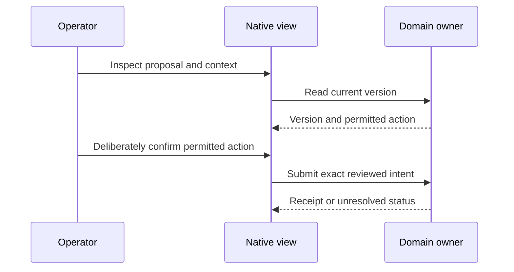
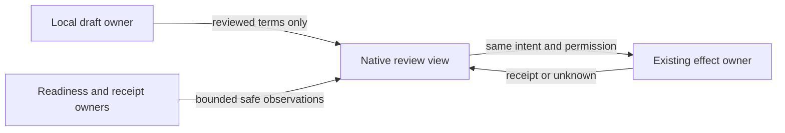
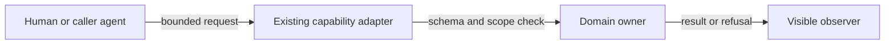
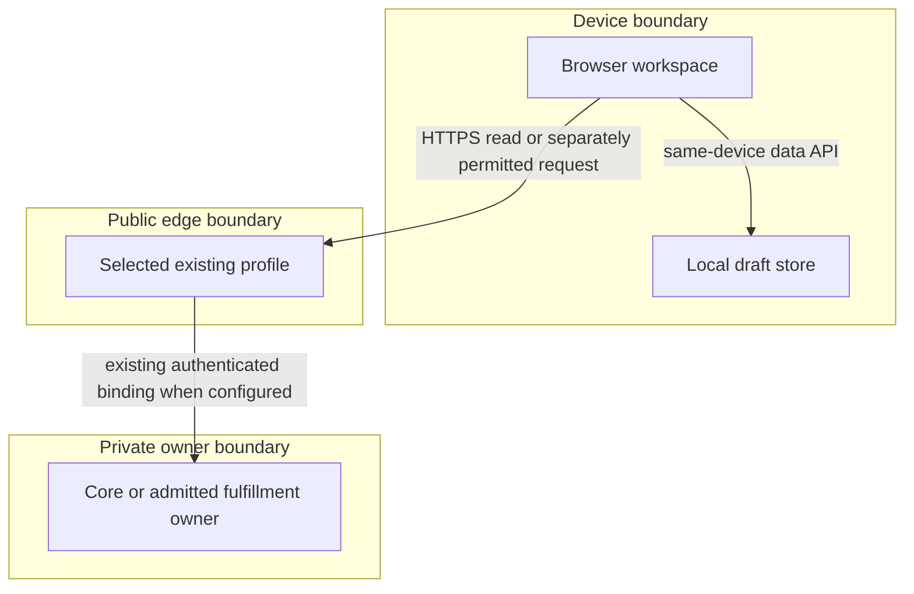

# Reference implementation — native commerce workspace increment

This on-demand companion extends the [product owner](prd-tad-adr-mvp-gtm-edge-commerce-agent.md)
at **`edge-commerce-agent-mvp@0.13.0`**. PRD, TAD, ADR, MVP and GTM below share that join.
The split preserves the <600-line limit and leaves dated sandbox evidence in its original owner.
No second platform, roadmap, capability registry or release controller is introduced.
The [first-dollar sprint](prd-tad-adr-mvp-gtm-20260909T1320Z-solopreneur-mvp-gtm.md)
remains the customer-validation and payment owner. The implementation disposition below distinguishes shipped source, local checks and remaining acceptance.

**Context:** local source at S0 implements drafts, staged publication, sandbox checkout and bounded
service execution, but splits their status across different profiles and views. **Intent:** help one
operator prepare an offer, understand where it can run, and recover the next blocked step.
**Directive CW-D03:** refine the local Admin project list/detail with original native composition,
retaining CW-D02 environment/recovery behavior and verifying the live local UI.
**Role/Subject:** Commerce UI owner. **Action/Verb:** implement and verify. **Object:** native workspace
increment. **Outcome:** criterion → native owner → check → remaining-gap traceability, with $0 new spend.
The follow-up “IMPLEMENT recommendations; live ui verification” grants implementation and local UI
checks. The fidelity follow-up covers native layout, density and navigation; copying source, assets or brand
content is excluded. Neither follow-up grants deployment, outreach, provisioning or money effects.

## Codebase grounding — reference implementation

S0 = Commerce Git commit `f2284eff42d3903d8c72d23cc919d3d72aadba9c`, inspected 2026-10-04.
S0 grounds the plan; implementation starts from published plan commit
`e305f61bd6ecdf14f65eceb44c894ec4dc0636f8` in successor branch
`agent/device-0232231d4a19/commerce-workspace-ui`, then verification successor
`agent/device-0232231d4a19/commerce-workspace-verification` from `9bb287ec89177fc60980732bc48806e4bfbb8016`.
The current fidelity successor starts at `6c6a9d825431aee015a5bba8d45e3c5b4dfffbfd` in
`agent/device-0232231d4a19/commerce-console-fidelity`. Implementation rows refer to the retained diff;
the native publication receipt binds the final candidate without a self-referential commit hash.
The parent retains older sandbox receipt pins; S0 is a code snapshot, not an observed deployment.
Shared authoring: [guideline 3.4.0][guideline], [templates 1.5.0][templates], [verification][verification].
OS runtime source inspected at `1d3e803f9c28c33ab41f3bf6755e760426e1c956`; the consumer's
[package](../package.json) remains pinned to `8a40d044fe09e2f5eef48407257dd08d0d385c88`.
No pin or lockfile is changed. Cross-repository reuse uses declared exports or versioned protocols.

| ID / exact S0 source | Inspected behavior / disposition | Reuse decision, minimal delta and check |
|---|---|---|
| S1 [workspace.js](../public/local-first/workspace.js), [drafts.js](../public/local-first/drafts.js), [launch.js](../public/local-first/launch.js) | Existing local search, filters, pagination, offer preview, review and import/export; state is browser-local | extend-owner: add profile/project context around existing views; `test/local-first/workspace-browser.mjs`, `merchant-launch.test.mjs` |
| S2 [merchant-page.ts](../src/edge/merchant-page.ts), [merchant.client.js](../src/edge/client/merchant.client.js), [merchant-state.client.js](../src/edge/client/merchant-state.client.js) | Existing full-profile vendor/admin navigation, tab-memory operator session, local proposals and recovery | extend-owner: surface exact proposal/version and recovery action; `test/browser/merchant-workspace.spec.ts` |
| S3 [theme-deployment-store.ts](../src/core/theme-deployment-store.ts), [checkout-session.ts](../src/core/checkout-session.ts) | Existing durable fenced activation, checkout coordination and distinct effect owners | reuse: preserve CAS/claim and checkout semantics; `test/shared/theme-deployment.test.ts`, `test/e2e/dev-paid-loop.spec.ts` |
| S4 [worker.ts](../src/local-first/worker.ts), [readiness.ts](../src/edge/readiness.ts), [release-boundary-projection.ts](../src/core/release-boundary-projection.ts) | Existing local profile source/version response and full-profile exact route readiness; no unified project/environment dashboard | extend-owner: bounded read projection only; `test/local-first/readiness.test.mjs`, `test/domain/production-route-proof.test.ts` |
| S5 [mcp.ts](../src/edge/mcp.ts), [webmcp-runtime.ts](../src/edge/client/webmcp-runtime.ts), [capability-map.ts](../src/invocation/capability-map.ts) | Existing authenticated MCP, optional browser tools and upstream sigil coverage; discovery is not authority | reuse: existing schemas/handlers; `check:invocation-surface`, `check:webmcp` |
| S6 [workspace-pack.ts](../src/local-first/workspace-pack.ts), [fulfillment.ts](../src/local-first/fulfillment.ts), [workflow.js](../public/local-first/workflow.js) | Existing pack creation and session-bound workflow start/status/cancel/retry; pack conversion does not execute source | retain-local contracts: show existing service results distinctly; `test/local-first/workspace-pack.test.mjs`, `fulfillment.test.mjs` |
| S7 [local release](../scripts/local-first-release/deployment.mjs), [full release](../scripts/production-release/production-controller.ts), [rollback browser proof](../scripts/local-first-release/rollback-browser.mjs) | Existing independent profile controllers and retained recovery evidence | reuse: read receipt summaries, never provision from the view; `test/local-first/release.test.mjs`, `rollback.test.mjs` |
| S8 [native styles](../public/local-first/style.css), [full-profile styles](../src/edge/experience-styles.ts), [LICENSE](../LICENSE) | Existing native CSS/semantic controls and MIT project license | retain-local styling; no new framework or asset import; browser accessibility checks and lockfile diff |

| Non-native input claim / provenance | Disposition and native conclusion |
|---|---|
| Operator-supplied public project/environment screens, read 2026-10-04, suggest centralized status and activity | Confirmed as a navigation pattern only; S4/S7 provide native evidence owners; CW-01/02 are a local proposal, not a copied implementation |
| Operator-supplied admin link establishes complete back-office behavior | Unverified: authentication stopped at a second factor; no private admin data inspected. Ground CW-03/04 on S1–S3 instead |
| A new hosted platform or external commerce dependency is needed | Contradicted for the chosen increment: S1–S8 already provide reusable boundaries; new resource allocation is excluded |
| Existing native screens provide a complete commerce suite or multi-tenant control plane | Contradicted: source has bounded offers/themes/checkout; inventory, tax, returns, customer administration and tenant IAM are not established by these views |
| Attractive screens prove demand, production status or zero total cost | Unverified; separate customer, runtime and cost receipts are required |

External material supplies only abstract questions to investigate. It supplies no authored names,
links, assets, source, prompts, packages or runtime dependencies. No parity claim is made.

## PRD — reference implementation

### Buyer, pain and scope

**Vision:** one understandable workspace over portable commerce capabilities: prepare locally,
inspect the intended environment, request only permitted effects, and read the actual outcome.
The initial user and buyer is a solo service merchant; the beneficiary is their shopper. An integrator
and an operator are secondary users. Reachable prospects, geography and willingness to pay are unknown.

| Pain / evidence | Current workaround / measurable outcome | Rank and reason |
|---|---|---|
| CW-P1: offer preparation to reviewed handoff is fragmented; source-observed separation, buyer impact unvalidated | Move between local drafts, vendor proposals and admin; target ≤5 minutes to reviewed export | 1: closest existing buyer journey and setup-service offer; validate before building broader features |
| CW-P2: readiness and failures are easy to confuse across profiles; S2/S4 show different owners | Inspect runtime/API/release evidence manually; target ≤60 seconds to identify profile, source and next blocked action | 2: enables honest operation of the same offer; no proven support savings yet |
| CW-P3: integrations can overstate tool authority; S5 exposes differing surfaces | Read individual schemas and retry unsupported actions; target ≤15 minutes to first correct read/prepare invocation | 3: developer support after merchant comprehension; API breadth alone is not buyer value |

Must for R1: CW-01–CW-08 as bounded below. Should: a priced prospect walkthrough of the existing
sandbox. Could: additional native read projections after observed need. **Won't this increment:**
managed infrastructure signup/provisioning, team IAM, organization billing, secrets editing, new SDKs,
new cart/order/ledger stores, inventory, tax, promotions, returns/refunds, shipping, subscriptions,
payouts, multi-currency expansion, autonomous payment, remote draft sync or new AI/model calls.

| VCC / story | Given → when → observable end state and constraint | TAD / ADR / stated acceptance check |
|---|---|---|
| CW-01: operator identifies active context | Given local, sandbox or full-profile evidence, when opening a workspace, then profile, merchant scope, source revision, observed time and unavailable capabilities are explicit; missing evidence says Unknown | W1,W3 / CW-A1,A2 / extend existing workspace/browser and readiness suites with all three profiles and absent evidence |
| CW-02: operator reads environment activity | Given an exact approved receipt or readiness response, when inspecting the selected environment, then source/version/result/next action are shown; stale or mismatched evidence never says deployed/ready | W3 / CW-A2 / extend readiness and production-route-proof cases; candidate/version mismatch, timeout and stale-cache cases must pass |
| CW-03: merchant prepares and resumes | Given a fresh profile, when creating/editing/reviewing/exporting one offer offline, then the exact saved revision survives reload and imports on a second device; private notes stay out of launch data | W1 / CW-A1,A3 / existing merchant-launch checks plus timed fresh-profile browser/export-import test at 360/768/1280 px |
| CW-04: admin recovers publication | Given two concurrent reviewers or an interrupted write, when resuming the proposal, then at most one reviewed version activates and unknown remains unresolved until readback; no silent retry/new intent | W2 / CW-A3 / existing merchant-workspace and theme-deployment tests extended for duplicate tabs, changed base and lost response |
| CW-05: shopper distinguishes outcomes | Given a draft, test checkout or execution result, when opening its details, then preview, test-payment verification and fulfillment each have separate state/receipt; redirects alone never establish success | W1,W2,W5 / CW-A2,A3 / existing checkout, fulfillment and workspace browser suites with incomplete/failed/pending outcomes |
| CW-06: human and agent use the same capability | Given any advertised surface, when invoking a supported read/prepare operation, then schema/result match its owner; tools cannot publish or confirm merely because a human UI can | W4 / CW-A4 / invocation/WebMCP tests plus negative effect tests; unsupported surfaces produce a reason, not an invented alias |
| CW-07: user operates across devices and abilities | Given keyboard, 200% zoom, touch and offline mode, when navigating/recovering, then all review fields/errors are perceivable, focus returns correctly, and actions retain ≥44 px targets; no horizontal page overflow at 360 px | W1,W2 / CW-A1,A3 / existing browser harness extended for dimensions, focus, text status, cancellation and offline reload; physical-device study separately required |

| CW-08: operator locates a merchant project | Given saved drafts, when searching projects and opening a detail, then a compact console shows only that merchant’s offers, original native preview, local storage and explicit environment observation; navigation works offline with no imported assets or hosted-state invention | W1,W3 / CW-A5 / native workspace browser suite: grouping, filtering, escaped text, detail URL, history, keyboard focus, absent project and responsive offline reload |

All eight VCCs retain **pending human acceptance**. Source checks below prove their named bounded paths,
not whole-product or physical-device acceptance. Acceptance needs surfaced check output and an independent evaluator mechanism.
TTV baselines are unmeasured; the target journey is open → draft → review → export → inspect environment.
A clean-browser stopwatch study precedes implementation baseline sign-off and any savings claim.
Discovery, rendering, local preparation and reads use zero model tokens; user-invoked agents retain their
own measured budgets. No language model decides readiness, prices, authority or financial success.

## TAD — reference implementation

TAD consumes exactly CW-01–CW-08 above; dependencies flow **portable contract → domain owner →
transport adapter → view**. A read projection has no write capability and creates no new truth store.

| Component / source | Single responsibility and smallest delta | Data, limit and recovery |
|---|---|---|
| W1 local workspace / S1,S8 | Extend current hash navigation and offer tables with context and next-step details; use existing editor | Existing IndexedDB revision checks, 100-draft and 8 MB backup limits; explicit export/import only; no identity/secret storage |
| W2 merchant/admin / S2,S3 | Extend existing proposal detail and unresolved-state controls; preserve operator session boundary | Existing 20-proposal cap and atomic consume; credentials in tab memory; reconnect/reload clears; preserve intent after unknown result |
| W3 environment projection / S4,S7 | Read selected profile/route/candidate and safe receipt summary; single observed runtime shared by local merchant groups, no organization tenancy | Proposed ≤20 activity summaries, ≤32 KB response and 5 s read deadline; explicit refresh only; failure cancels and preserves Unknown; no timer polling |
| W4 invocation projection / S5 | Reuse capability map, owner schemas and adapters; add no second dispatcher | Existing upstream sigil semantics; no new command tokens; cancellation propagates; secret values omitted from discovery |
| W5 result detail / S6 | Project existing pack, checkout and fulfillment results without conflating them | Preserve source digest, run/session identity and existing bounds; cancelled/unresolved result cannot be marked delivered |

**Proposed W3 read contract:** profile, merchant identifier, candidate SHA, active version, evidence
reference, observation timestamp, status reason and permitted next action; absent values remain absent.
Prefer existing `/readyz` and `commerce.release.boundary.read` responses. Add fields to the owning
read projection only when the existing contract cannot represent them; version and test that change.
A browser may not fetch arbitrary pasted URLs, expose protected logs or enumerate another principal.
No public projection includes credentials, customer details, private repository data or unredacted logs.
Cached context is explicitly stale and never authorizes writes. No remote draft migration is planned.

### Invocation surface contract

This is a projection of S5/S6, not a new invocation register. Authoritative sigil mappings remain
`src/invocation/capability-map.ts` plus the admitted upstream catalog; unresolved mappings fail closed.
A URL/hash used for navigation is not automatically a `/`, `@` or `#` capability token.

| Capability identity / owner | Browser / HTTP / MCP | WebMCP and sigils / boundary |
|---|---|---|
| `commerce.merchant.catalog`, `commerce.merchant.theme.stage`, `commerce.merchant.proposals.read` / S2 | Existing browser actions; catalog uses public read; stage/queue are browser-local, no general MCP stage endpoint claimed | Existing optional WebMCP read/prepare; no publish tool, no newly invented sigil mapping |
| `commerce.catalog.search`, `commerce.offer.select`, `commerce.checkout.initiate` / S5 | Existing shopper controls; full runtime owns discovery/checkout transports | Existing WebMCP prepare only; human confirmation remains separate; upstream mapping must resolve before dispatch |
| `commerce.release.boundary.read` / S4,S5 | Existing authenticated full-runtime MCP read; W3 browser projection proposed | WebMCP projection unsupported this increment; sigils only if admitted upstream; reads grant no deploy authority |
| `commerce.workspace.{projects.list,project.read,offer.review,environment.read}` / CW-D04 | Local-first runner, read-only HTTP and stateless MCP share `workspace-capabilities.js` | Optional native WebMCP; existing token-map `/ @ #` tuple; explicit snapshot required headlessly; no publish/payment authority |
| `commerce.workspace.program-pack.create` / S6 | Existing service `/api`, `/mcp`, `/service.json` under `services/workspace-pack`; deterministic preparation | Native WebMCP exposure not asserted; no effect execution; service mapping must not be invented |
| `commerce.theme.deploy` / S2,S3,S5 | Existing scoped operator action; visible review/claim/CAS path | Not exposed by merchant WebMCP; broad agent discovery never substitutes for operator scope or exact reviewed base |
| Deployment, payment confirmation, secrets and tenant membership | Existing owner controls outside the proposed projection | Unsupported autonomous effect in CW; no new CLI or skill. Skills may orchestrate admitted commands, never create authority |

### Native design adoption and failure policy

S8 owns local colors, spacing, typography, icons/monograms and responsive controls. Retain the current
semantic HTML/CSS and S1 editor; no new design system, font download, illustration dependency or parallel
Settings page. Existing filters/navigation are reused; shared cross-profile preference synchronization
is unsupported. These are reuse decisions, not a claim of design-token parity across runtimes.
CW-07/08 supply focus, accessible names, status text and responsive checks. The adopted policy is
[native design contract 1.1.0][design]. S8's `style.css` remains the token/rendering owner, `index.html`
the Airvio identity/action-label owner, and S1 the state/projection owner; no appearance store exists.
Console neutrals, density and sidebar/card composition are scoped to local Admin. Original previews
reuse existing monograms and launch-safe text. The full-profile adapter is deliberately outside CW-08.
Numeric values remain in native CSS; the publication receipt pins final bytes. No remote font/icon,
image, source code or runtime package is consumed. Full contrast, zoom and assistive-technology
acceptance remain gaps; screenshots and layout checks are not an accessibility conformance claim.

| Failure or threat | Required behavior / owner check |
|---|---|
| Stale source/version, wrong route or misleading healthy process | W3 displays Unknown/blocked reason; never promote liveness into readiness; S4 route proof |
| Concurrent edits/publication or lost response | W1 revision rejection; W2 fenced CAS, unresolved record and readback; S2/S3 tests |
| Malformed imported backup, oversized payload or injected markup | Existing validation/byte caps, render text safely, preserve prior draft; S1 import/browser tests |
| Cross-origin request, CSRF, credential leakage or expired session | Existing session/auth/origin checks; no credential persistence/logging; S2/S6 and checkout tests |
| Offline, cancelled fetch or provider failure | Local draft remains usable; remote effects unavailable; no assumed payment/fulfillment; S1/S4/S6 tests |
| Free allowance or license unknown | Local existing-device/FOSS work continues; dependent hosted effect stays disabled until owner supplies exact eligibility/cost evidence |

### Five flows and inventories

All diagrams are proposed CW projections at version 0.13.0, dated 2026-10-04. Rectangles are native
components/stages; rounded nodes are people. No diagram asserts production readiness. Text inventories
provide the mobile/offline alternative; canvas projection is parse-only and consumes zero model tokens.

**Diagram CW-J** · Class: Journey stage map · Notation: flowchart LR · Version: 0.13.0
**Caption:** the merchant reaches a reviewed local offer before choosing any remote effect.

| Node | Stage / criterion |
|---|---|
| J1 | Profile and source / CW-01,02 |
| J2 | Existing editor and private data / CW-03,07 |
| J3 | Exact revision and permitted action / CW-03,04,06 |
| J4 | Preview, payment and fulfillment states / CW-05 |

**Diagram CW-W** · Class: User workflow · Notation: sequenceDiagram · Version: 0.13.0
**Caption:** only a reviewed request reaches the existing owner; an unknown result remains unresolved.

| Node | Happy / alternate / error path |
|---|---|
| U | Review and confirm / stay local / lacks authority, CW-03,04 |
| V | Match current version / cancel / preserve unresolved, CW-01,07 |
| O | Existing CAS receipt / already applied / stale version rejected, CW-04,05 |

**Diagram CW-D** · Class: Data flow · Notation: flowchart LR · Version: 0.13.0
**Caption:** draft content and runtime observations remain distinct inputs to the visible review.

| Node | Data and journey binding |
|---|---|
| D1 | Private draft, J2; omit private notes on export, CW-03 |
| D2 | Profile/source/time, J1/J4; no secrets, CW-01,02 |
| D3 | Presentation only, J3; no new ledger, CW-05,07 |
| D4 | Existing theme/checkout/fulfillment authority, J4; no cross-effect success inference, CW-04,05 |

**Diagram CW-H** · Class: Orchestration / harness flow · Notation: flowchart LR · Version: 0.13.0
**Caption:** an optional agent can discover and prepare only through the admitted owner contract.

| Node | Role / bound / journey binding |
|---|---|
| H1 | Caller at J1–J3; no automatic agent/model allocation |
| H2 | S5 dispatcher, CW-06; existing catalog limits and cancellation |
| H3 | S3/S6 executor; existing effect limits, no agent-created presence receipt |
| H4 | W1–W5 readback at J4; W3 proposed 5 s deadline, no retry loop |

**Diagram CW-T** · Class: Runtime topology · Notation: flowchart TB · Version: 0.13.0
**Caption:** the local browser remains useful alone; online profiles preserve their existing trust boundaries.

| Node | Residency / trust / criterion |
|---|---|
| T1 | User device; local-first UI and optional tools, CW-01,03,06,07 |
| T2 | IndexedDB; no automatic device sync, CW-03 |
| T3 | Selected edge profile; local-only use stays in T1/T2, never silently switch profile, CW-01,02 |
| T4 | Existing private core/relay; provider checkout remains separately owned, CW-04,05 |

## ADR — reference implementation

CW-A1–A4 retain their proposed broader acceptance scope; CW-A5 is accepted for this source increment; accepted EC decisions retain their historical scope.
Constraints are non-compensatory: native reuse, no imported implementation, $0 new spend, FOSS offline
MVP, <600 lines/file, <500,000 bytes/chunk, race-safe owner effects and no duplicate registry/store.

| Decision | Alternatives and constraint/outcome | Consequence, recovery and revisit trigger |
|---|---|---|
| CW-A1 extend existing workspace | Pass: native extension or current manual views. Fail: copied platform/parallel app (ownership/source constraint). Native extension is preferred for CW-P1 only if study confirms friction | Small UI delta; retain old navigation until acceptance. Revert scoped view without deleting drafts; revisit after timed study |
| CW-A2 read-only environment visibility first | Pass: existing response/receipt projection or manual diagnostics. Fail: hosted control plane/provisioning (cost and effect scope). Projection reduces navigation steps; savings unmeasured | No create-environment/secrets/deploy buttons; show Unknown. Disable projection on contract mismatch; revisit with ≥2 operators needing the same missing action |
| CW-A3 preserve local/CAS/reconciliation semantics | Pass: native revision checks and explicit transfer. Fail: optimistic success, auto-sync or second ledger (race/owner constraints) | More explicit unresolved states; readback/review before retry. Keep persisted formats/pins compatible; revisit only after fault tests |
| CW-A5 derive compact console from drafts | Accepted: existing hash views, merchant grouping and native CSS. Rejected: a second project store, fabricated hosted environments or imported implementation. Preserve semantic density using original content | Up to 100 groups from the existing 100-draft cap; detail shows 10 recent offers. Unknown project gives recovery. Revert views/CSS only; revisit after measured navigation friction |
| CW-A4 reuse invocation owner | Pass: existing schema/handler adapters or contract-only adapter with equivalence proof. Fail: generic extraction/new SDK without two concrete consumers | No local sigil grammar fork; unsupported surfaces remain explicit. Revert adapter/pin together if bytes/errors differ; revisit after measured integration failures |

Direct reuse outranks extraction on fewer owners and migration surfaces, given the hard constraints.
Manual diagnostics and the proposed projection are economically incomparable until the study measures
support time; the plan does not invent a weighted commercial score. No contested vendor selection is
needed. Stop decision refinement after three cycles or two cycles without reducing blockers.

## MVP — reference implementation

The smallest increment is **one existing project, one merchant, one reviewed offer and one truthful
environment/result readback**, beginning offline. Organization/team/cloud administration is deferred.
CW-J/W/D/H/T cover every CW criterion; all components W1–W5 map back to the eight criteria; CW-08 adds a local view projection to CW-J/D/T.
The historical sandbox mechanism remains usable within its separate authority, not an R1 prerequisite.

| Phase / buyer outcome | Reuse / smallest delta / owner | Exit and prerequisite | Active bounds / recovery / recheck |
|---|---|---|---|
| R0 reviewable plan / now | S1–S8; parent + this companion / architect | Seven VCC joins, exact source, five flows, checks and gaps recorded | 30 min estimate, 40 min cap after preflight; 2 Markdown files/60 KB changed bytes; 0 runtime modules, 0 always-load delta, $0; preserve lane on blocked release |
| R1 reviewed offer and honest context / implemented slice | W1–W3/W5; existing view extensions / commerce UI owner | User follow-up grants implementation; five human baseline walkthroughs remain an acceptance gap; CW-01–05,07 | Current sprint estimate ≤45 active min, cap 60 min; 12 files/90 KB diff, 0 new runtime modules; zero new packages/services/model calls; revert view only on false status |
| R1b project navigation / CW-08 | W1/S8 native hash view and CSS / UI owner | Original list/detail, actual merchant scope, no copied assets; search, keyboard, offline and narrow layouts checked | Estimate 40 active min, cap 50 min; ≤7 files/90 KB diff, 0 new modules/packages/services; preserve drafts when reverting UI |
| R2 equivalent agent preparation / existing contract retained | W4 existing schema/adapters / integration owner | Existing three merchant WebMCP tools exercised with visible proposals and no publication tool; no new route/sigil adapter | 4 active hours estimate, 1-day cap; ≤4 modules/30 KB; 0 new registries; stop on contract mismatch, preserve previous pin |
| R3 priced setup pilot / conditional | Existing first-dollar sprint and native demo / product owner | Named consenting prospect, accepted priced deliverable and explicit outreach/collection authority | ≤2 hours preparation, ≤1 hour delivery target; 0 runtime modules/$0 new infrastructure; prospect wait rechecked when response/authority arrives |

Each phase has a maximum of three implementation/alignment iterations. Runtime serving-token cap is
0 for this slice; authoring uses the existing assistant allocation with no new paid account/model or
addon. Authoring token/cost telemetry is unavailable, recorded as unknown rather than a fictitious cap.
No autonomous agent loop is added; source implementation uses the fixed active-time and byte budget. Token telemetry remains unknown.
R1/R2 stop if scope requires a new database or runtime. R3 stops on absent priced need or negative
contribution estimate. Later commerce domains remain Won't until authentic demand changes the rank.

**Demo ≤5 minutes:** Hook 30 s (merchant's workaround), Setup 45 s (context), Probe 90 s (draft/edit),
Reveal 60 s (offline exact review/export, CW-03), Recover 45 s (stale/missing evidence stays Unknown,
CW-02/04), Close 30 s (distinct result and next allowed action, CW-05). This is a target, not measured TTV.
Core functionality, theme alignment, technical integration and usefulness remain unassessed by users for CW.
A fixture result cannot establish physical-device usability, demand or higher experience maturity.

### Deploy boundary and recovery

| Lane / effect | Authority and evidence required | Current disposition / recovery owner |
|---|---|---|
| Authoring → source review | User's implementation follow-up, native successor with 12 reserved paths, source-bound checks | Open for this implementation; RELEASE publishes exact candidate for review |
| Source review → protected main | Exact candidate plus required protected Integration Gate and integration receipt | Not inferred from local checks; use existing OS release owner |
| Main → generated mirror | Separate consumer projection instruction and exact source join | Closed; no authored mirror edits |
| Main → runtime | Product-owned changed-input analysis, cost/license proof, exact deployment authority and receipt | Closed for this turn; changed UI assets require separate exact-candidate production approval and readback |
| Runtime → financial/customer effect | Exact effect instruction, current provider/principal/terms and outcome evidence | Closed; separate payment/fulfillment owners and recovery |

Run START → affected checks → RELEASE. DEPLOY is conditional on its separate authority. Source
rollback is a reviewed revert of these paths, preserving receipts and browser drafts; no storage/schema
migration is introduced. Runtime rollback remains the profile controller’s exact retained predecessor.
For a future UI release retain preceding asset/profile revision and draft compatibility. For ambiguous
publication/payment keep intent and receipts, reconcile through the owner, never claim rollback from a
source revert. `production-runtime.md` has older deferred-checkout prose; consult S4/S7 and exact profile
receipts before release. That pre-existing documentation drift is not fresh production evidence.

## GTM — reference implementation

Consume CW-P1–P3, CW-03/05 and the existing first-dollar sprint. Order: **bounded setup/recovery
service → integration help → recurring hosting → transaction take-rate**. Only the first is near-built;
all commercial demand is unvalidated. The offer hypothesis is help one solo merchant prepare and
rehearse one offer with a clear handoff, not sell a complete commerce platform. Do-nothing/manual
workflows remain valid alternatives until the buyer values the difference. No outbound message is sent.

| Experiment / owner | Evidence, target and window | Continue / pivot / stop |
|---|---|---|
| E1 pain and price / product | Five authorized merchant interviews over 7 days; workaround frequency, time lost and offered price; target ≥2 same pain and ≥1 accepted priced pilot | Otherwise revise segment/offer; stop new feature expansion. Price unknown until recorded, no invented WTP |
| E2 activation / UX | Five clean-browser tasks, target 4/5 ≤5 min and 5/5 distinguish draft, sandbox, deployed and paid; device/browser recorded | Fix status comprehension before any effect enablement; repeat only after changed design |
| E3 first dollar / sprint owner | Accepted deliverable, authentic collected amount ≥1 in agreed currency, receipt, acceptance and measured support; within 14 days after authority | Count only collected funds; synthetic checkout and gross volume are not revenue. Repeat demand needs another independently attributed paid use |
| E4 retention / product | Seven-day follow-up on the same merchant's next offer and support minutes | Continue if reused with accepted value; otherwise investigate friction before recurring package |

These are experiment windows after prerequisites, not ETAs for an external response or payment.
Support is initially the existing operator, no hiring/additional system. One unresolved effect at a time;
escalate incidents to the effect owner with redacted source/intent/receipt context. Proposed pilot capacity:
one 60-minute session/day; stop acquisition at that limit until measured delivery supports expansion.

### Economics, obligations and projections

Discovery financial sketch is **incomplete**. Inputs A01 price, A02 reachable prospects, A03 conversion,
A04 delivery/support minutes, A05 labor valuation, A06 payment fees and A07 collection delay are unknown
at 2026-10-04; product/finance owns dated observations. A08 new-infrastructure spend cap = $0 (user
constraint); A09 native serving-model tokens = 0 (design constraint). Hardware, energy, existing-account
allocation and development tokens are unmeasured; free quotas never prove $0 TCO or FOSS hosting.

Local existing-device model admits MIT source/offline preparation; hosted edge and always-on device
service require separate quota, egress, license and operations evidence. No paid plan/addon/overage or
trial requiring payment enrollment is allowed. License uncertainty blocks only its dependent adoption.
Contribution = collected service price − fees − marginal delivery/support cost. Recognized revenue,
collected cash, gross transaction volume and sandbox test amounts remain separate. No cash is claimed.
ADLC cost ledger: R0 has two authored docs, zero runtime resources; measured check times and unavailable
token/labor cost are recorded in Evidence. Lost/repeated checks remain costs, not zero-valued savings.

Before audience handoff, product owns two independent market-sizing methods (reachable segment ×
annual observed demand; separately sourced segment spend/population), geography and timing evidence.
Finance owns linked income/cash-flow/balance-sheet projections and base/downside/upside scenarios with
cash-floor runway. Without these inputs C02/C12/C15 remain deferred; no TAM/SAM/SOM or forecast is
invented. Bootstrap only, no capital raise or dilution; revisit funding only after repeat paid demand.
Jurisdiction, entity/contract terms, data obligations and provider eligibility need a qualified review
owner before a real customer offer; no legal rule is asserted here. Minimize personal data and retain
only necessary evidence references; per-environment retention must be agreed before live operation.

Pitch Deck, Business Plan and Financial Model are deferred projections of this exact join, never new
sources of claims. Product owns their creation after E1 and financial inputs; recheck before any audience
request. Current audience output is this internal planning document. No deck or forecast is represented
as finished.

## From-0-to-1 coverage — reference implementation

All rows bind `edge-commerce-agent-mvp@0.13.0`. Coverage is a disposition, not readiness or validation.
Dispositioned **16/16**; covered applicable **11/16**; deferred **5**; not applicable **0**.

| Domain | Decision / exact source section in this revision | Accountable owner / evidence or gap / next check |
|---|---|---|
| C01 purpose/pain | covered / PRD | Product / S1–S4, unvalidated buyer pain / E1 |
| C02 market/timing | deferred / economics | Product / geography and two-method sizing missing / before audience handoff after E1 |
| C03 offer/alternatives | covered / GTM + ADR | Product / bounded offer and manual alternative, no price / E1 |
| C04 product/experience | covered / PRD | UX / seven proposed VCCs, baseline absent / E2 |
| C05 architecture/data | covered / TAD | Architect / S1–S8, W1–W5 and five flows / source refresh before R1 |
| C06 quality/security/AI | covered / TAD failures | Engineering / failure checks and zero-model design, execution pending / R1/R2 |
| C07 decisions | covered / ADR | Architect / CW-A1–A4 / admission and fault results |
| C08 smallest slice | covered / MVP | UI owner / bounded scope and demo, no new runtime proof / CW checks |
| C09 acquisition/retention | covered / GTM | Product / E1–E4 planned, no prospect / authorized study |
| C10 operations | covered / GTM + deploy boundary | Operator / one-session capacity hypothesis, owner recovery / pilot drill |
| C11 organization/obligations | deferred / economics | Product / jurisdiction, contract, data review owner unassigned / assign before real customer offer |
| C12 financial viability | deferred / economics | Finance / incomplete inputs/scenarios / after measured pilot inputs |
| C13 capital/milestones | covered / economics + MVP | Product / bootstrap decision and demand gate / repeat paid demand |
| C14 ADLC | covered / deploy boundary + Evidence | Release owner / admitted lane and scoped checks / exact protected receipt |
| C15 audience projections | deferred / economics | Product / no audience handoff or sourced market/model / after C02,C12 |
| C16 learning | deferred / GTM | Product / no observed experiment result / E1–E4 successor Context |

Deferrals keep planning review open and block only their dependent implementation/customer/audience
transition. They are not silently waived. PRD→TAD criterion joins: 7/7; W1–W5→PRD owners: 5/5;
ADR bindings: 7/7. These are authored traceability counts, not completed VCCs or whole-guideline compliance.

## Console refinement checkpoint — reference implementation

CW-D03 / CW-08 / CW-A5 extends the preceding verified source candidate `6c6a9d8`.
Its [Integration Gate](https://github.com/huijoohwee/agentic-commerce-os/actions/runs/37171501366/job/111345188054)
passed; that result is predecessor evidence, not proof for this new diff. The native successor's
publication receipt and checks bind the current source without a self-referential commit hash.

**Development:** compact sidebar and breadcrumb, searchable horizontal project cards, merchant-scoped
detail and recent-offer table. Project identity is derived from existing launch merchant IDs; drafts
without launch terms form Personal workspace. Empty storage shows a truthful starting workspace.
No new persistent schema, organization, remote environment, deployment or membership is created.
The detail separates browser storage from the shared example checkout. Environment state remains
Not checked until explicit inspection, ages/stales under the existing policy and grants no effect.

**MVP/checks:** the existing browser suite adds two-merchant scoping, literal injected text, private-note
exclusion, search/no results, unknown project recovery, history, search shortcut focus, fresh-offer
creation, 360/768/1280 layouts and offline detail reload. A browser can reset its online hint on a
service-worker reload; the check verifies network failure and an unobserved/offline status, never
retained readiness. Live loopback inspection uses labelled sample data and the real unavailable
sandbox response. Final clean check output belongs to the native handoff; fixture screenshots live
under `node_modules/.cache/local-first-verification/projects-desktop.png` and `project-detail-*.png`.

**Production Release:** no activation or promotion. **Runtime:** agent-operated loopback plus browser
fixtures; full-profile visual parity and production hosting are outside CW-08. **GTM:** this refinement
supports CW-P1/E2 comprehension only; no measured buyer savings, demand or revenue is inferred.
Next owner action: source review of CW-D03 and the five-person E2 study once participants are available.
Cleanup keeps the reviewable worktree and preview; integration/deployment need their own receipts.

## Implementation and evidence — reference implementation

**Development:** CW-D02 reuses the native successor of the published documentation lane; 12 reserved
paths, 60 active-minute cap, 90 KB diff cap, 0 new modules/packages/services and $0 new spend.
The inherited 0.7.0 plan is commit `e305f61bd6ecdf14f65eceb44c894ec4dc0636f8` / PR #94;
its protected Integration Gate passed. That result does not certify this successor's changed code.
**Production Release:** none for 0.13.0. **Runtime:** local loopback and test fixtures only; no new live
deployment, payment or customer receipt. Historical EC evidence keeps its own source and expiry.

| Criterion / native owner | Implemented source and check disposition | Remaining acceptance |
|---|---|---|
| CW-01 / W1,W2 | Existing local/vendor/admin views show profile and local merchant scope; environment exposes source and observation time. `workspace-browser.mjs` and `merchant-workspace.spec.ts` exercise both profiles | Five human first-use tasks and physical devices unmeasured |
| CW-02 / W3 | Explicit same-origin GET `/readyz`; profile/source match (also lane/version in full profile), 5 s deadline, 32 KiB streamed cap, cancellation and stale/unknown states; ≤20 in-memory observations, no polling, credentials, writes or persisted release history | Authenticated release-boundary receipt projection deferred; public readiness is never deployment proof |
| CW-03 / W1 | Existing draft/review/JSON transfer retained; role harness verifies durable offline reload, conflicts, exact review and private-note exclusions | No cloud synchronization or new portable schema |
| CW-04 / W2 | Visible pending/unknown/confirmed recovery explanation reuses existing claim/CAS/readback; tests cover two tabs and a lost write response followed by one-minute wait and explicit matching readback | Full provider/container runtime acceptance remains separate |
| CW-05 / W5 | Context, proposal outcome and environment copy distinguish draft, publication, test checkout, real payment and fulfillment; existing sandbox flow harness retained | Customer comprehension and real transaction evidence absent |
| CW-06 / W4 | Existing three merchant browser tools retained; bounded staging visibly updates review queue, aborted calls do not stage, and no publication tool or credential is exposed | No new WebMCP/HTTP/MCP/sigil capability or authority; native-provider acceptance unchanged |
| CW-07 / W1,W2 | Browser checks at 360/768/1280 CSS pixels; live local browser inspected with offline save/reload; status live region, focus routing and ≥44px existing/new actions retained | 200% browser zoom, assistive technology and physical-device study remain open |

W3 stays inside the existing profile-specific bootstrap owners; each consumes its own incompatible
readiness contract and never displays arbitrary backend detail. No shared registry, new always-load
file, schema migration or background fetch is added. A result ages once at 60 s and also invalidates
on offline; reconnect requires explicit refresh. A late cancelled response cannot replace the newer
state. Unknown leaves drafts intact and gives an explicit next action.

`npm run dev -- --local-first` now starts the existing asset Worker on a fresh loopback origin. The
isolated origin avoids an earlier session's offline cache hiding edited assets; source remains
`local-unreleased`, never a fabricated commit. Export drafts before ending a Dev session to carry them
to its next origin. Restart Dev after asset edits. Full `npm run dev` keeps its existing verified
container prerequisite; no container guard, dependency or production configuration was changed.

Local browser findings repaired before handoff: stale cached development assets, reconnect copy that
still said Offline, and cramped tablet cards. Agent-operated offline save/reload uses an explicitly
labelled sample draft. It is not the five-person E2 study, demand validation or production evidence.

Targeted evidence: five merchant browser cases pass; the existing local-first harness passes all
role/offline/review/checkout/pack/durable-listing groups with the added environment assertions.
At clean `9bb287ec8`, typecheck, 91 domain tests, unit tests, five merchant browser cases and the
local-first browser harness passed. Worker tests passed 59/60: the remaining assertion required
the retained “Release identity” label. This successor restores it in the environment disclosure; both invalid-configuration Worker cases
and all five merchant browser cases pass after the correction.
Both Dev and Production dry runs passed; largest measured chunk was 488,129 bytes (<500,000).
Metadata/five-role joins, authored limits and terminology pass. The initial affected run stopped with
`blocked-validation-input-drift` because source changed during validation; that run is not final proof.
Exact clean-candidate integration,
worker regression and dry-run outcomes must be read from the native publication/check receipt; local
fixtures can identify the base HEAD while the checkout is dirty and must not be described as its
clean release proof. Screenshot artifacts are under `node_modules/.cache/local-first-verification`.

**Release handoff:** run affected checks, publish the reserved diff through the native owner, and
retain exact-candidate PR/check evidence. The separate clean named-check run passed 119 local-first tests, its browser groups and source
checks, then stopped at `podman_workerd_override_required` before full browser setup. This local
platform prerequisite blocks that check;
it does not justify weakening the guard. Protected integration, deployment, cleanup and canonical
sync remain separate effects. Recheck on changed source, CI evidence, runtime prerequisite or grant.

### CW-D04 — Existing workspace capabilities across invocation surfaces

**PRD / CW-06:** an operator inspects projects, exact offer readiness and runtime configuration through the compact console, browser tools or a headless client. Acceptance: the same capability returns the same data for the same snapshot, unknown inputs fail explicitly, no surface approves or publishes, and mobile/offline reads preserve the existing draft workflow. Customer pain and willingness to pay remain hypotheses; hosted infrastructure management is outside this increment.

**TAD / W4:** `workspace-capabilities.js` owns four schemas and read handlers: projects list, project read, offer review and environment read. `drafts.js` owns merchant grouping; `launch.js` owns economics; the existing readiness owner supplies runtime observations. `workspace-tools.js` loads only when Tools & commands or Agent tools opens and registers optional native WebMCP only after Enable. Disable/page exit aborts registration; schema drift refuses invocation. `workspace-service.ts` exposes `/services/workspace/{service.json,api,invoke,mcp}` under the existing application prefix. The locked MCP SDK provides stateless Streamable HTTP.

**ADR / CW-A5:** reuse the existing token-map owner for `/tool.route @mcp-gateway #mcp`, followed by an exact workspace tool name. This local service does not claim admission to the protected full-runtime registry. Browser execution defaults to current IndexedDB; headless execution requires an explicit `commerce.workspace-snapshot/v1`. Snapshot preparation is local and intentional; it excludes idea/price notes and workflow output but includes titles, launch terms and estimates. Results distinguish `browser-local`, `provided-snapshot` and `runtime-observation`. Offer review requires the saved revision and never substitutes for the human-reviewed launch-pack owner.

**MVP / evidence:** four real MCP tools are checked through SDK initialize/list/call in workerd against HTTP results; negative tests cover stale revisions, private/unknown fields, credentials, foreign origins, size limits, invalid sigils and cancellation. The browser harness exercises local reads, prepared requests, WebMCP registration/disposal, offline reload and 360/768/1280 layouts. Its WebMCP contract fixture accepts native JSON-string schema metadata. Live browser verification successfully registered and invoked native project tools; it does not prove production availability. The full local-first browser harness and both dry runs pass. Requests/results are capped at 196,608 bytes, snapshots at 100 offers and a smaller byte bound; operations use a five-second deadline. No snapshot persistence, external service, new package or paid resource is added. Cached capability modules and source-bound discovery enable offline use; environment reads remain online observations. New modules remain below 600 lines.

**GTM / first-dollar:** reuse this increment to demonstrate one merchant's saved offer and cost readiness before an authorized buyer study. It introduces no billable plan or payment claim. Sprint bound: 45 active-minute estimate, 60-minute implementation cap, 14 changed files, 110 KB diff; validation/provider waits are separately observed. Exact clean source, CI and release outcomes belong to the native candidate receipts; no protected merge or deployment is authorized by these checks. Recheck when source, native API, runtime prerequisites or authority changes.

### CW-D05 — Shared shopper and vendor console

**PRD / CW-01,02,07:** switching roles retains a consistent header, breadcrumb, navigation, panel density and mobile layout while preserving catalog filters, offer editing and human review.
**TAD / W1,W2:** reuse the existing console CSS owner and workspace hash router. Shopper uses a compact collection and sandbox panel; Vendor reuses its offer table/editor inside the same shell. Search buttons and Cmd/Ctrl+K focus the active role's query; subviews return to that role's list.
**ADR / CW-A6:** remove the replaced decorative hero and banner styles; add no modules, packages, capability identities or data stores. Invocation capabilities and payment authority are unchanged.
**MVP:** existing browser coverage checks shared content geometry at 360/768/1280 pixels, role search and subview keyboard routing, filters, previews, editing, offline persistence and sandbox access. Live local review covers empty states and mobile layouts; fixture images carry sample offers. Clean candidate/CI receipts own release proof; local checks do not prove deployment.
**GTM:** reduce role-switch friction for the same first-offer demonstration; customer TTV and willingness to pay remain unvalidated. Sprint: 25 active-minute estimate, 40-minute cap, 6 files / 80 KB diff (compressed CSS expands review bytes), no always-load module additions. Recheck on source/API/authority drift.

### CW-D06 — Project overview and environment detail alignment

**PRD / CW-01,02,07:** project selection retains its merchant context through environment detail and back. Overview and project pages show searchable, paginated saved-offer activity; environment detail combines a local preview, observed status, explicit checks and searchable tab history. No hosted infrastructure management is added.
**TAD / W1,W2:** the existing workspace router, project grouping, preview card and readiness owner remain authoritative. Query parameters carry project identity; unknown projects stay unavailable. One record-table renderer serves saved activity and check history. Local saved revisions and shared runtime observations remain separate facts.
**ADR / CW-A7:** reuse current components and semantic controls; no imported design assets, new modules, packages, capability schemas or storage. Root, project and environment views share the console layout. The browser tools and MCP/sigil invocation contracts remain unchanged; observation expiry, cancellation and explicit refresh retain their current owner.
**MVP / evidence:** typecheck and the existing full browser harness pass before publication. Added coverage verifies project context, activity search/pagination, check-history filtering, unavailable project refusal, mobile geometry and offline reload. Exact clean candidate and CI results belong to native publication/check receipts; screenshots contain local fixtures and prove no deployment.
**GTM / bounds:** reduce navigation friction in the same first-offer demonstration. TTV and willingness to pay remain unvalidated. Estimate 30 active minutes; 45-minute cap, 8 files / 90 KB diff, zero new modules/packages/spend. Recheck when source, runtime or authority changes; source publication remains separate from integration and deployment.

### CW-D07 — Contextual native agent tools

**PRD / CW-06,07:** open Agent tools from Admin without losing the current project or environment. Saved-offer Inspect carries the exact ID and revision. Opening the panel performs no capability call; operators explicitly run, prepare or enable browser tools. Missing projects fail visibly without selecting another project.
**TAD / W4:** move the existing lazy tool runner into a native dialog and restore it on close; one DOM, schema set and handler owner serve both entry points. Project and environment context select their existing capabilities; close aborts work, disables WebMCP and restores keyboard focus. Prepared project/offer MCP snapshots validate the target and include only its matching offers; discovery includes the supplied collection.
**ADR / CW-A8:** reuse the existing four capabilities and `/tool.route @mcp-gateway #mcp` grammar across UI, WebMCP and MCP. No assistant simulation, imported assets, hosted infrastructure, new modules, packages or storage. Read-only tool use retains human launch approval and explicit environment observations.
**MVP / evidence:** browser coverage checks context, no automatic result, exact revision refusal, scoped request bytes, WebMCP result parity/disposal, Escape/focus, offline reads and 360/768/1280 layouts. Live local browser registration/invocation and close disposal passed separately; fixture coverage alone does not establish native support. Typecheck, authored limits, terminology, invocation/WebMCP checks and the full browser harness pass before publication. Exact candidate test/CI outcomes belong to publication receipts; no production claim follows from local checks.
**GTM / bounds:** reduce manual ID entry during the same first-offer demonstration; buyer pain, TTV and willingness to pay remain unvalidated. Estimate 30 active minutes; 45-minute cap, 8 files / 90 KB diff, zero added modules/packages/spend. Provider waits remain separate; recheck on source/API/runtime/authority drift.

| Finding Type | Severity / Rule ID and rule text | Artifact / evidence | Owner and remediation |
|---|---|---|---|
| missing-economics-metric | major / time-to-value#2: validate TTV in a clean environment | PRD: baseline unmeasured | UX; run E2 before baseline sign-off |
| pain-point-not-validated | major / pain-point-to-feature-mapping#1: label each pain by evidence status | CW-P1–P3: hypotheses, no priced prospect | Product; E1 and successor record |
| unimplemented-guideline | major / overview#1: disposition domains with evidence or explicit gap | C02,C11,C12,C15,C16 deferred with triggers | Named coverage owners; close before dependent transition |

No claim of exhaustive conformance or baseline acceptance is made. Independent runtime evaluation,
clean-device TTV and buyer evidence remain open. Recheck after source/criterion/authority drift;
stop after three alignment cycles or two without blocker reduction.

| PRD-TAD-ADR-MVP-GTM | CID | RAO | Updated Date |
|---|---|---|---|
| Contextual agent tools source handoff | edge-commerce-agent-mvp@0.13.0 / CW-D07 | UI owner → expose current project/environment/offer through the existing runner → bounded successor with scoped UI, invocation and cleanup checks | 2026-10-04 |
| Next authorized planning action | Same join / CW-P1 | Product → identify one reachable merchant and proposed priced outcome → E1 inputs; prerequisite: explicit contact authority, recheck on supplied prospect | 2026-10-04 |
| Next acceptance action | Same join / CW-01–08 | Product/QA → run five human baseline tasks and resolve full-runtime prerequisites → independently bound acceptance; recheck when participants/runtime are available | 2026-10-04 |

[guideline]: https://github.com/huijoohwee/huijoohwee.github.io/blob/82835ac37d524643faa6b9703cb077ea9474ab15/guidelines/prd-tad-adr-mvp-gtm-guidelines.md
[templates]: https://github.com/huijoohwee/huijoohwee.github.io/blob/82835ac37d524643faa6b9703cb077ea9474ab15/guidelines/prd-tad-adr-mvp-gtm-templates.md
[verification]: https://github.com/huijoohwee/huijoohwee.github.io/blob/82835ac37d524643faa6b9703cb077ea9474ab15/guidelines/prd-tad-adr-mvp-gtm-verification.md

[design]: https://github.com/huijoohwee/huijoohwee.github.io/blob/82835ac37d524643faa6b9703cb077ea9474ab15/guidelines/design-theme-contract.md
