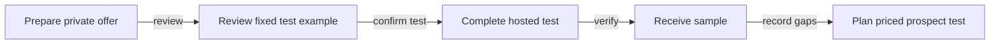
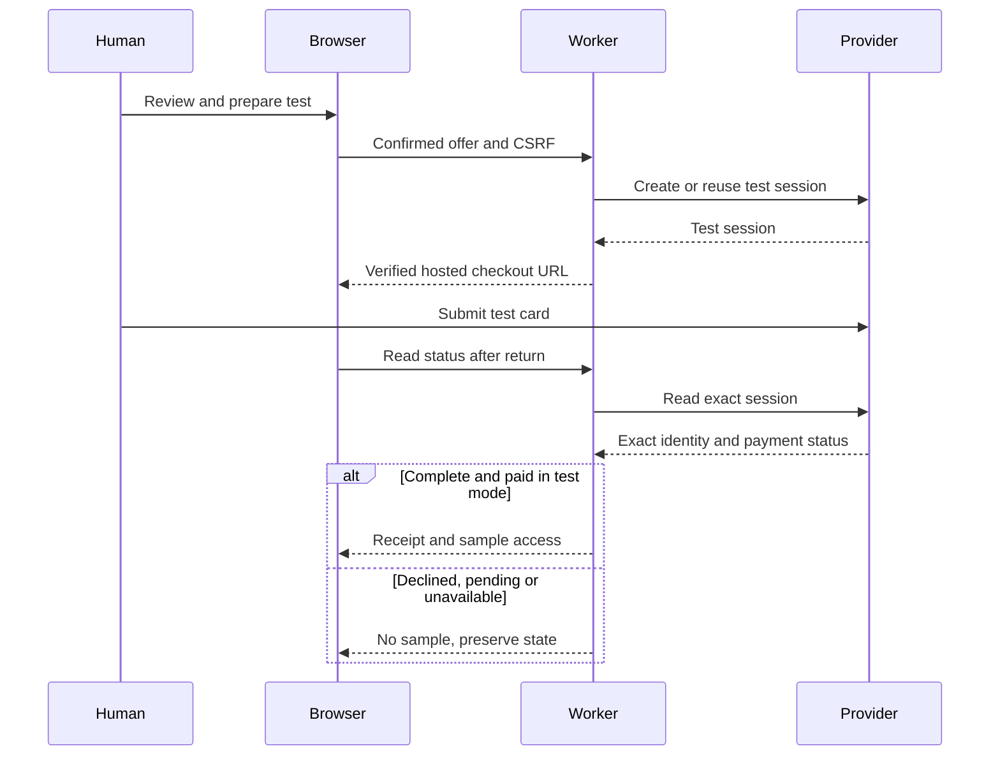
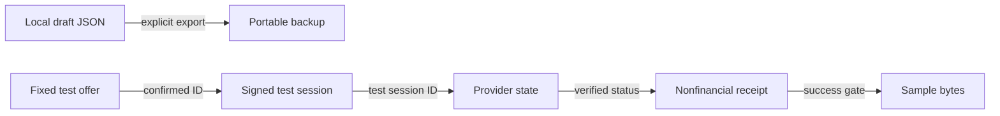
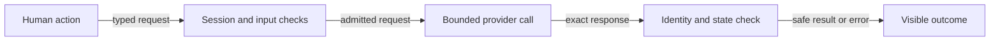
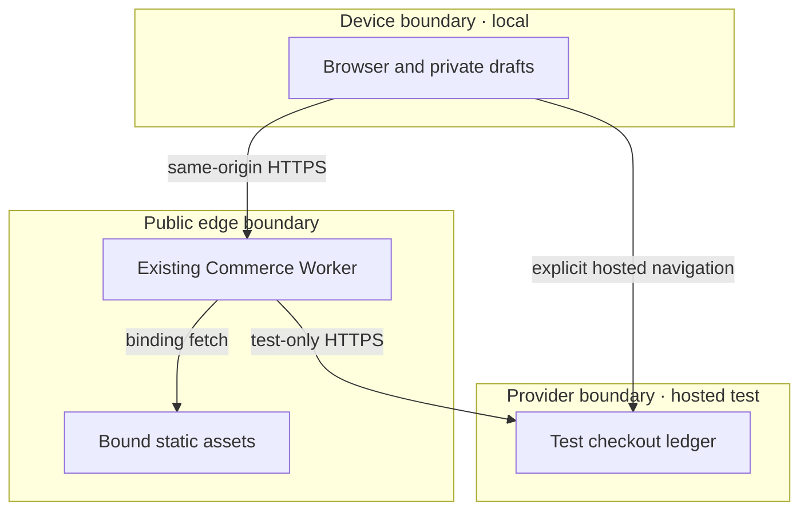

# Reference implementation — Edge Commerce sandbox and first-dollar boundary

`edge-commerce-agent-mvp@0.6.0` joins [PRD](#prd), [TAD](#tad), [ADR](#adr), [MVP](#mvp)
and [GTM](#gtm). PRD owns criteria; TAD consumes that exact revision; ADR binds the design;
MVP and GTM consume their checks and outcomes. This document describes concrete choices for
this reference implementation, not universal vendor requirements. Shared [guidelines][guideline]
and the [CID contract][cid] own grammar; no new command or continuity schema is introduced.

The legacy sandbox section anchor is retained for existing 0.5.0 companion links.
0.6.0 reconciles documentation with the deployed 0.5.0 implementation; it changes no runtime or
wire contract. The current operator instruction is **sandbox payment only, complete autonomously**.
A later deployment still requires its own exact-candidate authority. Protected merge is not deployment.
The [first-dollar sprint][sprint] owns actual customer validation and collection at
`PRD-TAD-ADR-COMMERCE-MVP-GTM-001@1.2.0`; it consumes this sandbox, not the reverse.

**Context:** [ER-SB-01–07][evidence] show offline drafts and a publicly verified provider test loop.
**Intent:** let a solo operator rehearse a reviewed offer through verified sample delivery.
**Directive:** document the existing sandbox, bind each criterion to its source and evidence, and
keep unvalidated customer demand, live payment and full-agent production behind their own gates.
**Role/Subject:** Commerce product architect. **Action:** the architect documents the verified sandbox.
**Outcome:** one current criterion-to-source-to-check chain. **Verb/Object:** documents / the verified sandbox.

## Codebase grounding — reference implementation

The supplied private, untracked input `joohwee/prd-tad-ard/prd-tad-adr-mvp-gtm-edge-commerce-agent.md`
revision 0.1.0, SHA-256 `fc833b05a1ab59520a45fb6b1f0149d298341a62c248cb118629535aae5223bf`,
remains preserved as input. It is not a second implementation owner. Material claims used here:

| Input claim | Disposition | Scoped source evidence / consequence |
|---|---|---|
| No existing codebase; new storefront/cart/merchant workers required | contradicted | [Runtime source][source] already owns `src/edge/index.ts`, `src/core/checkout-session.ts`, theme deployment and `public/local-first/`; reuse them |
| First sale requires a new cart, database and accelerator | contradicted | Existing single-offer Core checkout owns its SQLite Durable Object; the public sandbox instead uses the provider's existing session ledger; no new store |
| Private draft review confers payment or publishing authority | contradicted | `public/local-first/launch.js` checks content only; `src/core/theme-deployment-store.ts` requires fenced operator authority; sandbox writes separately require session/CSRF checks |
| Optional browser-native tools are absent | contradicted | `src/edge/client/webmcp-runtime.ts` and existing browser action/tool owners provide optional tools; ordinary browser controls remain available |
| External marketplace or agent projects supply implementation code | contradicted | Existing native HTML/CSS/JS and `src/local-first/stripe-checkout.ts`; no copied framework, prompt, source or new dependency |
| The specified Stripe sandbox belongs to the operator | confirmed | ER-SB-05 authenticated MCP read; `checkout-offer.ts` pins the account and test price; create rechecks both |
| Returning from hosted checkout proves payment | contradicted | `checkout.ts` re-reads the exact provider session; only `complete` and `paid` enables sample delivery |
| Free quotas or synthetic settlement establish zero TCO, demand or revenue | unverified | No account bill, priced customer conversation or actual collection evidence; none is used for a readiness or WTP claim |
| Wallet availability, fee tables and account quotas justify a new rail | unverified | Not needed for this increment; recheck with the payment owner before adopting a rail, rather than copying historical pricing assumptions |

| Owner and exact source | Owned capability / join |
|---|---|
| Commerce `50cc1d7e1a81af4ca89c2c4584bc50aee89ec55f` | Public sandbox, private drafts, full Edge/Core source and release controller |
| OS `08afe0e775b3a65bf7c9e6f21c0b19d9c2a6b2d3` | Shared workspace and lifecycle owner; consumer package stays at lockfile pin `13c3839aba7fc64bf94f93aa29b1239ab929840d` |
| Graph `ddfb165472ce20a2fe4ebca9b799d32c86cb052d` | Full-runtime discovery/payment providers and its own Dev → generated mirror → public deployment |
| Canvas `821415e48c59de96f7184a2b32d1597727698558` | Admission and protected transition authority |
| Website `c83b43bd7fd018e0ac41629787e0e713db9a1e13` | Guideline 2.6.0 and shared semantic/diagram checks |
| Production mirror `6f1d5d0ef0d6345a3b066bb7029e08dcf6b68077` | Generated Graph projection; no authored edits or Commerce deployment inference |
| Spatial client `8334355dc2c1f9bdf463ba102a63b5a3ac579d89` | Optional GameXR client; no checkout prerequisite |

Private workspace context was refreshed at `9f910e4db51c25bde7c6be867d8ceff229e05c8e` under OS
config `08afe0e775b3a65bf7c9e6f21c0b19d9c2a6b2d3`. Memory grants no execution or release authority.
Earlier 0.5.0 handoffs are historical observations at their declared revision. The serialized
`commerce.merchant-launch/v1` keeps its existing `edge-commerce-agent-mvp@0.2.0` contract identity;
this documentation revision neither rewrites exported packs nor treats that compatibility join as stale authority.

## PRD

**Join:** `edge-commerce-agent-mvp@0.6.0`.

**PP-01 — unvalidated:** a solo service operator cannot easily test an offer-to-delivery journey
without rebuilding payment integration. Impact and frequency are hypotheses; no priced prospect
conversation or measured willingness-to-pay has been supplied. A technical rehearsal can reduce
integration uncertainty, but cannot validate the buyer or promise high WTP.

**Personas and stories:** as a solo vendor, I want private drafts, estimated economics and exact
review so I can prepare an offer without publishing research. As a shopper testing the example,
I want clear test terms and an explicit confirmation so I know no real money moves. As an admin,
I want truthful readiness and failure states so I do not mistake role navigation for authority.

**Must:** EC-01–EC-07, the already deployed dependency-closed rehearsal. **Should:** a timed actual
prospect walkthrough and priced pilot under the sprint owner. **Could:** additional supported role
workflows once a buyer need is evidenced. **Won't (this increment):** real charges, subscriptions,
inventory, shipping, payouts, customer accounts, multi-item carts, autonomous price/payment writes,
new databases, paid hosting, extra model calls, background agents and automatic cross-device sync.

Each row states a Given/When/Then VCC and names its TAD owner, ADR and evidence. EC-08–EC-10 are
separately scoped supporting capabilities; they do not widen the public profile's delivered rung.

| ID / VCC | Given → when → then | TAD / ADR / evidence |
|---|---|---|
| EC-01 | Given saved v1/v2 drafts, when offline reload/import or competing edits occur, then accepted data survives and malformed/stale writes preserve the previous version | C1 / A1,A3 / ER-SB-02,03; local-first Worker/merchant tests and browser groups |
| EC-02 | Given complete costs and saved terms, when review/export runs, then integer estimates are exact, edits invalidate review and exported launch arguments omit private notes | C1,C2 / A1,A3 / ER-SB-02,03; `merchant-launch.test.mjs`, `merchant-browser.mjs` |
| EC-03 | Given the public offer, when a human starts checkout, then explicit review, valid session and CSRF are required; offline or agent API writes cannot approve it | C3,C4 / A2 / ER-SB-02,03; `checkout.test.mjs`, browser sandbox group |
| EC-04 | Given a provider response, when identity is validated, then live keys/sessions or account, offer, nonce, amount or currency mismatches fail closed; repeated create reuses its intent | C3,C4 / A2 / ER-SB-02,03,05; `test/local-first/checkout.test.mjs` |
| EC-05 | Given an open or declined session, when it is read/canceled, then it never unlocks a sample; cancel expires the open session and refresh never asserts payment from a redirect | C3,C4 / A2 / ER-SB-02,03,06 |
| EC-06 | Given provider-confirmed test success, when receipt/download is requested, then the same signed browser session receives a nonfinancial receipt and sample; receipts exclude customer details and are not offline-cached | C3,C4 / A2 / ER-SB-02,03,05–07 |
| EC-07 | Given the exact approved artifact, when release/readback runs, then source, Worker version, route, sandbox bindings and all eleven browser groups agree | C5 / A2,A6 / ER-SB-03,04 and protected approval/artifact |
| EC-08 | Given the full Dev profile, when an authorized merchant activates and a shopper confirms, then one synthetic settlement/revenue row occurs and replay adds neither | C6 / A1,A4 / ER-SB-02; `test/e2e/dev-paid-loop.spec.ts`; delivered `undocumented` |
| EC-09 | Given the full Edge profile, when shopper/vendor/admin controls and browser tools are used, then existing scopes and human-write gates hold | C6 / A4,A5 / ER-SB-02; `commerce-experience.spec.ts`, `merchant-workspace.spec.ts`; delivered `undocumented` |
| EC-10 | Given these joined docs, when existing parser, projection, link and scope checks run, then metadata, continuity and grounded evidence resolve without runtime changes | C7 / A6 / documentation check record in this revision; no product-delivery claim |

EC-09 replaces the duplicate use of EC-08 for experience acceptance in 0.5.0; EC-07 owns the
public release proof. This explicit split changes documentation identifiers, not behavior.

| Metric | Baseline / estimate | Target and measurement boundary |
|---|---|---|
| TTV to first private draft | Estimate 4 actions / 2 min | ≤5 actions / 3 min; fresh browser walkthrough pending; offline behavior independently tested |
| TTV to first sample | Estimate 10 actions / 3 min, card details grouped as one form | ≤12 actions / 5 min; hosted path completed, clean first-use stopwatch study pending |
| Checkout amount | Fixed SGD 8.00 test amount; actual charge 0 | Test amount is never revenue |
| Monthly runtime model tokens | 0 prompt + 0 completion on native draft, checkout and read paths | Retain zero model calls; caller-owned agents measure their own usage |
| Monthly / 12-month TCO | No new package, Worker or store; billing and operator time unmeasured | Free-tier execution only; no $0 total-cost claim until actual bill and labor are measured |
| ROI score | Impact/reach and operator hours unknown | Do not fabricate `(impact × reach)/(hours + monthly TCO + token cost)`; validate PP-01 before paid-product ranking |
| Authoring cost | One docs lane, 3 files, zero runtime/module/always-load delta | 40-minute initial estimate; three alignment cycles max; stop/replan if blockers do not decrease |

The TTV and economic research gaps are tracked in the alignment register; they do not become
retroactive runtime acceptance results. Customer adoption remains below sign-off under the sprint owner.

## TAD

**Join:** TAD consumes exactly PRD `edge-commerce-agent-mvp@0.6.0`; ADR binds these components.

| Component | Single owner / contract / bounds | Local / delivered rung |
|---|---|---|
| C1 private draft store | `public/local-first/drafts.js`; `commerce.local-drafts/v2`, v1 import; 100 drafts, existing 8 MB backup cap, revision-checked IndexedDB transactions | runtime-ready / production-verified, EC-01 |
| C2 launch preparation | `launch.js`; `commerce.merchant-launch/v1`, integer minor units, exact-content digest; no authority or real provider-price override | runtime-ready / production-verified, EC-02 |
| C3 browser checkout | `checkout.ts`, `checkout-offer.ts`, `public/local-first/checkout.js`; only `#checkout` loads the module; fixed test offer, no arbitrary draft prices | runtime-ready / production-verified, EC-03–06 |
| C4 provider adapter | `stripe-checkout.ts`; native HTTPS, existing provider ledger, no SDK; 15 s/request, 65,536-byte response limit, no automatic retry | runtime-ready / production-verified, EC-04–06 |
| C5 deployment | `scripts/local-first-release/`; v2 artifact, authorization, browser and completion schemas; exact public source/version/route readback | runtime-ready / production-verified, EC-07 |
| C6 full Commerce runtime | Existing Edge/Core, `CheckoutSession`, `ThemeDeployment`, derived `RevenueLedger`, human confirmation and optional WebMCP | dev-proven / undocumented, EC-08,09; full production evidence remains gated |
| C7 documentation checks | Existing authored-limits/terminology and website parser/projection owner; no runtime validator added | dev-proven / undocumented, EC-10; metadata, links, limits and projection checks passed |

**Integration and state:** only `GET checkout`, status, receipt, download and `POST start`, cancel,
reset are admitted under `/agentic-commerce-os/checkout`. POST bodies are ≤1,024 bytes and require
exact offer, `confirmed:true`, matching Origin, content type and CSRF. A signed Secure/HttpOnly/
SameSite=Lax cookie carries a random intent and optional provider session for seven days. Creation
expires at 23 hours before the provider's minimum 24-hour idempotency retention. Only test keys and
`cs_test_*` identities are valid. Account and price are re-read before create; every response checks
nonce, owner, offer, amount, currency and mode. Errors preserve pending/unknown state. Expired
sessions may return a nonfinancial receipt; only `complete` + `paid` unlocks sample content.

Receipt schema `commerce.stripe-test-receipt/v1` separates `realMoney:false`, `chargeMinor:0` and
`testAmountMinor:800`. The sample is also open source, so this is delivery verification, not copy
protection. Card details stay on the provider page; no customer details enter the browser receipt.
Receipt/download/API requests are excluded from service-worker caching. Offline use is for private
preparation; cross-device transfer uses explicit JSON export/import and conflict checks.

**Invocation and readiness dimensions:** the public profile's normal browser controls remain primary.
OS Status Surface is explicitly excluded from this increment; full-profile `/readiness` remains a
separate read capability. AI Agent Discovery and MCP Gateway federation use existing full-profile
`src/edge/mcp.ts`, `src/edge/client/webmcp-runtime.ts` and [runtime API](runtime-api.md), each `dev-proven` /
`undocumented` for delivery here. There is no new tool registry, proxy, payment-confirmation tool,
model invocation or claim that remote transports expose local harness parity.

### Five flow patterns — reference implementation

All diagram source is present below; tables give a text/mobile/offline fallback. Body Mermaid
flowcharts target the declared D3 projection; the sequence is text/static only and makes no graph
projection claim. Rendering and projection checks are recorded separately from runtime evidence.

**Diagram EC-J1** · Class: Journey stage map · Notation: flowchart LR · Version: 1 — 2026-09-12 · Surface: d3
**Caption:** The rehearsal moves from private preparation to an explicitly confirmed test and verified sample.

| EC-J1 node | Journey / criterion |
|---|---|
| draft | Vendor preparation; EC-01,02 |
| review | Shopper review; EC-03 |
| hosted | Human provider test; EC-04,05 |
| sample | Verified delivery; EC-06 |
| learn | Admin learning; GTM, no demand assertion |

**Diagram EC-W1** · Class: User workflow · Notation: sequenceDiagram · Version: 1 — 2026-09-12 · Surface: text-only
**Caption:** A return navigation never substitutes for the provider's authoritative payment state.

| EC-W1 participant | Responsibility / failure boundary |
|---|---|
| Human | Explicit test confirmation; may decline or abandon |
| Browser | Local review and signed same-origin session; no payment assertion |
| Worker | Validate CSRF, exact identity and provider state; fail closed |
| Provider | Own authoritative test session; no live-key acceptance |

**Diagram EC-D1** · Class: Data flow · Notation: flowchart LR · Version: 1 — 2026-09-12 · Surface: d3
**Caption:** Draft content stays local; only the fixed reviewed test offer reaches payment preparation.

| EC-D1 node | Schema / owner / journey |
|---|---|
| local, backup | `commerce.local-drafts/v2`; C1; preparation |
| offer | Fixed `CHECKOUT_OFFER`; C3; review |
| session | Signed intent / optional payment ID; C3; preparation |
| provider | Exact test checkout session; C4; confirmation |
| receipt, sample | `commerce.stripe-test-receipt/v1` and Markdown; C3; delivery |

**Diagram EC-H1** · Class: Orchestration / harness flow · Notation: flowchart LR · Version: 1 — 2026-09-12 · Surface: d3
**Caption:** Each user action executes one bounded deterministic pass with no model call or background retry.

| EC-H1 node | Role / input → output / bound |
|---|---|
| intent | Dispatcher: visible confirmation → request; one action |
| validate | Guard: bounded JSON/session → admitted request or typed error |
| adapter | Executor: typed test operation → ≤65,536-byte response; 15 s per request; create includes parallel account/price reads then session create |
| verify | Observer: exact provider response → verified status or refusal; zero tokens |
| view | Consumer: status → pending/error or sample access; no automatic retries |

**Diagram EC-T1** · Class: Runtime topology · Notation: flowchart TB · Version: 1 — 2026-09-12 · Surface: d3
**Caption:** Browser drafts and provider test state remain in separate trust boundaries under one existing public Worker.

| EC-T1 node | Role / type / lane / residency |
|---|---|
| browser | Consumer + private store / browser / delivery / device; no automatic sync |
| worker | Router + guard / existing Worker / delivery / edge processing |
| assets | Read-only source / asset binding / delivery / provider-managed static storage |
| provider | Authoritative test state / managed API / delivery / provider-managed; no residency jurisdiction claim |

| Diagram | Projects | Nodes | Edges | Clusters | Version |
|---|---|---|---|---|---|
| EC-J1 | yes | 5 | 4 | 0 | 1 |
| EC-W1 | no | 0 | 0 | 0 | 1 |
| EC-D1 | yes | 7 | 5 | 0 | 1 |
| EC-H1 | yes | 5 | 4 | 0 | 1 |
| EC-T1 | yes | 4 | 4 | 3 | 1 |

### Deployment and recovery — reference implementation

| Boundary | From → to | Evidence / operator instruction | Recovery / state |
|---|---|---|---|
| Source integration | Authoring → protected main | Exact Integration Gate and authorized PR merge; ER-SB-01,02 | Revert through protected successor; current docs merge does not deploy |
| Public sandbox | Approved main artifact → existing public route | ER-SB-03,04; exact protected environment approval retained in run | Controller retained predecessor version/route and rollback checks; open for that released candidate only |
| Full agent production | Full Core/Edge candidate → delivery | Missing independent trust/provider/execution evidence under `production-runtime.md` | Existing release owner; closed |
| Real money / customer pilot | Reviewed offer → real transaction | Current instruction permits sandbox only; actual payer and payment authority absent | No live operation; closed |

Commerce's scoped public profile deploys directly through its own protected workflow. Graph's
Dev → generated `huijoohwee` mirror → public Graph/apex topology remains Graph-owned. This docs
change edits neither mirror nor route. Route evidence never grants another component's release.

## ADR

**Join:** ADR `edge-commerce-agent-mvp@0.6.0` binds this PRD/TAD. Accepted decisions:

- **EC-A1 — reuse native owners.** Existing drafts, themes and checkout avoid a second store or
  application. A new cart/database was rejected for this single-offer rehearsal; recovery preserves
  old backup import and launch-pack contracts. Consequence: multi-item marketplace work is deferred.
- **EC-A2 — keep sandbox payment at its provider.** Reuse Stripe's existing test account with a thin
  native HTTP adapter; Graph's live-configured payment service stays unchanged. A deterministic FOSS
  local simulator remains a test fixture, not provider integration proof. A self-hosted payment stack
  adds operations and cannot prove this account's hosted behavior. Provider outage means unavailable,
  never an inferred success. Keys stay in protected secrets; no SDK or ledger is added.
- **EC-A3 — local preparation and explicit writes.** Reuse IndexedDB and export/import; reject an
  automatic sync service. Review digests protect content integrity, not identity or payment authority.
- **EC-A4 — full-profile role boundaries.** Reuse operator fencing, public/agent tool allowlists and
  staged proposals. Public role pages grant no credentials; no agent fabricates human presence.
- **EC-A5 — native UX patterns.** Mercur and commerce-agents are inspiration only; reuse semantic
  HTML, CSS, dialogs and existing actions. [Coverage and gaps](mercur-experience-parity.md) at 0.5.0
  remain historical behavior evidence. Inventory, payouts and complete framework parity are unclaimed.
- **EC-A6 — source-owned documentation and exact release.** Remove the deferred-checkout conflict,
  join the sprint/evidence companion and retain dated observations. No runtime/schema changes or
  replayed deployment authority; full-profile trust gates remain unchanged.

**Constraints ↔ Argumentation ↔ Outranking:** admit only sandbox-only, zero-new-resource, native
choices. A native simulator satisfies offline fixture needs but fails the operator's real-provider
integration condition; routing through the live payment service fails the sandbox boundary. The
existing provider plus bounded adapter satisfies both. These arguments favor reuse over a new
stack by fewer unbuilt components; ER-SB-02–07 independently test the selected outcome. This is a
constraint-based engineering choice, not a self-graded commercial score or proof of FOSS licensing
for the managed provider. No unsupported pairwise economic superiority is asserted.

| TCO dimension | Existing managed test service | Existing FOSS local fixture | New self-hosted stack |
|---|---|---|---|
| 12-month infrastructure/egress | No new resources; account bill unmeasured | Existing device; energy/storage unmeasured | Not provisioned; cost unknown, not admitted |
| Model tokens | 0 | 0 | No justified model need |
| Operator burden | Existing account/secret and provider API maintenance | Existing fixtures; no hosted-account proof | Additional patching, backup, operation and security |
| Tradeoff | Meets requested hosted test; proprietary managed dependency already selected by user | Reusable deterministic tests; does not meet hosted outcome | Extra TCO without a nearer verified outcome |

## MVP

Consume EC-01–EC-07, C1–C5 and A1–A3/A6. Evidence ER-SB-01–07 in the [handoff][evidence]
closes the released sandbox slice. EC-08/09 remain separately Dev-proven; prospect acceptance,
real collection, cross-region guarantees, measured TCO and physical-device reach are not inferred.

| Demo beat | Action / check | Budget |
|---|---|---|
| Hook | State PP-01 and the sandbox-only outcome | 20 s |
| Setup | Open the fixed offer and review terms; EC-03 | 40 s |
| Reveal | Complete test checkout, verify provider status and download; EC-04–06 | 3 min target |
| Close | Show nonfinancial receipt and next priced-customer evidence; GTM | 30 s |

Actual hosted decline, success and downloads were observed in ER-SB-05–07. The beat budget is a
future timed demo target, not a retroactively measured benchmark. Domain object: a reviewed test
checkout intent. Its attained capability is verified test delivery; next gap is a real prospect's
accepted offer and authorized collection, not a higher external marketplace rubric level.

Bounded execution consumes these same joins: D1 documents and checks EC-10; D2 protects integration
and cleanup under A6; GTM successor S01 depends on a priced prospect, independently of D1/D2.
No extra agent, worktree, schema registry or persistent task record is required by a phase label.

## GTM

Consume PP-01, the PRD's research metrics and A1/A2. The boundary record is ER-SB-01–08 plus
ER-GTM-01–03 in [the evidence companion][evidence]; it explicitly separates offer, runtime,
mechanism, transaction, fulfillment and economics. `mechanism-proven` applies to sandbox only;
`demand-validated` and collected revenue remain absent. No outreach or real payment was performed.

| Priority / stream | Reuse / new work | Constraint, argument and prerequisite |
|---|---|---|
| 1 — concierge setup, Should until a reachable prospect exists | Existing drafts/themes/test demo; new priced conversation and accepted deliverable | Fewest unbuilt components; one unvalidated buyer is still a gate, not an existing segment |
| 2 — recurring hosted service, Could | Existing release owner; new full-runtime evidence and paying repeated use | More prerequisites than setup; full production and recurring value unproven |
| 3 — marketplace take-rate, Won't this increment | Existing derived revenue; new genuine external volume | Requires verified distinct external principals and actual transactions |

Acquire the first prospect through the operator's existing relationships only after choosing a
named recipient and authorizing outreach. Existing relationships are a channel hypothesis, not an
observed audience. Record priced conversation → accepted deliverable → authorized collection →
measured delivery cost → successor Context. Feed authentic receipts to the existing demand verifier;
never enroll fabricated payer evidence from this sandbox. [The sprint][sprint] owns those steps.

## Alignment and maintenance — reference implementation

The evidence companion consumes this implementation at 0.6.0 and the sprint at 1.2.0. Current
five-role joins, source links, schema owners, five flow inventories, deployment boundaries and
monetization separation are the bounded documentation review. Existing source checks validate
syntax, links, limits and projection; they do not certify every advisory statement in the guideline.

**Observed checks, 2026-09-12:** shared metadata parser, all five revision joins, 27 local links/anchors,
authored limits (382 files), terminology (383 files) and convergence (8 assertions) pass. Existing
projection check passes for 10 diagrams: 44 nodes / 37 edges / 7 clusters across the two owners;
this sandbox contributes 21 / 17 / 3. All ten diagrams render with the existing Mermaid runtime;
workflow and topology images were visually inspected. Static syntax failures in both sequence
diagrams were corrected at source. No runtime or dependency file changed. Protected CI still
validates the exact published candidate.

**Selected artifact-bearing coverage:** 12/12 linked: `markdown-yaml-frontmatter-enforcement#1`
(frontmatter), `artifact-continuity-authoring-seam#1,#3,#5,#6,#8` (joined roles, one owner, grounding,
criterion coverage and independent evidence), `flow-patterns#1,#2` (five flows),
`time-to-value#1` (metrics), `monetization#1,#3` (separate evidence and ranked streams),
`division-of-work#1` (C1–C7). Advisory framing is not scored as missing artifacts; this selection
contains zero advisory rules and is not an exhaustive guideline conformance certificate.

| Finding Type | Severity | Rule anchor | Artifact reference | Evidence excerpt | Remediation |
|---|---|---|---|---|---|
| missing-economics-metric | major | time-to-value#2 | PRD metrics | "clean first-use stopwatch study pending" | Locally reproducible timed fresh-profile walkthrough by QA before customer sign-off |
| pain-point-not-validated | major | pain-point-to-feature-mapping#1 | PP-01 / sprint S01 | "no priced prospect" | Specification change by product owner with a priced prospect result before demand promotion |

Known 0.5.0/1.1.0 issues resolved: `status-conflict` (deferred versus deployed test checkout),
`artifact-naming-noncompliant` (mixed revision joins), `missing-frontmatter-key` (handoff), and
`cid-composition-divergence` (different CID/RAO/SVO actions). Current bounded review: 0 blocker,
2 tracked major, 0 minor; other selected finding types are zero. No runtime-ready claim is made
for the pending research or full production capabilities. Recheck after any upstream criterion,
source or evidence revision; at most three alignment cycles, stop/replan if blockers do not decrease.

[guideline]: https://github.com/huijoohwee/huijoohwee.github.io/blob/c83b43bd7fd018e0ac41629787e0e713db9a1e13/guidelines/prd-tad-adr-mvp-gtm-guidelines.md
[cid]: https://github.com/huijoohwee/huijoohwee.github.io/blob/c83b43bd7fd018e0ac41629787e0e713db9a1e13/guidelines/cid-guidelines.md#shared-field-contract
[source]: https://github.com/huijoohwee/agentic-commerce-os/tree/50cc1d7e1a81af4ca89c2c4584bc50aee89ec55f
[evidence]: prd-tad-adr-mvp-gtm-handoff.md#mvp
[sprint]: prd-tad-adr-mvp-gtm-20260909T1320Z-solopreneur-mvp-gtm.md
