# Edge Commerce Agent — grounded first-dollar loop

This combined PRD/TAD/ADR/MVP/GTM is the implementation owner for
`edge-commerce-agent-mvp@0.2.0`. All five sections consume this exact identity.
The supplied private, untracked `joohwee/prd-tad-ard/prd-tad-adr-mvp-gtm-edge-commerce-agent.md`
at SHA-256 `fc833b05a1ab59520a45fb6b1f0149d298341a62c248cb118629535aae5223bf`
is preserved as the 0.1.0 input, rather than treated as an existing runtime or duplicated
implementation owner. This revision replaces its greenfield architecture assumptions.

The user selected **implement the first-dollar commerce loop; keep deployment separately gated**
on 2026-09-12. The [existing local-first release amendment][prior] continues to describe the
asset-only deployment profile. This increment connects that authoring surface to the full Commerce
profile through a reviewed launch pack. It neither enables payment on the asset-only Worker nor
changes the protected production route automatically.

```yaml
context: "Existing Commerce has offline drafts, merchant themes, discovery, guarded checkout and derived revenue; the source input incorrectly assumes no codebase"
intent: "Help a solo operator take one specific buyer outcome through review into the existing first-sale flow with no new dependencies or infrastructure"
directive: "Reuse the draft store and theme/checkout owners, implement bounded launch economics and exact-content review, then verify the native Dev loop"
role: "solo-operator-and-authorized-agent"
action: "review one offer, publish its theme under the existing claim, confirm the provider quote, and fulfill against the settlement receipt"
outcome: "one reviewable merchant launch pack and a tested draft-to-settlement mechanism; actual demand and payment remain evidence-gated"
subject: "solo-operator"
verb: "launch"
object: "one-reviewed-commerce-offer"
```

## Codebase grounding

Inspected canonical revisions are context pins, not claims of live deployment:

| Owner | Revision | Responsibility |
|---|---|---|
| agentic-os | `08afe0e775b3a65bf7c9e6f21c0b19d9c2a6b2d3` | ADLC, lane admission, invocation dictionaries, shared contracts |
| agentic-commerce-os | `addf6afb3821c61b33f44d1b0a4e82afb7e139fa` | Drafts, merchant launch, storefront, checkout coordination, derived revenue |
| agentic-graph | `ddfb165472ce20a2fe4ebca9b799d32c86cb052d` | Discovery/payment providers, canvas, Dev → generated mirror → Cloudflare orchestration |
| agentic-canvas-os | `821415e48c59de96f7184a2b32d1597727698558` | Application/admission contracts |
| huijoohwee.github.io | `c83b43bd7fd018e0ac41629787e0e713db9a1e13` | Shared guidelines and semantic schemas |
| huijoohwee | `6f1d5d0ef0d6345a3b066bb7029e08dcf6b68077` | Generated production projection; no authored changes here |
| GameXR | `8334355dc2c1f9bdf463ba102a63b5a3ac579d89` | Optional spatial client; no first-sale dependency |

| Input claim | Disposition and source-grounded consequence |
|---|---|
| No existing codebase; create `/workers/storefront`, `/workers/cart-do`, `/agents/merchant` | **Contradicted.** Reuse `src/edge/index.ts`, `src/core/checkout-session.ts`, `src/core/theme-deployment-store.ts`, and `public/local-first/`. These speculative paths are not implementation owners. |
| Cart requires a new Durable Object | **Narrowed.** First sale uses one provider offer and the existing per-checkout SQLite Durable Object. A multi-item, cross-merchant cart is deferred. No cross-PoP cart claim follows from local tests. |
| Postgres + Hyperdrive are Must | **Rejected for this increment.** Existing registry/theme/checkout/revenue objects and upstream providers already own the data. A second store adds cost, coordination and migrations without a first-sale need. |
| KV is unsuitable for strongly consistent cart writes | **Confirmed.** [KV docs][kv] describe eventual consistency and delays of 60 seconds or more. It is not used for money, review or checkout state. |
| Hyperdrive is an accelerator for an existing database | **Confirmed.** [Hyperdrive docs][hyperdrive]; no database origin is introduced here. |
| Durable Objects support transactional persistent state | **Confirmed.** [SQLite storage API][sqlite]; the existing checkout uses `transactionSync`, event records and recovery alarms. External I/O still requires application-level concurrency and idempotency controls. |
| Workers Free: 100K/day, 30 ms CPU, 1 MB script | **Corrected.** [Current limits][limits] list 100,000 requests/day and 10 ms CPU/HTTP request; current Worker-size entry is 64 MiB. This project retains the stricter 500 kB emitted-chunk cap. |
| DO free-tier unknown | **Verified reference limits.** [Pricing][do-pricing]: SQLite-backed Free includes 100K requests/day, 13K GB-s/day, 5M rows read/day, 100K rows written/day and 5 GB storage. Quotas are not measured account usage or a $0 bill. |
| Neon/free GitHub quota implies $0 TCO | **Not adopted as proof.** No Neon origin is needed. Free quotas do not establish this account's bill; token, transaction, operator time and quota exhaustion remain separate. |
| Stripe is a new required Commerce integration; fee universally 2.9% + $0.30 | **Narrowed/corrected.** Reuse the Graph payment owner. [Stripe Singapore pricing][stripe] currently lists 3.4% + $0.50 for domestic cards, with other charges depending on method/currency. No rate or rail is hardcoded into the estimator. |
| Cloudflare Wallets can collect the first dollar | **Unavailable today.** [Wallet docs][wallets] currently offer handle reservations, without sending, receiving or holding funds. Keep any future adapter behind the existing payment owner. |
| WebMCP must be omitted entirely | **Contradicted by local source.** Commerce already exposes optional browser tools and backend MCP. Keep feature detection and normal browser controls; [the WebMCP draft][webmcp] and [Chrome trial][chrome-trial] do not establish universal browser availability. |
| External FOSS supplies runtime components | **Reference only.** [commerce-agents][agents] separates host/backend responsibilities and checkout handoff; [Mercur][mercur] has an MIT core on Medusa. No external code, prompts, framework or package is copied/adopted. |
| Local review is cryptographic human authority; test settlement is real revenue | **Rejected.** Review only acknowledges exact local bytes. Existing operator claim/fence checks own theme activation; signed human presence and providers own production payment. Dev settlement is a synthetic mechanism test. |

Shared memory was refreshed from the private source at
`9f910e4db51c25bde7c6be867d8ceff229e05c8e`, with OS config
`08afe0e775b3a65bf7c9e6f21c0b19d9c2a6b2d3`. It supplied routing context only.

## PRD

**Buyer hypothesis:** a solo service operator with an identified, reachable customer needs to turn
an AI-drafted offer into a priced, reviewable storefront without rebuilding checkout or publishing
private research. No named payer, priced conversation, commitment or payment has been supplied.
High willingness-to-pay is a hypothesis, not a validated market claim.

**Smallest complete mechanism:** private offer draft → estimated unit economics → exact-content
merchant review → native theme launch pack → authorized merchant activation → buyer discovery →
human quote confirmation → provider settlement → one derived revenue entry → receipt-led fulfillment.
The operator supplies a currently registered discovery agent. Its provider owns offer price,
availability and fulfillment obligations; editing planned economics cannot overwrite those facts.

Must: legacy-safe offline draft persistence; structured buyer/outcome/merchant/agent/cost fields;
integer monetary calculations; review invalidation after edits; private-note-free native launch
export; Dev consumption by the existing protected merchant/checkout flow; explicit external gates.
Should: measure buyer time-to-checkout and actual contribution with the first paid pilot.
Deferred: multi-item carts, autonomous pricing/inventory writes, automatic fulfillment, more databases,
new model calls, wallet funding, social outreach, multi-device automatic sync and deployment.

| ID | Acceptance / verification owner |
|---|---|
| EC-01 | Existing v1 backups open without data loss; v2 terms survive offline reload/import; malformed or conflicting input never overwrites saved data. `test/local-first/worker.test.mjs`, `merchant-launch.test.mjs`, browser check. |
| EC-02 | Revenue minus delivery, payment, agent and acquisition cost is exact in integer minor units; setup recovery and ten-sale estimates are derived; extra decimal precision/unsafe amounts fail. `merchant-launch.test.mjs`. |
| EC-03 | Review/export requires a saved profitable estimate, explicit UI acknowledgement and exact content/revision match; edits and other-tab updates force review again. Unit + `merchant-browser.mjs`. |
| EC-04 | The export uses the existing `commerce.theme.deploy` arguments, omits private description/price notes and grants no publish/payment authority. Unit + browser. |
| EC-05 | No merchant storefront exists before activation; an agent credential cannot publish; current operator claim publishes the generated manifest; merchant-scoped discovery reaches one visually confirmed Dev settlement and one revenue row; replay adds neither. `test/e2e/dev-paid-loop.spec.ts`. |
| EC-06 | A 390 px browser works offline after cache installation; Graph is optional navigation; no draft/payment network writes occur. `scripts/local-first-release/check.mjs`. |
| EC-07 | Existing domain, unit, real Worker/SQLite, browser, ADLC and dry-bundle checks run; evidence gaps remain failures. `npm run check:integration`, `npm run check`. |
| EC-08 | Release consumes the browser producer's exact required checks and candidate identity; incomplete, duplicate-filled or mismatched proofs fail. `scripts/local-first-release/browser-proof.mjs`, `test/local-first/browser-proof.test.mjs`. |

## TAD

Keep one native browser module for economics/review/export. `drafts.js` owns the v2 persistence
schema and launch-field validation; `launch.js` imports that validator and loads on demand when
terms are saved or reviewed. Service-worker installation caches its small source for offline use;
it does not execute the economics module or load Graph/LLM tools in the background.

```mermaid
flowchart LR
  draft[Private browser draft] --> estimate[Estimated unit economics]
  estimate --> review[Exact saved-content review]
  review --> pack[Native merchant launch pack]
  pack --> operator[Authorized operator and claim]
  operator --> theme[Existing ThemeDeployment DO]
  theme --> shop[Existing merchant storefront]
  shop --> quote[Registered discovery provider]
  quote --> human[Human reviews exact quote]
  human --> checkout[Existing CheckoutSession DO]
  checkout --> provider[Authoritative payment provider]
  provider --> revenue[Existing derived RevenueLedger]
  provider --> fulfill[Receipt-led merchant fulfillment]
```



| Component | Owner / validation |
|---|---|
| Draft persistence, v1 → v2 import normalization | `public/local-first/drafts.js`; existing IndexedDB transaction/revision check, no schema-store migration |
| Estimates, review digest and native launch contract | `public/local-first/launch.js`; `test/local-first/merchant-launch.test.mjs` |
| Merchant editor and human review controls | `public/local-first/app.js`, `index.html`, `style.css`; `merchant-browser.mjs` |
| Offline/asset delivery | `sw.js`, `src/local-first/worker.ts`, release artifact inventory; existing route/integrity checks |
| Browser proof completeness | `scripts/local-first-release/browser-proof.mjs`; shared by check and release, without changing external release authority |
| Device executor cancellation | `scripts/isolated-process.ts`; startup completes before attach/cancel, exact-container cleanup remains mandatory; real isolation and local-host checks |
| Live merchant catalog scope and storefront | `src/core/theme-deployment.ts`, `theme-deployment-store.ts`, `merchant-catalog.ts`, `src/edge/index.ts` |
| Guarded payment and revenue idempotency | `src/core/checkout-session.ts`, `checkout-markup.ts`, `src/edge/human-confirmation.ts`; existing Worker tests and strengthened Dev E2E |

`commerce.local-drafts/v2` adds nullable `launch` to the existing draft; v1 is an explicit backup
compatibility contract. Missing terms remain valid private drafts. Unknown review/approval flags
are rejected. Imports compare canonical field order and fail atomically on conflicts. Accepted old
stored bytes are normalized when read; an old browser tab may remove new terms if it later writes
its legacy record, which invalidates the next review rather than retaining stale authorization.
Back up before moving drafts between different deployed versions.

`commerce.merchant-launch/v1` contains the continuity ID, source draft/revision/digest,
`reviewed-local` disposition, minimal native theme manifest, estimated economics, merchant path
and the existing operator tool arguments. It excludes private description and negotiation notes.
The review digest is an integrity comparison, not an identity signature or credential. Imported
packs still require existing authorization at their consuming runtime. Review does not attest
that the claimed agent belongs to the merchant or that a buyer paid.

Bounds: 100 drafts; existing 8 MB backup limit; 120-character title; 280-character buyer/outcome;
128-character identifiers; each non-negative amount ≤1,000,000,000 minor units; positive sale price
and positive per-sale estimated contribution for launch review. Provider fee and token costs are
entered explicitly, never guessed. Taxes, refunds, recurring fees and working capital are not
modeled; the screen labels results as estimates. Zero dependencies and cloud resources added;
one on-demand module; every authored file <600 lines and emitted chunk <500 kB.

## ADR

**EC-A1 — reuse over replacement (accepted).** Hard constraints exclude duplicate payment/store
owners, paid infrastructure, imported FOSS code, fabricated demand and unattended settlement.
Argumentation: a full Postgres/cart rebuild creates a migration and provider burden; an offline-only
editor cannot reach payment; a native launch pack reuses the implemented merchant and buyer loop.
Outranking among admitted choices favors the launch bridge by smallest change and shortest path
to testing one paid offer. This ranks implementation distance, not proven WTP. The deterministic
constraints → argument → selection output uses zero model calls; caller-owned agents can consume it.

**EC-A2 — keep payment authority at the source (accepted).** Planned price is not a quote.
The registered discovery/checkout provider and existing human-confirmation flow own live facts.
No Stripe SDK, wallet, webhooks, cart store, checkout alias or parallel ledger is added.

**EC-A3 — preserve offline authoring and explicit activation (accepted).** A reviewed pack is
portable to the existing MCP operator action and testable without credentials. Automatic publish
and server-side human approval of arbitrary merchant price changes are not implemented by this
pack. Existing trusted operator APIs remain trusted operator APIs; do not describe their token
as cryptographic human presence. Agents without operator authority cannot use that write path.

## MVP

One scoped Commerce lane. Ground against `addf6afb…`, implement the bridge, run focused behavior
checks followed by the existing integration suite, inspect mobile output and preserve evidence.
Validation budget: one full integration run after the change, targeted reruns for concrete failures,
then terminal evidence classification. Local runtime prerequisites are the source-owned verified
workerd build and rootless Podman; they are stopped after owned tests complete.

[The handoff](edge-commerce-mvp-handoff.md) records actual check results and remaining gates.
Local rungs derive from those observations; there is no production, cross-region, real-payment,
zero-bill or demand claim based on test fixtures.

## GTM

1. Find one reachable operator with an expensive manual outcome. Record a priced conversation or
   pilot commitment; retain the evidence with its owner. No outreach has been sent by this task.
2. Agree on one deliverable and configure its actual registered provider quote. Enter delivery time,
   collection, agent and acquisition costs in the draft; inspect contribution and setup recovery.
3. Review/export the pack. An authorized operator feeds its `nextAction.arguments` to
   `commerce.theme.deploy` using the current authoring claim; [runtime API][api] owns that contract.
4. After separately authorized deployment and readiness proof, use the merchant storefront's
   discovery and human-confirmation flow. Treat uncertain settlement as unresolved, never paid.
5. Deliver only against the authoritative receipt. Verify actual collected revenue/costs and buyer
   acceptance; feed the outcome to the existing `scripts/demand-evidence-verifier.mjs` where suitable.

First-dollar ranking: a paid concierge/setup offer using existing merchant themes is nearest built;
recurring hosted service is next after an independently ready deployment; platform take-rate requires
actual external transaction volume. None is demand-validated here. A local pack, synthetic Dev sale,
signup or positive estimate cannot satisfy the existing demand-evidence verifier.

**Release gates:** current provider/admission pins and credentials; independent evaluator/trust
evidence required by the full-Commerce profile; reviewed human-presence issuer; exact candidate and
free-tier-compatible execution transport; protected merge; separately authorized release, live route
verification and rollback proof. Existing `production-runtime.md` and Graph's release owner remain
authoritative. Generated mirror paths are never hand-edited. No merge, deploy or cleanup authority
is inferred from this document or passing local checks.

[prior]: prd-tad-adr-mvp-gtm-20260909T1320Z-solopreneur-mvp-gtm.md
[api]: runtime-api.md
[kv]: https://developers.cloudflare.com/kv/concepts/how-kv-works/
[hyperdrive]: https://developers.cloudflare.com/hyperdrive/
[sqlite]: https://developers.cloudflare.com/durable-objects/api/sqlite-storage-api/
[limits]: https://developers.cloudflare.com/workers/platform/limits/
[do-pricing]: https://developers.cloudflare.com/durable-objects/platform/pricing/
[stripe]: https://stripe.com/en-sg/pricing
[wallets]: https://developers.cloudflare.com/wallets/
[webmcp]: https://github.com/webmachinelearning/webmcp
[chrome-trial]: https://developer.chrome.com/blog/ai-webmcp-origin-trial
[agents]: https://github.com/anthropics/commerce-agents
[mercur]: https://github.com/mercurjs/mercur
