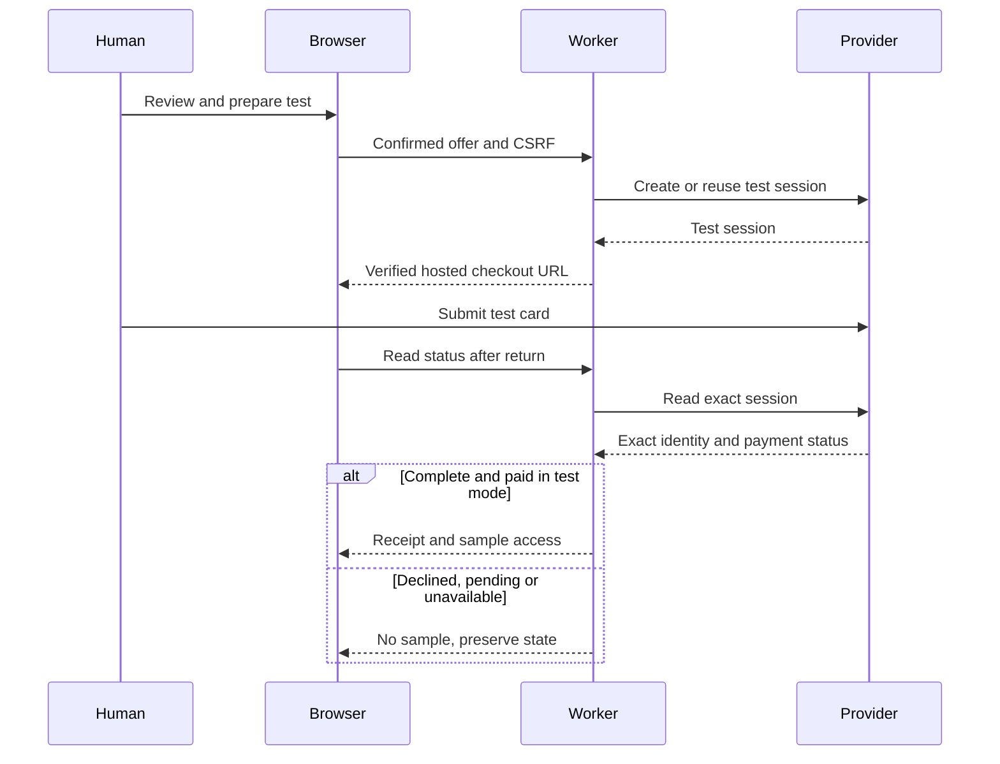
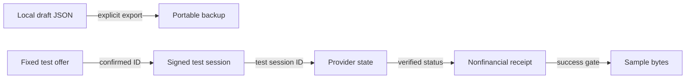
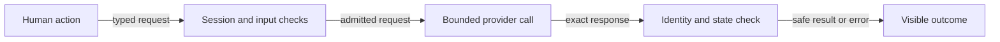
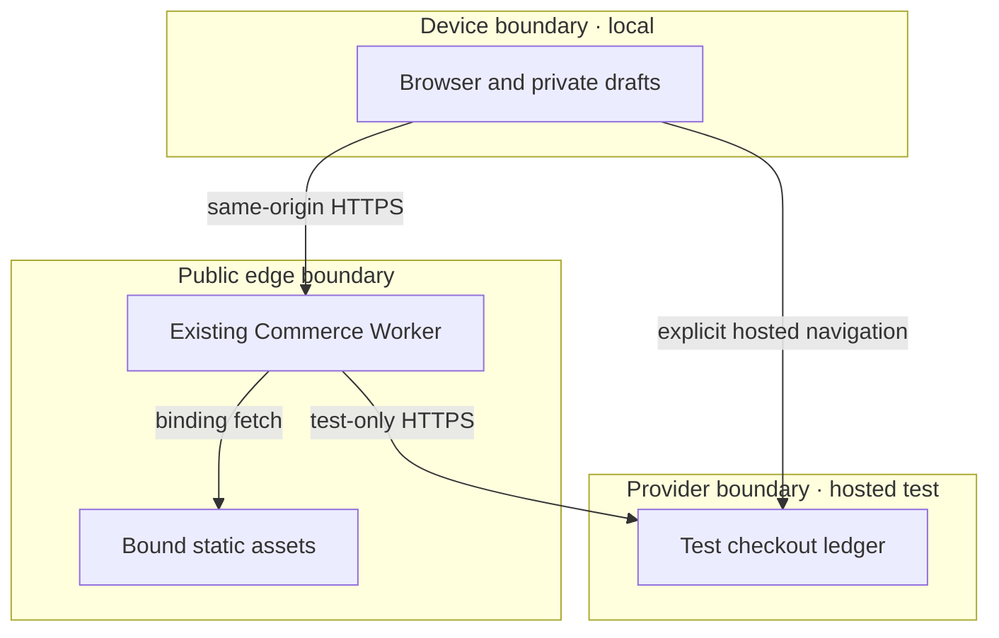

# Reference implementation — native commerce, workspaces and first-dollar boundary

The approved [durable listing fulfillment](durable-fulfillment.md) extension joins the existing draft,
review and sandbox owners. Its candidate runtime and rollback gates have separate evidence; they do
not inherit the production verification recorded below.

The proposed [native commerce transfer ecosystem](prd-tad-adr-mvp-gtm-native-commerce-transfer.md)
at `NATIVE-COMMERCE-TRANSFER-001@0.2.1` specifies MainPanel, transfer and policy-evidence enhancements.
It consumes this sandbox baseline and inherits no implementation, payment or deployment readiness.

`edge-commerce-agent-mvp@0.18.0` joins [PRD](#prd), [TAD](#tad), [ADR](#adr), [MVP](#mvp)
and [GTM](#gtm). PRD owns criteria; TAD consumes that exact revision; ADR binds the design;
MVP and GTM consume their checks and outcomes. This document describes concrete choices for
this reference implementation, not universal vendor requirements. Shared [guidelines][guideline]
and the [CID contract][cid] own grammar; no new command or continuity schema is introduced.

The legacy sandbox section anchor is retained for existing 0.5.0 companion links.
0.6.0 reconciles documentation with the deployed 0.5.0 implementation; it changes no runtime or
wire contract. The historical operator instruction was **sandbox payment only, complete autonomously**.
A later deployment still requires its own exact-candidate authority. Protected merge is not deployment.
The [first-dollar sprint][sprint] owns actual customer validation and collection at
`PRD-TAD-ADR-COMMERCE-MVP-GTM-001@1.2.0`; it consumes this sandbox, not the reverse.

**Context:** [ER-SB-01–07][evidence] record the historical sandbox; current source owners support the workspace increment.
**Intent:** let a solo operator prepare an offer and understand its next permitted action and actual outcome.
**Directive:** implement the authorized native workspace increment, bind each criterion to source and evidence, and
keep unvalidated demand, live payment and full-agent production behind their own gates.
**Role/Subject:** Commerce product architect. **Action:** implement native workspace visibility and recovery over existing owners.
**Outcome:** one current criterion-to-source-to-check chain. **Verb/Object:** implement / the native commerce increment.

## Current workspace increment — reference implementation

The [workspace companion](prd-tad-adr-mvp-gtm-commerce-workspaces.md) is the size-bounded
CW-01–CW-08 extension of this same `edge-commerce-agent-mvp@0.16.0` join. It owns the new
project/environment read projection, native admin recovery journey, capability boundaries,
five flows, C01–C16 coverage and next bounded tasks. It adds no independent product or roadmap.
The five section roles below retain EC-01–EC-10; each consumes its matching companion section
for CW requirements/design/decisions/MVP/GTM. Historical receipts remain at their recorded revisions.
The 0.6.0 sandbox retains its scoped evidence. Revision 0.14.0 adds a compact project console and merchant detail views over saved local drafts,
retaining the preceding environment visibility, publication recovery and failure-path checks. The companion records their
local proof and incomplete human/full-runtime acceptance. Whole-document rungs stay `undocumented`.

The follow-up “IMPLEMENT recommendations; live ui verification” authorizes source implementation and
local browser verification. The subsequent fidelity request authorizes original native composition
of the local Admin project list/detail. Outreach, deployment, financial effects and provisioning remain separate.
No reference implementation, assets, dependency or hosted service is imported for this increment.

The 0.14.0 workspace increment is owned by the companion's **CW-D04 / CW-A5**: native
project search/detail, exact-revision offer readiness and environment inspection share one schema
and read handler across the compact UI, optional WebMCP and stateless MCP. Existing `/ @ #`
routing vocabulary comes from the native token-map owner; full-runtime registry admission is not
claimed. Browser-local reads and explicit headless snapshots have distinct provenance. This
preserves human launch approval and the first-dollar boundary; hosted infrastructure is excluded.
CW-D05 / CW-A6 reuses this console shell across Shopper and Vendor, including compact navigation,
role-specific search and responsive panels; catalog, editor, review and offline persistence retain
their native owners. The companion carries acceptance and verification boundaries.
CW-D06 / CW-A7 aligns the project and environment overview with a shared preview/status card,
project context selection, searchable saved-offer activity and explicit environment-check history.
Existing invocation and effect boundaries remain owned by their current handlers.
CW-D07 / CW-A8 adds a contextual Agent tools dialog reusing the same lazy runner, exact saved
IDs/revisions and scoped prepared snapshots. Explicit invocation, close/disposal, focus and offline
checks preserve existing capability contracts and human launch authority.
CW-D08 / CW-A9 adds compact environment panels, result-filtered and paginated check history,
and exact observation inspection. The current readiness owner retains 20 tab-local records;
all invocation surfaces keep the same explicit environment-read capability and effect boundary.

## Codebase grounding — reference implementation

The supplied private, untracked input `joohwee/prd-tad-ard/prd-tad-adr-mvp-gtm-edge-commerce-agent.md`
revision 0.1.0, SHA-256 `fc833b05a1ab59520a45fb6b1f0149d298341a62c248cb118629535aae5223bf`,
remains preserved as input. It is not a second implementation owner. Material claims used here:

| Input claim | Disposition | Scoped source evidence / consequence |
|---|---|---|
| No existing codebase; new storefront/cart/merchant workers required | contradicted | [Runtime source][source] already owns `src/edge/index.ts`, `src/core/checkout-session.ts`, theme deployment and `public/local-first/`; reuse them |
| First sale requires a new cart, database and accelerator | contradicted | Existing single-offer Core checkout owns its SQLite Durable Object; the public sandbox instead uses the provider's existing session ledger; no new store |
| Private draft review confers payment or publishing authority | contradicted | `public/local-first/launch.js` checks content only; `src/core/theme-deployment-store.ts` requires fenced operator authority; sandbox writes separately require session/CSRF checks |
| Optional browser-native tools are absent | contradicted | `src/edge/client/webmcp-runtime.ts` and existing browser action/tool owners provide optional tools; ordinary browser controls remain available |
| External marketplace or agent projects supply implementation code | contradicted | Existing native HTML/CSS/JS and `src/local-first/stripe-checkout.ts`; no copied framework, prompt, source or new dependency |
| The specified Stripe sandbox belongs to the operator | confirmed | ER-SB-05 authenticated MCP read; `checkout-offer.ts` pins the account and test price; create rechecks both |
| Returning from hosted checkout proves payment | contradicted | `checkout.ts` re-reads the exact provider session; only `complete` and `paid` enables sample delivery |
| Free quotas or synthetic settlement establish zero TCO, demand or revenue | unverified | No account bill, priced customer conversation or actual collection evidence; none is used for a readiness or WTP claim |
| Wallet availability, fee tables and account quotas justify a new rail | unverified | Not needed for this increment; recheck with the payment owner before adopting a rail, rather than copying historical pricing assumptions |

Historical sandbox source bindings; current CW bindings are in the companion.

| Owner and exact source | Owned capability / join |
|---|---|
| Commerce `50cc1d7e1a81af4ca89c2c4584bc50aee89ec55f` | Public sandbox, private drafts, full Edge/Core source and release controller |
| OS `08afe0e775b3a65bf7c9e6f21c0b19d9c2a6b2d3` | Shared workspace and lifecycle owner; consumer package stays at lockfile pin `13c3839aba7fc64bf94f93aa29b1239ab929840d` |
| Graph `ddfb165472ce20a2fe4ebca9b799d32c86cb052d` | Full-runtime discovery/payment providers and its own Dev → generated mirror → public deployment |
| Canvas `821415e48c59de96f7184a2b32d1597727698558` | Admission and protected transition authority |
| Website `c83b43bd7fd018e0ac41629787e0e713db9a1e13` | Guideline 2.6.0 and shared semantic/diagram checks |
| Production mirror `6f1d5d0ef0d6345a3b066bb7029e08dcf6b68077` | Generated Graph projection; no authored edits or Commerce deployment inference |
| Spatial client `8334355dc2c1f9bdf463ba102a63b5a3ac579d89` | Optional GameXR client; no checkout prerequisite |

Private workspace context was refreshed at `9f910e4db51c25bde7c6be867d8ceff229e05c8e` under OS
config `08afe0e775b3a65bf7c9e6f21c0b19d9c2a6b2d3`. Memory grants no execution or release authority.
Earlier 0.5.0 handoffs are historical observations at their declared revision. The serialized
`commerce.merchant-launch/v1` keeps its existing `edge-commerce-agent-mvp@0.2.0` contract identity;
this documentation revision neither rewrites exported packs nor treats that compatibility join as stale authority.

## PRD

**Join:** `edge-commerce-agent-mvp@0.16.0`.

**PP-01 — unvalidated:** a solo service operator cannot easily test an offer-to-delivery journey
without rebuilding payment integration. Impact and frequency are hypotheses; no priced prospect
conversation or measured willingness-to-pay has been supplied. A technical rehearsal can reduce
integration uncertainty, but cannot validate the buyer or promise high WTP.

**Personas and stories:** as a solo vendor, I want private drafts, estimated economics and exact
review so I can prepare an offer without publishing research. As a shopper testing the example,
I want clear test terms and an explicit confirmation so I know no real money moves. As an admin,
I want truthful readiness and failure states so I do not mistake role navigation for authority.

**Must (historical sandbox):** EC-01–EC-07, the dependency-closed rehearsal recorded in ER-SB.
**Must (workspace increment; see companion implementation disposition):** CW-01–CW-08 in the companion, with separate acceptance. **Should:** a timed actual
prospect walkthrough and priced pilot under the sprint owner. **Could:** additional supported role
workflows once a buyer need is evidenced. **Won't (this increment):** real charges, subscriptions,
inventory, shipping, payouts, customer accounts, multi-item carts, autonomous price/payment writes,
new databases, paid hosting, extra model calls, background agents and automatic cross-device sync.

Each row states a Given/When/Then VCC and names its TAD owner, ADR and evidence. EC-08–EC-10 are
separately scoped supporting capabilities; they do not widen the public profile's delivered rung.

| ID / VCC | Given → when → then | TAD / ADR / evidence |
|---|---|---|
| EC-01 | Given saved v1/v2 drafts, when offline reload/import or competing edits occur, then accepted data survives and malformed/stale writes preserve the previous version | C1 / A1,A3 / ER-SB-02,03; local-first Worker/merchant tests and browser groups |
| EC-02 | Given complete costs and saved terms, when review/export runs, then integer estimates are exact, edits invalidate review and exported launch arguments omit private notes | C1,C2 / A1,A3 / ER-SB-02,03; `merchant-launch.test.mjs`, `merchant-browser.mjs` |
| EC-03 | Given the public offer, when a human starts checkout, then explicit review, valid session and CSRF are required; offline or agent API writes cannot approve it | C3,C4 / A2 / ER-SB-02,03; `checkout.test.mjs`, browser sandbox group |
| EC-04 | Given a provider response, when identity is validated, then live keys/sessions or account, offer, nonce, amount or currency mismatches fail closed; repeated create reuses its intent | C3,C4 / A2 / ER-SB-02,03,05; `test/local-first/checkout.test.mjs` |
| EC-05 | Given an open or declined session, when it is read/canceled, then it never unlocks a sample; cancel expires the open session and refresh never asserts payment from a redirect | C3,C4 / A2 / ER-SB-02,03,06 |
| EC-06 | Given provider-confirmed test success, when receipt/download is requested, then the same signed browser session receives a nonfinancial receipt and sample; receipts exclude customer details and are not offline-cached | C3,C4 / A2 / ER-SB-02,03,05–07 |
| EC-07 | Given the exact approved artifact, when release/readback runs, then source, Worker version, route, sandbox bindings and all eleven browser groups agree | C5 / A2,A6 / ER-SB-03,04 and protected approval/artifact |
| EC-08 | Given the full Dev profile, when an authorized merchant activates and a shopper confirms, then one synthetic settlement/revenue row occurs and replay adds neither | C6 / A1,A4 / ER-SB-02; `test/e2e/dev-paid-loop.spec.ts`; delivered `undocumented` |
| EC-09 | Given the full Edge profile, when shopper/vendor/admin controls and browser tools are used, then existing scopes and human-write gates hold | C6 / A4,A5 / ER-SB-02; `commerce-experience.spec.ts`, `merchant-workspace.spec.ts`; delivered `undocumented` |
| EC-10 | Given these joined docs, when existing parser, projection, link and scope checks run, then metadata, continuity and grounded evidence resolve without runtime changes | C7 / A6 / documentation check record in this revision; no product-delivery claim |

EC-09 replaces the duplicate use of EC-08 for experience acceptance in 0.5.0; EC-07 owns the
public release proof. This explicit split changes documentation identifiers, not behavior.

| Metric | Baseline / estimate | Target and measurement boundary |
|---|---|---|
| TTV to first private draft | Estimate 4 actions / 2 min | ≤5 actions / 3 min; fresh browser walkthrough pending; offline behavior independently tested |
| TTV to first sample | Estimate 10 actions / 3 min, card details grouped as one form | ≤12 actions / 5 min; hosted path completed, clean first-use stopwatch study pending |
| Checkout amount | Fixed SGD 8.00 test amount; actual charge 0 | Test amount is never revenue |
| Monthly runtime model tokens | 0 prompt + 0 completion on native draft, checkout and read paths | Retain zero model calls; caller-owned agents measure their own usage |
| Monthly / 12-month TCO | No new package, Worker or store; billing and operator time unmeasured | Free-tier execution only; no $0 total-cost claim until actual bill and labor are measured |
| ROI score | Impact/reach and operator hours unknown | Do not fabricate `(impact × reach)/(hours + monthly TCO + token cost)`; validate PP-01 before paid-product ranking |
| Authoring cost | One docs lane, 3 files, zero runtime/module/always-load delta | 40-minute initial estimate; three alignment cycles max; stop/replan if blockers do not decrease |

The TTV and economic research gaps are tracked in the alignment register; they do not become
retroactive runtime acceptance results. Customer adoption remains below sign-off under the sprint owner.

## TAD

**Join:** TAD consumes exactly PRD `edge-commerce-agent-mvp@0.16.0`; ADR binds these components.
CW requirements consume W1–W5 in the companion. The following rungs are historical EC evidence,
not fresh verification of the October source or whole-workspace acceptance.

| Component | Single owner / contract / bounds | Local / delivered rung |
|---|---|---|
| C1 private draft store | `public/local-first/drafts.js`; `commerce.local-drafts/v2`, v1 import; 100 drafts, existing 8 MB backup cap, revision-checked IndexedDB transactions | runtime-ready / production-verified, EC-01 |
| C2 launch preparation | `launch.js`; `commerce.merchant-launch/v1`, integer minor units, exact-content digest; no authority or real provider-price override | runtime-ready / production-verified, EC-02 |
| C3 browser checkout | `checkout.ts`, `checkout-offer.ts`, `public/local-first/checkout.js`; only `#checkout` loads the module; fixed test offer, no arbitrary draft prices | runtime-ready / production-verified, EC-03–06 |
| C4 provider adapter | `stripe-checkout.ts`; native HTTPS, existing provider ledger, no SDK; 15 s/request, 65,536-byte response limit, no automatic retry | runtime-ready / production-verified, EC-04–06 |
| C5 deployment | `scripts/local-first-release/`; v2 artifact, authorization, browser and completion schemas; exact public source/version/route readback | runtime-ready / production-verified, EC-07 |
| C6 full Commerce runtime | Existing Edge/Core, `CheckoutSession`, `ThemeDeployment`, derived `RevenueLedger`, human confirmation and optional WebMCP | dev-proven / undocumented, EC-08,09; full production evidence remains gated |
| C7 documentation checks | Existing authored-limits/terminology and website parser/projection owner; no runtime validator added | dev-proven / undocumented, EC-10; metadata, links, limits and projection checks passed |

**Integration and state:** only `GET checkout`, status, receipt, download and `POST start`, cancel,
reset are admitted under `/agentic-commerce-os/checkout`. POST bodies are ≤1,024 bytes and require
exact offer, `confirmed:true`, matching Origin, content type and CSRF. A signed Secure/HttpOnly/
SameSite=Lax cookie carries a random intent and optional provider session for seven days. Creation
expires at 23 hours before the provider's minimum 24-hour idempotency retention. Only test keys and
`cs_test_*` identities are valid. Account and price are re-read before create; every response checks
nonce, owner, offer, amount, currency and mode. Errors preserve pending/unknown state. Expired
sessions may return a nonfinancial receipt; only `complete` + `paid` unlocks sample content.

Receipt schema `commerce.stripe-test-receipt/v1` separates `realMoney:false`, `chargeMinor:0` and
`testAmountMinor:800`. The sample is also open source, so this is delivery verification, not copy
protection. Card details stay on the provider page; no customer details enter the browser receipt.
Receipt/download/API requests are excluded from service-worker caching. Offline use is for private
preparation; cross-device transfer uses explicit JSON export/import and conflict checks.

**Invocation and readiness dimensions:** the public profile's normal browser controls remain primary.
OS Status Surface is explicitly excluded from this increment; full-profile `/readiness` remains a
separate read capability. AI Agent Discovery and MCP Gateway federation use existing full-profile
`src/edge/mcp.ts`, `src/edge/client/webmcp-runtime.ts` and [runtime API](runtime-api.md), each `dev-proven` /
`undocumented` for delivery here. There is no new tool registry, proxy, payment-confirmation tool,
model invocation or claim that remote transports expose local harness parity.

### Five flow patterns — reference implementation

All diagram source is present below; tables give a text/mobile/offline fallback. Body Mermaid
flowcharts target the declared D3 projection; the sequence is text/static only and makes no graph
projection claim. Rendering and projection checks are recorded separately from runtime evidence.

**Diagram EC-J1** · Class: Journey stage map · Notation: flowchart LR · Version: 1 — 2026-09-12 · Surface: d3
**Caption:** The rehearsal moves from private preparation to an explicitly confirmed test and verified sample.

```mermaid
flowchart LR
  draft["Prepare private offer"]
  review["Review fixed test example"]
  hosted["Complete hosted test"]
  sample["Receive sample"]
  learn["Plan priced prospect test"]
  draft -->|"review"| review
  review -->|"confirm test"| hosted
  hosted -->|"verify"| sample
  sample -->|"record gaps"| learn
```

| EC-J1 node | Journey / criterion |
|---|---|
| draft | Vendor preparation; EC-01,02 |
| review | Shopper review; EC-03 |
| hosted | Human provider test; EC-04,05 |
| sample | Verified delivery; EC-06 |
| learn | Admin learning; GTM, no demand assertion |

**Diagram EC-W1** · Class: User workflow · Notation: sequenceDiagram · Version: 1 — 2026-09-12 · Surface: text-only
**Caption:** A return navigation never substitutes for the provider's authoritative payment state.

```mermaid
sequenceDiagram
  participant Human
  participant Browser
  participant Worker
  participant Provider
  Human->>Browser: Review and prepare test
  Browser->>Worker: Confirmed offer and CSRF
  Worker->>Provider: Create or reuse test session
  Provider-->>Worker: Test session
  Worker-->>Browser: Verified hosted checkout URL
  Human->>Provider: Submit test card
  Browser->>Worker: Read status after return
  Worker->>Provider: Read exact session
  Provider-->>Worker: Exact identity and payment status
  alt Complete and paid in test mode
    Worker-->>Browser: Receipt and sample access
  else Declined, pending or unavailable
    Worker-->>Browser: No sample, preserve state
  end
```

| EC-W1 participant | Responsibility / failure boundary |
|---|---|
| Human | Explicit test confirmation; may decline or abandon |
| Browser | Local review and signed same-origin session; no payment assertion |
| Worker | Validate CSRF, exact identity and provider state; fail closed |
| Provider | Own authoritative test session; no live-key acceptance |

**Diagram EC-D1** · Class: Data flow · Notation: flowchart LR · Version: 1 — 2026-09-12 · Surface: d3
**Caption:** Draft content stays local; only the fixed reviewed test offer reaches payment preparation.

```mermaid
flowchart LR
  local["Local draft JSON"]
  backup["Portable backup"]
  offer["Fixed test offer"]
  session["Signed test session"]
  provider["Provider state"]
  receipt["Nonfinancial receipt"]
  sample["Sample bytes"]
  local -->|"explicit export"| backup
  offer -->|"confirmed ID"| session
  session -->|"test session ID"| provider
  provider -->|"verified status"| receipt
  receipt -->|"success gate"| sample
```

| EC-D1 node | Schema / owner / journey |
|---|---|
| local, backup | `commerce.local-drafts/v2`; C1; preparation |
| offer | Fixed `CHECKOUT_OFFER`; C3; review |
| session | Signed intent / optional payment ID; C3; preparation |
| provider | Exact test checkout session; C4; confirmation |
| receipt, sample | `commerce.stripe-test-receipt/v1` and Markdown; C3; delivery |

**Diagram EC-H1** · Class: Orchestration / harness flow · Notation: flowchart LR · Version: 1 — 2026-09-12 · Surface: d3
**Caption:** Each user action executes one bounded deterministic pass with no model call or background retry.

```mermaid
flowchart LR
  intent["Human action"]
  validate["Session and input checks"]
  adapter["Bounded provider call"]
  verify["Identity and state check"]
  view["Visible outcome"]
  intent -->|"typed request"| validate
  validate -->|"admitted request"| adapter
  adapter -->|"exact response"| verify
  verify -->|"safe result or error"| view
```

| EC-H1 node | Role / input → output / bound |
|---|---|
| intent | Dispatcher: visible confirmation → request; one action |
| validate | Guard: bounded JSON/session → admitted request or typed error |
| adapter | Executor: typed test operation → ≤65,536-byte response; 15 s per request; create includes parallel account/price reads then session create |
| verify | Observer: exact provider response → verified status or refusal; zero tokens |
| view | Consumer: status → pending/error or sample access; no automatic retries |

**Diagram EC-T1** · Class: Runtime topology · Notation: flowchart TB · Version: 1 — 2026-09-12 · Surface: d3
**Caption:** Browser drafts and provider test state remain in separate trust boundaries under one existing public Worker.

```mermaid
flowchart TB
  subgraph device["Device boundary · local"]
    browser["Browser and private drafts"]
  end
  subgraph edge["Public edge boundary"]
    worker["Existing Commerce Worker"]
    assets["Bound static assets"]
  end
  subgraph service["Provider boundary · hosted test"]
    provider["Test checkout ledger"]
  end
  browser -->|"same-origin HTTPS"| worker
  worker -->|"binding fetch"| assets
  worker -->|"test-only HTTPS"| provider
  browser -->|"explicit hosted navigation"| provider
```

| EC-T1 node | Role / type / lane / residency |
|---|---|
| browser | Consumer + private store / browser / delivery / device; no automatic sync |
| worker | Router + guard / existing Worker / delivery / edge processing |
| assets | Read-only source / asset binding / delivery / provider-managed static storage |
| provider | Authoritative test state / managed API / delivery / provider-managed; no residency jurisdiction claim |

| Diagram | Projects | Nodes | Edges | Clusters | Version |
|---|---|---|---|---|---|
| EC-J1 | yes | 5 | 4 | 0 | 1 |
| EC-W1 | no | 0 | 0 | 0 | 1 |
| EC-D1 | yes | 7 | 5 | 0 | 1 |
| EC-H1 | yes | 5 | 4 | 0 | 1 |
| EC-T1 | yes | 4 | 4 | 3 | 1 |

### Deployment and recovery — reference implementation

| Boundary | From → to | Evidence / operator instruction | Recovery / state |
|---|---|---|---|
| Source integration | Authoring → protected main | Exact Integration Gate and authorized PR merge; ER-SB-01,02 | Revert through protected successor; current docs merge does not deploy |
| Public sandbox | Approved main artifact → existing public route | ER-SB-03,04; exact protected environment approval retained in run | Controller retained predecessor version/route and rollback checks; open for that released candidate only |
| Full agent production | Full Core/Edge candidate → delivery | Missing independent trust/provider/execution evidence under `production-runtime.md` | Existing release owner; closed |
| Real money / customer pilot | Reviewed offer → real transaction | Current instruction permits sandbox only; actual payer and payment authority absent | No live operation; closed |

Commerce's scoped public profile deploys directly through its own protected workflow. Graph's
Dev → generated `huijoohwee` mirror → public Graph/apex topology remains Graph-owned. This docs
change edits neither mirror nor route. Route evidence never grants another component's release.

## ADR

**Join:** ADR `edge-commerce-agent-mvp@0.16.0` binds this PRD/TAD. Accepted decisions:

- **EC-A1 — reuse native owners.** Existing drafts, themes and checkout avoid a second store or
  application. A new cart/database was rejected for this single-offer rehearsal; recovery preserves
  old backup import and launch-pack contracts. Consequence: multi-item marketplace work is deferred.
- **EC-A2 — keep sandbox payment at its provider.** Reuse Stripe's existing test account with a thin
  native HTTP adapter; Graph's live-configured payment service stays unchanged. A deterministic FOSS
  local simulator remains a test fixture, not provider integration proof. A self-hosted payment stack
  adds operations and cannot prove this account's hosted behavior. Provider outage means unavailable,
  never an inferred success. Keys stay in protected secrets; no SDK or ledger is added.
- **EC-A3 — local preparation and explicit writes.** Reuse IndexedDB and export/import; reject an
  automatic sync service. Review digests protect content integrity, not identity or payment authority.
- **EC-A4 — full-profile role boundaries.** Reuse operator fencing, public/agent tool allowlists and
  staged proposals. Public role pages grant no credentials; no agent fabricates human presence.
- **EC-A5 — native UX patterns.** Reuse semantic HTML, CSS, dialogs and existing actions.
  [Native workspace coverage](native-commerce-workspaces.md) remains historical behavior evidence.
  CW-A1 extends these owners; inventory, payouts and complete platform parity remain unclaimed.
- **EC-A6 — source-owned documentation and exact release.** Remove the deferred-checkout conflict,
  join the sprint/evidence companion and retain dated observations. No runtime/schema changes or
  replayed deployment authority; full-profile trust gates remain unchanged.

**Constraints ↔ Argumentation ↔ Outranking:** admit only sandbox-only, zero-new-resource, native
choices. A native simulator satisfies offline fixture needs but fails the operator's real-provider
integration condition; routing through the live payment service fails the sandbox boundary. The
existing provider plus bounded adapter satisfies both. These arguments favor reuse over a new
stack by fewer unbuilt components; ER-SB-02–07 independently test the selected outcome. This is a
constraint-based engineering choice, not a self-graded commercial score or proof of FOSS licensing
for the managed provider. No unsupported pairwise economic superiority is asserted.

| TCO dimension | Existing managed test service | Existing FOSS local fixture | New self-hosted stack |
|---|---|---|---|
| 12-month infrastructure/egress | No new resources; account bill unmeasured | Existing device; energy/storage unmeasured | Not provisioned; cost unknown, not admitted |
| Model tokens | 0 | 0 | No justified model need |
| Operator burden | Existing account/secret and provider API maintenance | Existing fixtures; no hosted-account proof | Additional patching, backup, operation and security |
| Tradeoff | Meets requested hosted test; proprietary managed dependency already selected by user | Reusable deterministic tests; does not meet hosted outcome | Extra TCO without a nearer verified outcome |

## MVP

Consume EC-01–EC-07, C1–C5 and A1–A3/A6. Evidence ER-SB-01–07 in the [handoff][evidence]
closes the released sandbox slice. EC-08/09 remain separately Dev-proven; prospect acceptance,
real collection, cross-region guarantees, measured TCO and physical-device reach are not inferred.

| Demo beat | Action / check | Budget |
|---|---|---|
| Hook | State PP-01 and the sandbox-only outcome | 20 s |
| Setup | Open the fixed offer and review terms; EC-03 | 40 s |
| Reveal | Complete test checkout, verify provider status and download; EC-04–06 | 3 min target |
| Close | Show nonfinancial receipt and next priced-customer evidence; GTM | 30 s |

Actual hosted decline, success and downloads were observed in ER-SB-05–07. The beat budget is a
future timed demo target, not a retroactively measured benchmark. Domain object: a reviewed test
checkout intent. Its attained capability is verified test delivery; next gap is a real prospect's
accepted offer and authorized collection, not a higher external marketplace rubric level.

Bounded execution consumes these same joins: D1 documents and checks EC-10; D2 protects integration
and cleanup under A6; GTM successor S01 depends on a priced prospect, independently of D1/D2.
No extra agent, worktree, schema registry or persistent task record is required by a phase label.

## GTM

Consume PP-01, the PRD's research metrics and A1/A2. The boundary record is ER-SB-01–08 plus
ER-GTM-01–03 in [the evidence companion][evidence]; it explicitly separates offer, runtime,
mechanism, transaction, fulfillment and economics. `mechanism-proven` applies to sandbox only;
`demand-validated` and collected revenue remain absent. No outreach or real payment was performed.

| Priority / stream | Reuse / new work | Constraint, argument and prerequisite |
|---|---|---|
| 1 — concierge setup, Should until a reachable prospect exists | Existing drafts/themes/test demo; new priced conversation and accepted deliverable | Fewest unbuilt components; one unvalidated buyer is still a gate, not an existing segment |
| 2 — recurring hosted service, Could | Existing release owner; new full-runtime evidence and paying repeated use | More prerequisites than setup; full production and recurring value unproven |
| 3 — marketplace take-rate, Won't this increment | Existing derived revenue; new genuine external volume | Requires verified distinct external principals and actual transactions |

Acquire the first prospect through the operator's existing relationships only after choosing a
named recipient and authorizing outreach. Existing relationships are a channel hypothesis, not an
observed audience. Record priced conversation → accepted deliverable → authorized collection →
measured delivery cost → successor Context. Feed authentic receipts to the existing demand verifier;
never enroll fabricated payer evidence from this sandbox. [The sprint][sprint] owns those steps.

## Alignment and maintenance — reference implementation

The historical evidence companion consumes 0.6.0 and the sprint at 1.2.0; it is not silently
re-stamped as October evidence. The workspace companion records the 0.16.0 source join; RR-D10 records local readiness repair and remaining runtime gates. Historical
five-role joins, source links, schema owners, five flow inventories, deployment boundaries and
monetization separation are the bounded documentation review. Existing source checks validate
syntax, links, limits and projection; they do not certify every advisory statement in the guideline.

**Observed checks, 2026-09-12:** shared metadata parser, all five revision joins, 27 local links/anchors,
authored limits (382 files), terminology (383 files) and convergence (8 assertions) pass. Existing
projection check passes for 10 diagrams: 44 nodes / 37 edges / 7 clusters across the two owners;
this sandbox contributes 21 / 17 / 3. All ten diagrams render with the existing Mermaid runtime;
workflow and topology images were visually inspected. Static syntax failures in both sequence
diagrams were corrected at source. No runtime or dependency file changed. Protected CI still
validates the exact published candidate.

**Selected artifact-bearing coverage:** 12/12 linked: `markdown-yaml-frontmatter-enforcement#1`
(frontmatter), `artifact-continuity-authoring-seam#1,#3,#5,#6,#8` (joined roles, one owner, grounding,
criterion coverage and independent evidence), `flow-patterns#1,#2` (five flows),
`time-to-value#1` (metrics), `monetization#1,#3` (separate evidence and ranked streams),
`division-of-work#1` (C1–C7). Advisory framing is not scored as missing artifacts; this selection
contains zero advisory rules and is not an exhaustive guideline conformance certificate.

| Finding Type | Severity | Rule anchor | Artifact reference | Evidence excerpt | Remediation |
|---|---|---|---|---|---|
| missing-economics-metric | major | time-to-value#2 | PRD metrics | "clean first-use stopwatch study pending" | Locally reproducible timed fresh-profile walkthrough by QA before customer sign-off |
| pain-point-not-validated | major | pain-point-to-feature-mapping#1 | PP-01 / sprint S01 | "no priced prospect" | Specification change by product owner with a priced prospect result before demand promotion |

Known 0.5.0/1.1.0 issues resolved: `status-conflict` (deferred versus deployed test checkout),
`artifact-naming-noncompliant` (mixed revision joins), `missing-frontmatter-key` (handoff), and
`cid-composition-divergence` (different CID/RAO/SVO actions). Historical 2026-09-12 bounded review: 0 blocker,
2 tracked major, 0 minor; other selected finding types are zero. No runtime-ready claim is made
for the pending research or full production capabilities. Recheck after any upstream criterion,
source or evidence revision; at most three alignment cycles, stop/replan if blockers do not decrease.

[guideline]: https://github.com/huijoohwee/huijoohwee.github.io/blob/82835ac37d524643faa6b9703cb077ea9474ab15/guidelines/prd-tad-adr-mvp-gtm-guidelines.md
[cid]: https://github.com/huijoohwee/huijoohwee.github.io/blob/82835ac37d524643faa6b9703cb077ea9474ab15/guidelines/cid-guidelines.md#shared-field-contract
[source]: https://github.com/huijoohwee/agentic-commerce-os/tree/50cc1d7e1a81af4ca89c2c4584bc50aee89ec55f
[evidence]: prd-tad-adr-mvp-gtm-handoff.md#mvp
[sprint]: prd-tad-adr-mvp-gtm-20260909T1320Z-solopreneur-mvp-gtm.md

## Experience assessment — reference implementation

This assessment consumes `edge-commerce-agent-mvp@0.16.0` and the separately scoped EC/CW criteria and evidence above. Core Requirements & Functionality, Innovation & Theme Alignment, Technical Execution & Integration, and Usefulness & Agentic Experience are **unassessed**: no criterion-scored user observation is attached to this implementation revision; automated and agent-operated checks are not customer observations. Existing sandbox and authoring receipts retain their recorded source, environment and expiry; this assessment neither renews them nor changes their readiness scope.

The document owner must capture one timed pilot in the buyer’s existing workspace, record the four observations using the shared maturity rubric, and measure accepted outcome, actual payment, repeat use and delivery/support cost separately. A successful sandbox checkout proves its declared mechanism only; it cannot establish willingness to pay, a commercial winner or collected customer revenue. Append the learn-loop result as a successor Context through the shared planning owner.

## RR-D10 — Production readiness recovery, reference implementation

**Context / PRD:** the 2026-10-04 live audit found fulfillment admission 503 while configuration readiness was 200. The deployed source remained `081de8b254985b09bd6e3d7367bf5d54484e44a3`; protected main was `ff97aa8274b9e00c1fda2a743aa5cdaba3c59e19`. User instruction “implement Production readiness” authorizes the repair over existing owners. Buyer priority: recover the existing offer-to-fulfillment path before adding capabilities.
**TAD:** the existing local-first Worker owns one bounded readiness observation, reused by the environment tool. Its configured host is checked through the existing authenticated relay with a 3-second deadline and request cancellation. Configuration, disabled fulfillment and unavailable fulfillment stay distinct. No cookie, job, model invocation, new registry or stored health cache is created. Browser tools remain explicit and lazy; the existing invocation grammar and schemas stay intact.
**ADR / RR-A1:** extend existing readiness and release owners. A configured host failure produces HTTP 503 with sandbox configuration retained; the native environment view shows Degraded. Host pins/errors/credentials stay private. Local profiles without a host explicitly report disabled. Fulfillment promotion requires the existing actual-listing rollback rehearsal; a v3 completion binds its proof digest to the exact source, restored deployment and retained reader. No evaluator proof or production authority is fabricated.
**MVP:** RR-01 requires unavailable, recovered, canceled and hung hosts to produce truthful bounded readiness; RR-02 requires API/tool parity and preserved UI/invocation flows; RR-03 rejects skipped, foreign-candidate or incomplete rollback evidence before a production-complete receipt. Independent full-profile evaluator enrollment, provider/catalog/registry evidence, real payments and whole-product parity remain outside proven scope.
**GTM:** restored execution shortens the existing first-offer path; no new price, demand, collection or conversion claim. Customer validation remains with the first-dollar owner. Sprint estimate/cap: 30 active minutes, 10 code/test modules plus three existing documentation owners, <200 kB source diff, no dependencies/new hosted resources/paid calls. One new test module is lazy development-only; existing runtime owners gain bounded code with no always-load module added. External waits have conditions, not ETAs.

| Criterion | Existing owner and check | Local readiness | Delivered readiness / next condition |
|---|---|---|---|
| RR-01 | `worker.ts`; `runtime-readiness.test.mjs`, `worker.test.mjs` | dev-proven: healthy/degraded/disabled, 3-second bound and cancellation checks pass | production-verified for local-first: source cb06, configured-capability readiness and exact release readback; device-session host limitation retained |
| RR-02 | `workspace-service.ts`, `workspace.js`; `workspace-invocation.test.mjs`, `workspace-browser.mjs` | dev-proven: API/MCP parity passes; responsive/degraded UI acceptance retained in browser receipt | production-verified local-first artifact; source MCP/API parity and public browser receipt retain their own coverage; independent human acceptance open |
| RR-03 | `local-first-release/execute.mjs`, `readiness.mjs`; release/readiness/rollback tests | dev-proven: 26 targeted controller/proof tests pass | production-verified: actual public listing survived retained-reader rollback and exact candidate restoration; v3 receipt binds proof digest |

**Development / unchanged plan join:** accepted requirements remain `edge-commerce-agent-mvp@0.16.0`. [PR #104](https://github.com/huijoohwee/agentic-commerce-os/pull/104) integrated at `cb06ee94bcb484d8b62ab48de633a367bb868846` after the green Integration Gate.
**Production Release:** [run 37214188137](https://github.com/huijoohwee/agentic-commerce-os/actions/runs/37214188137) completed successfully on 2026-10-04 after actual protected approval. Artifact `61be60b0d360e2c96701de721b5d21c565773a3a1c232d6b698bc17ad76502b7` binds the cb06 source. The v3 completion retains restored deployment `476cbbe7-5523-4e24-bf2f-d3efb1b555f8`, Worker version `5b889671-f668-417f-bf62-0b2bef029203`, and receipt digest `d48c2f4e00d228756f3502e1f7fac9b5e8de3d480bad82cfba50af6076356402`. Run artifact `local-first-result-37214188137` retains `completion.json`, `fulfillment-rollback-proof.json` and `live/browser-proof.json`.
**Runtime / recovery:** the actual public-browser listing survived reader version `1c04f403-9cc1-4b45-9dbb-a83e5f3ce7b4` and restoration of the exact candidate. Rollback proof digest `4c7477d80c7c7efbe6ab651fb59e5f8211ffd03afbe3a8fe893272205ae9ba4d` binds both verified deployments and output; human review, payment submission and real money are false. Public browser proof: eleven groups passed, 15:55:58Z.
**Transport observation:** the retained listing host keeps its separate source `f015d40c8caae51503136be92f3b2315be8245e8`, pinned artifacts, SQLite data and model limits of 1.5 GiB/2 CPU. Tunnel v2→v3 changed only the stale hostname fallback from port 5191 to HTTP 404, preserving both pinned 5192 routes and final 404. A guarded write/readback verified config hash `1916461e8ca93a3c32635324a2f8bfc62de0394a7aa5a547dcc1a688b5c7c29d`; the API provides no atomic version condition. 15:50:18Z probes returned host/session 200 and unknown-path 404.
**Limits / successor:** Workers Free is operator-confirmed; billing proof and total cost remain unknown. Availability is `device-session`: device sleep or process loss interrupts fulfillment. Full-profile issuer/evaluator enrollment, provider/catalog/registry evidence, required self-review prevention, real payment and independent human acceptance remain open. Runtime owner rechecks readiness/admission on source, host, ingress or authority drift; Product owns the timed human pilot and demand evidence. Transport rollback stops the connector before verified config restoration; drift prevents replay. Record this outcome through native RELEASE and private TODO. Reconciled main supersedes [PR105](https://github.com/huijoohwee/agentic-commerce-os/pull/105); deployed artifact is unchanged.

## LC — Existing live education offer, reference implementation

**Context / PRD:** the user requests production completion and reuse of the existing Stripe setup. Read-only dashboard observations on 2026-10-05 verify account `acct_1TKGGUGzH0w0k4VU`, active payments/payouts, product `prod_Udp8wzZHVOFgQv` (education materials), and one-time live price `price_1TeXU4GzH0w0k4VUqOmX4aTn`: SGD 800 minor units. The paid deliverable is the existing immutable education asset. No generated listing, subscription, new merchant, new price, new paid resource or new customer claim is introduced. The old webhook destination resolves to an unavailable public Worker and does not establish delivery.
**Intent / directive:** complete the shortest existing buyer-to-paid-download path, with explicit price confirmation and portable receipt recovery. Context → intent → implement existing checkout → verified download is the bounded CID; Commerce runtime owner implements and validates the path. Buyer pain remains hypothesized: interrupted checkout and lost browser state should not lose a paid download. Demand and the first dollar require authentic customer evidence.
**Join:** this material increment binds PRD, TAD, ADR, MVP and GTM at `edge-commerce-agent-mvp@0.17.0`. Historical EC/CW/RR receipts retain their recorded revisions; 0.17.0 does not renew them. LC acceptance consumes the existing sandbox implementation and adds only the requirements below.

| Criterion / PRD | TAD owner and acceptance | Current evidence / next gate |
|---|---|---|
| LC-01 — exact offer and informed charge | `checkout-offer.ts`, `stripe-checkout.ts`: live account/product/price, SGD800, immutable asset digest and profile hash match before creation and fulfillment | Dashboard identity observed; exact-offer source fixtures pass; live API readback remains a deployment prerequisite |
| LC-02 — durable paid delivery | `checkout.ts`, `stripe-webhook.ts`: raw signed webhook timestamp, exact paid Session plus line-item readback, idempotent fulfillment metadata in the existing Stripe ledger | Signature, paid readback and recovery fixtures pass; controlled endpoint creation must bind the returned signing secret before deployment |
| LC-03 — recovery across browsers | `checkout-recovery.ts`, `session.ts`: purpose-bound signed recovery token, distinct persistent secret, paid-state revalidation, same-origin restore; token never in URL | Saved-file, tamper, expiry, unpaid and foreign-offer source checks pass; fixture browser recovery/download pass |
| LC-04 — clear mode and mobile flow | Existing checkout/workspace/workflow views retain sandbox behavior; live shows the actual charge and saves recovery before redirect; reader disables new sales | Desktop/mobile live and reader fixture review pass; existing invocation (12), WebMCP (6) and routing (6) assertions pass |
| LC-05 — retain paid-order reader during rollback | Existing release controller must bind an exact live-compatible reader and new-sale-disabled behavior before live activation | Source preparation only; exact protected approval, authenticated endpoint-provisioning receipt and actual reader proof pending |
| LC-06 — fail closed on configuration drift | `worker.ts` and checkout owner require exact mode/profile and distinct credentials; sandbox remains default; configured readiness is not a payment-provider probe | Missing/malformed profile/secret and mode-separated readiness source tests pass; exact deployed identity remains required |
| LC-07 — authentic economics | Existing first-dollar owner records actual customer consent, gross/net proceeds, fees and support cost separately | No real charge, customer, demand or revenue is claimed from fixtures |

**ADR / LC-A1:** extend the current Commerce Stripe adapter and its receipt/asset owners. Direct reuse of the existing general payment Worker was evaluated: its routes, D1 settlement ledger and plan identity do not implement Commerce browser ownership or asset recovery. A second ledger or a copied payment service would create reconciliation obligations. A small mode-aware extension reuses the existing Stripe account/product/price and standard API; the sandbox path stays available. No new SDK, registry, database, email sender or always-on device dependency is needed for the paid static asset.
**ADR / LC-A2:** separate `sandbox`, `live-reader` and `live`. Reader accepts verified existing orders, recovery and cancellation/reset of existing intents but refuses new checkout creation. Existing hosted sessions may still complete and must retain delivery. Live requires an exact approved offer profile and dedicated live API/webhook/recovery secrets. A sandbox approval grants no live profile authority. Preserve legacy destinations until their owners explicitly retire them; add only the narrowly required Commerce destination after exact release preparation. Rollback must retain the same asset and verification capability.
**ADR / LC-A3:** save a bearer recovery file before navigating to hosted checkout. A signature proves integrity, while fresh Stripe paid-state and exact offer checks grant delivery. Losing both cookie and file requires operator support; no account/email recovery promise is invented. Recovery keys must be backed up privately and retained across reader rollback. Rotating or losing them can invalidate outstanding files and blocks promotion until an explicit migration exists.
**Five flows:** buyer confirmation → recovery file → hosted payment → return/download; disconnected or interrupted buyer → saved-file restore → verified download; webhook → signature/readback → idempotent asset fulfillment; operator → exact build/approval → reader proof → sales enablement; incident → disable new sales → restore verified reader → recover paid orders. Each effect uses its native owner; UI and agent tools do not create payment authority.
**MVP:** implement LC-01–04/06 first, then prepare LC-05 with the existing release controller. Backend slice: 60 active minutes, seven runtime owners and up to four focused test files, ≤70kB combined source/test diff (about 45kB runtime and 20kB tests). UI slice: 30 active minutes plus 10 minutes for observed desktop/focus defects, five existing files, ≤47kB diff/15kB net source. Checkout-only balanced desktop columns retain the existing mobile breakpoint and recovery keyboard focus visibility. Documentation: this owner, <600 lines. Keep every authored file <600 lines and runtime chunk <500kB. Two narrow server helpers are module-scoped; no browser always-load module is added. Release-controller follow-up: 60 active minutes, seven existing policy/deployment owners plus one narrow policy helper and one focused test, ≤70kB diff; root owns the existing workflow/browser verifier and two focused browser tests within a further 40-minute/35kB slice. Native START reserves these exact paths before edits. Webhook pairing correction, including the independently found concurrent-create case: a further 25 active minutes/30kB for one narrowly scoped provisioning helper and one test, with existing controller bindings. No second controller or dependency is introduced. External access, protected checks and human approval are conditions to recheck, not delivery ETAs.
**GTM:** rank this existing SGD8 static offer ahead of recurring hosting or marketplace commissions because it requires fewer unbuilt components and no device availability promise. Publish no conversion forecast. Measure a genuine first visit → informed payment → successful recovery/download and actual delivery/support expense; transaction fees use existing Stripe commercial terms and are not a new paid subscription. No outreach is authorized by this document. Feed authentic observed outcomes to the existing first-dollar owner.
**Development and runtime boundaries:** source review and test evidence may establish dev-proven mechanisms. Protected integration, exact deployment approval, provider configuration, live read-only identity checks, retained-reader proof and public browser verification remain separate effects. A real purchase is a customer action; automated tests must use fixtures or sandbox and must not submit a live charge. This increment does not promote generated listing fulfillment, full-provider runtime, unattended device availability or independent human acceptance.

**Payment-state limit:** the immutable entitlement records a verified completed payment and asset edition. It is not download-consumption evidence, net proceeds, refund automation or a dispute-revocation service. Refunds and disputes remain with the existing Stripe operator workflow; genuine support/refund observations feed a later criterion revision. No automatic revocation or refund SLA is advertised.

**LC release review policy:** the narrowly scoped live static offer uses a distinct live-owner approval receipt bound to the exact source/artifact, checkout mode, profile, webhook destination and retained reader descriptor. The human repository owner must approve that exact protected production run. This is a separate explicit owner-review policy for the single-merchant offer; it neither reuses an earlier sandbox approval nor changes the full-provider independent-review rule. The approval request must identify whether the candidate serves existing orders only or enables real SGD8 sales.

**ADR / LC-A4:** endpoint identity readback cannot establish that a configured signing secret belongs to that endpoint. The native provisioning helper verifies the existing account/offer, creates only the exact Commerce URL/two-event/API-version destination, and privately captures the secret from that response. An operator receipt binds the response identity, secret digest and profile, authenticated under the existing live API key. This is controlled operator evidence, not a Stripe-signed attestation. Release validates that receipt, configured secret and fresh endpoint identity; reader and live approvals bind the same receipt digest. No helper signs an operator-entered webhook secret. The exclusive per-operation journal refuses same-operation retries after an unknown outcome. One deterministic provider idempotency key prevents concurrent separate-directory creation within Stripe’s retention window; it is not an indefinite distributed lock. Later attempts require a complete endpoint inventory and operator reconciliation of every unresolved prior operation. Legacy destinations remain intact. Provisioning tests use fixtures; actual provider creation and private secret installation remain separate effects.

**Build repair / unchanged acceptance join:** document evidence patch 0.17.1 retains all five section roles at 0.17.0. The first published candidate exceeded the existing 499,999-byte listing-host budget because shared checkout imports included live-only Worker paths. Its immutable successor incorporates the separately protected storage/resource fixes and specializes only the sandbox-only device artifact at build time. The ordinary Worker retains live checkout; the device artifact must refuse live configuration before any provider call and retain sandbox sessions, checkout and listing delivery. A standard second minification pass may reduce the single hash-bound artifact; no chunk limit, feature contract or dependency boundary is relaxed. Repair cap: 20 active minutes, two build/test owners plus existing checkout owners, 15kB additional diff; verify exact artifact bytes, compiled sandbox/live-refusal behavior and ordinary live Worker fixtures before publication. Protected integration and actual host upgrade remain separate receipts.

**Review corrections:** the final compilation pass must honor the same abort signal and dispose its context; the observed cancellation gap adds a five-minute/2kB corrective slice without changing artifact limits. Current dependency advisories add an exact development HTTP-library patch within two dependency files/5kB and the existing security note, ten active minutes. For a sandbox host-pin transition, the existing deployment owner must retain the authenticated no-execution reader as failure recovery: restoring an older edge with obsolete host pins would not restore fulfillment. Bind and verify that exact reader before upload, use the existing guarded restoration owner only for known-owned provider state, and record a failed reader restoration separately from completion. Unknown provider writes preserve state. A pre-upload failure requires independent no-new-write evidence before reverting the host; otherwise retain the upgraded data and forward-recover. Controller correction: 15 active minutes/15kB of added implementation/test bytes, two existing owners and two existing tests (including predecessor-readback fixture alignment); contextual patch bytes are recorded separately. Live checkout rollback continues to require its distinct live-compatible reader.

**Host qualification:** the reviewed edge configuration selects the independently integrated host source `57418b3807a547de5083cdbd3254a19732f07c97` and its 499,924-byte native artifact `8f7734144d8ae426fddf11b81ead8bab4c9284a849e8278504d53c338862dbdd`, with the existing image, model, origin and retained reader. Actual loopback qualification against a private terminal-only snapshot copy verified readiness, unchanged completed output, original-owner access and foreign-owner denial; it submitted no job or inference. The copied state is qualification-only. Production requires draining the old host, retaining its complete latest state, and activating this exact artifact against a fresh state copy through the separately approved release. This observation does not establish a production restore or unattended availability.

**Approval-to-host handoff / evidence patch 0.17.2:** [PR112](https://github.com/huijoohwee/agentic-commerce-os/pull/112), candidate `405037963b92fbb3e2cdaf0a940d0b86e4825373`, passed protected [Integration Gate 37252192966](https://github.com/huijoohwee/agentic-commerce-os/actions/runs/37252192966) and integrated as `e9df6866d68c910e13e886c56508b09a0a78def9`. Source integration does not activate production. Dependency-install timing cannot synchronize approval and host cutover; the successor adds a 300-second monotonic rendezvous only for the initial approved sandbox transition between different exact host pins. Candidate readiness alone permits continuation. Authenticated old-host readiness means pending; classified temporary transport/502/503 gaps establish no identity. Recheck the candidate once if both pin probes return 403 during a fast cutover; unexplained denial, wrong identity, malformed response and redirects stop. Retain deadline, cancellation and failure observations. Ordinary/live/post-deployment checks remain immediate. Scope: two existing release owners, affected tests and this plan; 20 active minutes/20kB added diff, zero new modules, unchanged artifact cap and five-role acceptance revisions. Transition/deadline/refusal/cancellation tests and exact protected CI gate activation.

**Operator gate / next action:** leave the current host healthy through preparation and approval. Cut over only after this run's actual owner approval, successful authorization step and running sandbox deployment step, with at least 180 seconds remaining under `deployment-step.started_at + 300 seconds`; otherwise retain the old host and fail closed. Drain the exact process, preserve complete stopped current state, start qualified H574 over a fresh copy, then retain local/public identity and actual-listing/reader-rollback receipts. Startup/provider failure remains possible: pre-upload failure requires preserved-state forward recovery, never an old writer on upgraded data. Live-reader/live need separate approvals, Stripe Accounts Read, verified account/offer, controlled webhook provisioning and private secret installation. No charge, activation or unattended availability is claimed here. Recheck external CI/permission/approval waits on their result, without an ETA.

**Local validation:** 52 affected fulfillment/release/rollback tests, typecheck, 480-file authored limits, 16 evidence-contract, eight convergence and 11 deploy-boundary assertions passed; independent review has no remaining P1/P2. Successor publication and exact protected CI remain the next source gates.

**Sandbox delivered / 0.17.3:** supersedes prior gates. PR113 integrated `eb85af25eed19af667abd940f17cae2c4454e62d`. After owner approval, [run 37253499869](https://github.com/huijoohwee/agentic-commerce-os/actions/runs/37253499869) succeeded at 2026-10-05T02:08:49.787Z: Worker `7906c7f6-b4e8-4746-a19d-1cd65362eb3d`, restored deployment `d3dc8ef4-988a-4cee-baee-e3c6efa2444a`, completion receipt `8e655d4bf8ed39548f13b9ed1d2d39c28c38457125c735e1f0d530d89d9cd2b7`, rollback proof `2a0c2aa3cc2bf0d3d43538a29cc37835a20e1474ac244565657b971a65a645d5`; JSON in run artifacts.

**Recovery:** old host drained; backup retained; H574 started on a fresh state copy with retained row unchanged. Candidate refusal/old-host readiness → temporary 502 → exact H574 readiness took 113 seconds within 300. Actual public-browser listing survived no-execution reader `1c04f403-9cc1-4b45-9dbb-a83e5f3ce7b4` and exact restore; both verified, unknown write and payment false. Public readiness: 200, eb85, fulfillment ready. Device-session only; no always-on/off-device recovery or customer/revenue proof.

**Live / source handoff:** LC remains dev-proven. Account read returns 403 `more_permissions_required`; manual Accounts Read, account/offer verification, controlled webhook provisioning and private secrets precede separately approved live-reader/live releases. No new endpoint/live GitHub secrets. This document is outside artifact entries/listing build inputs: no deployment; runtime stays eb85. Scope: 10min/4kB/zero modules; document checks, protected integration.

**Checkout continuity / 0.18.0 — PRD:** CX-01 requires checkout and shop to retain the same header, navigation, breadcrumb, panel typography and responsive shell; navigation collapse persists across both, and shopper search returns focus to the existing offer search. CX-02 preserves confirmation, offline refusal, sandbox/live/reader distinctions, recovery-before-payment and verified downloads. Existing tool discovery and MCP/WebMCP `/ @ #` owners remain the invocation contract. The scope is this checkout journey; it does not assert full-platform equivalence.
**TAD / ADR:** ground on integrated `9bcd091c1807ed5af00a153a8a00e9fb7aec15e4`; reuse `public/local-first/{index.html,workspace.js,style.css}` and the single shopper navigation DOM node. Keep checkout's payment route and lazy module, map its navigation/search context to shopper, and use readable paired desktop panels with a mobile stack. No new theme, dependency, backend or module. All five section roles consume 0.18.0; earlier receipt sections retain their historical acceptance joins.
**MVP / GTM:** extend the existing checkout browser check for shared geometry, active location, collapse/search navigation and mobile overflow; run existing sandbox, live and reader fixtures for behavioral regression, plus authored limits, typecheck and invocation contracts. Bound: 30 active minutes, four UI owners maximum, one affected test and this document, 25kB diff, zero modules, every file <600 lines and chunk <500kB. Improve continuity for the existing offer without changing price, terms or claiming conversion/revenue evidence.
**Handoff:** local sandbox, live and reader browser fixtures passed, including CX-01 shared shell/collapse/search and CX-02 confirmation/recovery/offline/download checks; no hosted payment was submitted. Typecheck, 480-file authored limits, evidence-contract16, invocation12 and WebMCP6 passed; independent review found no P1/P2. Local visual review covered desktop and mobile. Five files changed, three UI owners, zero modules; source receipts and screenshots are retained in `checkout-shop-parity-evidence.json` in the operator workspace. Current production remains release22/eb85. Owner: Commerce UI/release operator; next action: exact protected integration and native closeout, then separately authorized deployment. Accounts Read and actual live activation remain unresolved; recheck external CI/permission results without an ETA.
