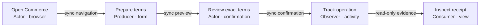
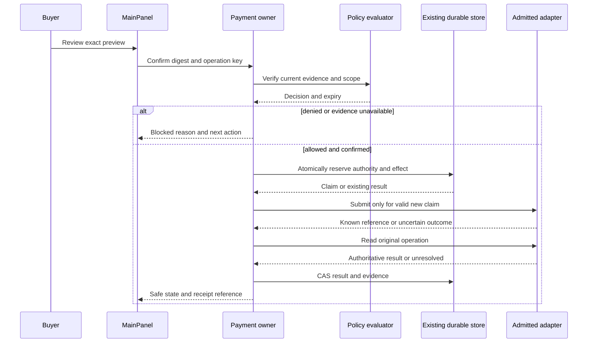
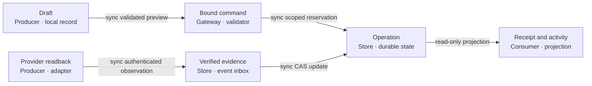
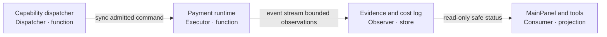
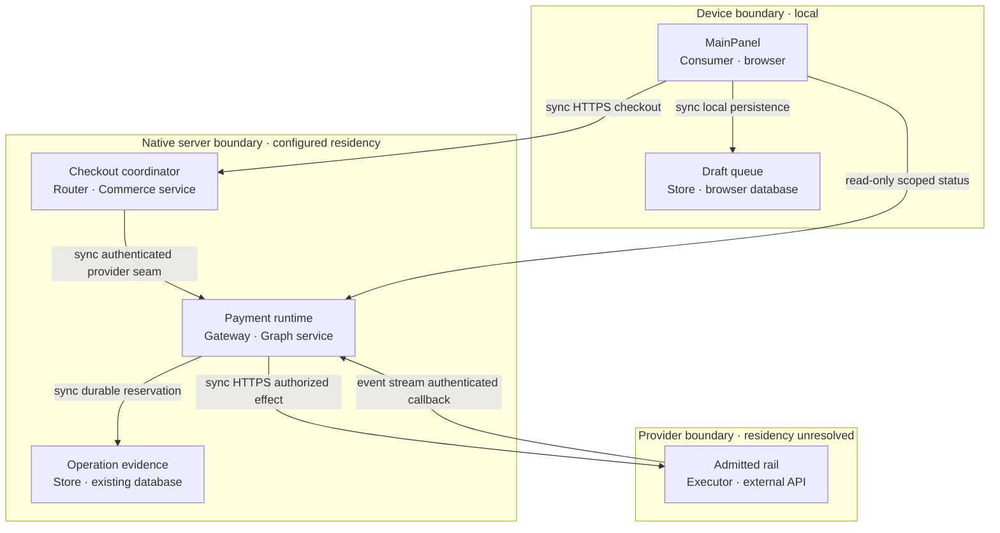

# Reference implementation — native transfer architecture and evidence

This companion consumes PRD NT-01–13, ADR A1–A7, MVP R0–R4 and GTM from the
[joined owner](prd-tad-adr-mvp-gtm-native-commerce-transfer.md) at
`NATIVE-COMMERCE-TRANSFER-001@0.2.0`. It owns TAD detail and observations, not another roadmap.
Concrete repository/provider names describe this reference implementation. Readiness remains unclaimed.
The [reuse companion](prd-tad-adr-mvp-gtm-native-commerce-shared-utils.md) owns U1–U7 source/export
observations and NT-10–13 compatibility/surface cases within T7. No additional runtime owner is created.

## Source evidence — reference implementation

Historical 0.1.0 baseline, inspected 2026-09-23 using clean local source trees. The reuse companion
records later canonical invocation sources and the separate unmerged MainPanel candidate. Pins are observations, not dependency upgrades:
Commerce `ee9805d9b159ff1d33cd083efb8602eb1ed68d48`; Graph `8f7c28578933bac4fc055dcda1965eac7d263a6c`;
OS `95977c83e6e3dc9945ede40d2618e52befc8f532`. Refresh affected joins on drift before implementation.
These rows select actual symbols and tests; they do not copy the shared grounding inventory.

| Evidence / source owner | Verified bounded source observation | Enhancement consequence / named check |
|---|---|---|
| S01 [CommerceHubView][panel], [MainPanel contract][panel-plan] | Renders shared readiness section/row values, publishes a local snapshot, then `SettingsView mode="payments"`; no transfer composer in this component | T1 extends this owner; preserve [MainPanel tests][panel-test] and `npm -C canvas run test:ci:unit -- ui.mainPanel.commerce` |
| S02 [buyer controller][controller], [queue][queue], [reconciler][reconciler] | Confirm enqueues; reconnect/retry uses same client key; queue rejects agent approval persistence; maximum 100 intents, five reconciliation attempts | T1/T3 reuse; `canvas/src/__tests__/paymentSurfaceRuntime.test.tsx`, `paymentIntentQueueRuntime.test.ts` |
| S03 [runtime contract][contract], [rail selector][rails] | Command allows UUID key, positive safe-integer amount, currency, fiat/xsgd, origin, approvalRef; unknown fields rejected; fingerprint lacks recipient/network/fee | Arbitrary-transfer fields cannot be sent to the current API; `grph-shared/__tests__/payment-runtime-contract.test.mjs`, `payment-rail-ssot.test.mjs` |
| S04 [adapters][adapters], [instruction adapter][instruction] | Adapter interface is create/read/refund; card runtime requires sandbox/test credentials; instruction adapter reads provider payment resources | Collection contracts are not general send/custody APIs; `payment-rail-adapters.test.ts` under payment Worker tests |
| S05 [service][service], [CAS][cas], [persistence][persistence], [ingress][ingress], [migration][migration], [routes][routes] | Revision CAS, bounded mutation retry, durable event claims, signature checks and provider readback exist; direct HTTP agent create/refund fail closed | Reuse effect owner; authenticated recipient/tenant scope must be designed before expansion; `payment-runtime-service.test.ts`, `payment-event-ingress.test.ts`, `payment-runtime-routes.test.ts` |
| S06 [CheckoutSession][checkout], [finalization][finalization] | Confirmation expiry/digests, provider submit/reconcile, settlement receipt and markup outbox are already native; finalization reports deferred secondary work | Extend identity binding; never charge again to repair markup; `test/domain/checkout-finalization.test.ts` |
| S07 [public sandbox][sandbox] | Requires sandbox config/session/CSRF, reads test-provider result; receipts explicitly carry `realMoney:false` and zero charge | Preserve mode boundary; `test/local-first/checkout.test.mjs`; current sandbox evidence at [handoff](prd-tad-adr-mvp-gtm-handoff.md) remains historical |
| S08 [RevenueLedger][revenue] | Unique settlement line with conflict rejection and bounded period reads; grouped registered-agent identifiers do not prove distinct customers | Revenue summary is not custody/general ledger; `test/workers/revenue-ledger-idempotence.property.test.ts` and demand verifier |
| S09 [Commerce MCP][commerce-mcp], [Graph tool contract][tools] | Native tool inventories, separate read/effect annotations and approval-gate contracts exist | Extend native schemas if admitted; no new tool registry; `test/shared/edge-mcp.test.ts`, Graph `mcp/__tests__/payment-tool-contract.test.mjs` |
| S10 [OS document ownership][owners] | Product behavior stays beside its implementation; shared authoring rules have one owner; source/release/deploy effects are distinct | This plan routes runtime work to owners and uses shared rules by reference; OS `npm run check`, Commerce authored-limit check |

## TAD component and contract inventory

All T1–T7 enhancement rungs are local `undocumented` / delivered `undocumented` until their VCCs run.
Existing source mechanisms retain their own evidence; presence of code grants no proposal readiness.

| Element / responsibility | Reuse → proposed delta / interface | Criteria |
|---|---|---|
| T1 UI projects operation state | S01–S02 → wire view sections to existing controller; add safe availability/activity projection, retain settings/anchors | NT-01,02,07,08 |
| T2 admission validates executable capability | S03–S05 + Commerce provider gate → explicit operation/mode/asset/network/recipient capability and policy decision reference | NT-02,03,06,09 |
| T3 intent binds exact user authorization | S02–S03,S06 → versioned transfer command, server-authenticated principal, canonical preview digest and durable single-use confirmation | NT-03,04,07,09 |
| T4 runtime controls the external effect | S04–S05 → admitted adapter operation, same-key replay, scoped durable claim and readback; no browser provider secrets | NT-04,05,09 |
| T5 receipts project verified outcome | S02,S05–S08 → immutable outcome reference, independent fulfillment/accounting status and recovery action | NT-05,07,09 |
| T6 policy evaluates evidence | S05 admission/auth primitives → new pure policy evaluator in Graph payment owner, persisted decision reference in existing store | NT-03,06,07,09 |
| T7 developer surfaces expose one contract | S01,S03,S09 + U1–U7 → existing shared exports, examples, errors, compatibility and surface conformance; reuse tools/readiness owners | NT-06,08,10–13 |

Build/release order: review shared contract extension → implement Graph runtime/store and tests →
admit Commerce adapter/confirmation join → project Graph MainPanel/browser/tool views → cross-owner
acceptance → separate deployment gates. No new cyclic package import; Commerce calls the existing
provider seam, Graph does not import Commerce UI. Schema compatibility precedes any consumer rollout.

### Current contract versus proposed transfer envelope

Current `PaymentIntentCommand` does **not** support recipient, chain, wallet signing, quote fees or
arbitrary token precision. Keep its existing collection wire shape backward compatible. R1 fixtures
are explicitly simulation-only. R3 needs a separately versioned discriminated operation schema in
the existing Graph contract owner, a migration, capability negotiation and producer/consumer tests.
Do not merely append unknown fields or treat `approvalRef` as authenticated proof.

| Proposed field group | Required semantics / owning boundary |
|---|---|
| Identity | schemaVersion, operationKind, operationId, principal/tenant binding, idempotencyKey; derive principal server-side, never trust a client actor ID |
| Value | asset identifier, network identifier, integer atomic amount encoded as decimal string, explicit decimals; reject floating point, unsafe conversion and ambiguous same-symbol assets |
| Beneficiary | verified recipient reference and validated destination appropriate to network; resolve reference under same tenant and include resolved destination digest in confirmation |
| Quote | quoteId/version, source, expiry, fee asset/atomic amount, debit total and recipient net amount; reject stale/unknown fees; no implied free gas or implicit exchange |
| Authority | confirmed preview digest, signed/verified principal session, operation scope, nonce, expiry and policyDecisionRef; consume effect authority durably once |
| Evidence | mode, source/deployment identity, adapter capability revision, provider correlation and safe reason; never store credentials, signing keys or identity documents here |

Use canonical encoding before hashing; include every financially meaningful field and mode in the
fingerprint. Scope uniqueness to authenticated tenant/principal + operation kind + idempotency key;
existing globally unique client UUID alone is not a complete multi-tenant authorization design.
Existing fiat safe-integer amounts stay unchanged; conversion from atomic strings must be checked
exactly and rejected if lossless conversion cannot be proven. No implicit asset/decimal conversion.

Preview is non-effectful. Confirm consumes the reviewed digest; policy/version, quote, beneficiary,
fee, network or mode changes invalidate it. Prepared fixtures cannot become live commands by flipping
a flag. A capability response describes allowed operations; it never supplies missing authorization.
Do not publish invented transfer endpoints/tools: R1 exposes none; R3 proposes schema/route registration
through the existing discovery and invocation owners after the provider contract exists.

### State and effect discipline

The existing payment states remain owned by S03. The following is a proposed transfer lifecycle,
not a declaration that current adapters implement it. UI labels may differ from persisted states.

| Phase | Enter only when / action | Failures and next allowed action |
|---|---|---|
| Draft / queued locally | User prepares nonsecret terms; no provider request | Offline review only; refresh policy/quote online before confirmation |
| Review required | Server resolves recipient, quote and policy preview | Changed/expired terms require new review; denial/unknown evidence blocks submission |
| Authorized / reserved | Exact digest confirmed; same-tenant authority consumed and durable effect claim reserved atomically | Another device receives existing operation; changed payload is conflict, not a new submit |
| Submitted / pending | Adapter accepts operation; provider ID or known idempotency reference recorded | A timeout after send becomes outcome unknown; read provider by original key/ID |
| Outcome unknown | External effect may have happened | No new key, alternate rail or new recipient; bounded readback, then operator case |
| Verified settled | Authenticated authoritative read matches principal binding, destination, amount, asset, network and required finality | Emit receipt; fulfillment/accounting can still be pending; no optimistic success from redirect/event alone |
| Failed / expired / cancelled | Proven no effect, or provider-supported cancellation confirmed | Display evidence; creating a genuinely new operation requires fresh review |
| Reversed / refunded | Separate authorized compensation has its own key and verified result | Link to original, retain both; a chain transfer is not assumed reversible |

Durable reservation must precede external submission. Existing CAS and provider idempotency are useful
primitives, not proof of exactly-once transfer across crashes. R3 admission requires either an
authoritative same-key provider lookup/idempotency guarantee or a refusal to automatically repeat an
ambiguous request. Do not claim distributed exactly-once delivery. Store first-result identity and
immutable events; stale workers cannot overwrite a terminal revision. Quotas/velocity use atomic
reserve/commit/release semantics, not a separate read-then-increment race.

Reconciliation reuses the existing five-attempt bound and schedule where appropriate; no unbounded
polling. Expired retry authority yields unresolved/manual review. Successful financial readback plus
failed receipt/markup delivery must repair projection/outbox only. Reorganization/finality loss is a
new incident/reversal observation, not deletion of the original evidence; R3 specifies each network's
finality rule before enablement. Direct payout reversal is unsupported unless the selected rail proves it.

### Programmatic policy and assurance

T6 is proposed native capability. Existing signature checks, CSRF, approval and provider admission
remain necessary but do not establish identity verification, sanctions screening or legal permission.
No jurisdiction, numerical legal threshold, provider certification or production compliance is assumed.

| Layer / input | Decision and evidence | Enforcement / missing-data behavior |
|---|---|---|
| Actor and authority | Authenticated principal, role, tenant, beneficiary ownership/control, exact approval scope | Server/execution owner rejects cross-tenant, spoofed or replayed authority |
| Product and jurisdiction | Reviewed policy version, geography basis, allowed action/asset/network and accountable reviewer | Deny unsupported; unknown is unavailable. Country/IP alone is insufficient policy proof |
| Identity and counterparty | Minimal external evidence references, verification scope/status, issuer, observedAt/expiresAt | Required missing/expired/revoked evidence blocks effect; fixture verdict clearly marked simulation |
| Screening and transaction limits | Source/dataset revision, freshness, coverage and reason codes; atomic reservations | A non-match is only the checked dataset result, not universal clearance; unavailable source stays unknown |
| Step-up and case review | Operation-bound challenge result or restricted case-decision receipt | No UI toggle/agent claim can satisfy it; changed terms require renewed evidence |
| Settlement and monitoring | Provider/chain readback, integrity/finality, anomaly case and audit linkage | No fulfillment on inconsistent evidence; preserve pending operation and escalate bounded recovery |

Decision record: decisionId, policyVersion/digest, authenticated subject reference, operationDigest,
evidence references + their source/freshness, decision (`allow`, `deny`, `challenge`, `review`, `unknown`),
reason codes, evaluatedAt, expiresAt and evaluator identity. These are proposed fields, not a new
universal schema. Persist through the existing payment store with a reviewed bounded migration.
Recheck at effect reservation; revoke stale policy decisions. Manual review may supply evidence but
cannot override missing execution authority, unsupported provider capability or zero-spend constraints.

Store no identity documents or seed material in the browser, graph documents, logs or receipts.
Keep sensitive case evidence behind access control; product UI receives safe reason and next action.
Retention, lawful processing basis, review roles and deletion/hold exceptions remain R3 prerequisites.
R1 stores synthetic evidence only, supports clearing local fixtures and makes no legal claim.

### Shared utility and invocation reuse

Consume the reuse companion's U1–U7 decisions and exact pins before changing T7. OS owns portable
invocation grammar/encoding and generic skill gates; Commerce owns checkout/admission; Graph owns
payment semantics and MainPanel. Preserve the source dependency DAG separately from runtime calls.
Use public package exports or the existing provider protocol; do not import another checkout's files.
Its surface matrix binds MCP/WebMCP, `/`, `@`, `#`, skills and commands to current owners without
inventing transfer routes. Its compatibility corpus and deletion/rollback plan govern R1a/R2.

### Developer and invocation contract

Use S09's exact tool inventories; `/mcp` and `/mcp/operator` remain distinct Commerce surfaces.
`commerce.checkout.prepare`, `commerce.settlement.get` and status/read tools retain existing semantics;
`commerce.checkout.confirm` cannot manufacture human presence. Graph's payment approval gate and
HTTP restrictions remain enforced. Optional WebMCP views reuse the native schemas and ordinary browser
controls; no availability claim is made for an unsupported browser API.

| Surface | Discover / use | Effect boundary and compatibility |
|---|---|---|
| Browser | Existing Commerce tab → reviewed operation → activity/receipt | Same policy/digest checks as headless caller; cached data is labelled stale |
| HTTP | S05 discovery and existing `PAYMENT_RUNTIME_ROUTE_PATHS` | No new transfer route in R1; explicit version/capability negotiation before R3 |
| MCP / WebMCP | Existing registered names, schema descriptions and annotations | Server enforces role/effect gates independently of annotation hints |
| `/`, `#`, `@` | Consume OS dictionaries and Commerce invocation resolver | No new tuple proposed; absent transfer binding returns unsupported, never guessed routing |
| Events and SDK examples | Redacted request/response, duplicate event, conflict and readback examples | Verify signatures, event identity and semantic dedupe; bound retries; no copied SDK, secret-bearing sample or new registry |

Developer onboarding target: discover → run local fixture → inspect safe errors → replay → read
receipt within 15 min (unmeasured). S03 owns field semantics, S05 owns effects, S09 owns tools, T1
projects them. Versioned conformance fixtures must catch unknown enum/field behavior and stale callers.
Only additive compatible fields may share a major version; changed money semantics require explicit
negotiation. Retire old versions only after usage evidence, notice and recovery support; no silent fallback.
Read/discovery/policy/receipt paths require zero model calls. An optional assistant can explain data
outside the effect path, but is excluded from MVP and cannot authorize or determine settlement.

## Five flow diagrams — reference implementation

Version 0.2.0; primary surface is the declared 2D graph for flowcharts; sequence is a secondary text
view and does not project. Solid arrows state intended calls/transitions, not implemented readiness.
Captions and inventory tables provide the accessible, mobile/offline reading alternative.

### D1 — journey stage map

Class: Journey stage map. Notation: Mermaid flowchart LR. Surface: 2D graph. Caption: the buyer
reviews one operation and can recover it without treating a pending state as successful payment.

| Nodes / inventory | Stage binding / criteria |
|---|---|
| discover, prepare / browser form | entry and preparation / NT-01,02,07 |
| review / confirmation | exact terms and policy / NT-03,06 |
| progress, receipt / activity views | resume and evidence / NT-04,05 |

### D2 — user workflow

Class: User workflow. Notation: Mermaid sequenceDiagram. Surface: secondary text. Caption: the
execution owner reserves the operation before any provider effect and resolves uncertain outcomes by reading.

| Participants / inventory | Happy / alternate / error path |
|---|---|
| Buyer, UI / T1,T3 | NT-03 reviewed digest; offline stops before effect |
| Runtime, Policy / T2,T4,T6 | NT-06 deny/challenge/unknown stops; no new key on timeout |
| Store, Adapter / T4,T5 | NT-04 replay returns same operation; NT-05 mismatch stays unresolved |

### D3 — data flow

Class: Data flow. Notation: Mermaid flowchart LR. Surface: 2D graph. Caption: authoritative
operation evidence drives receipts; local drafts and revenue summaries cannot establish settlement.

| Nodes / schema inventory | Privacy/lifecycle binding |
|---|---|
| draft, command / proposed transfer envelope | No credentials/identity documents; offline draft is not authorization |
| evidence, event, record / provider read + operation | Server-controlled provenance; immutable event links, tenant-scoped reads |
| view / safe projection | No sensitive policy payload; independent payment, fulfillment and accounting status |

### D4 — orchestration / harness flow

Class: Orchestration / harness flow. Notation: Mermaid flowchart LR. Surface: 2D graph.
Caption: deterministic dispatch executes one bounded operation while an observer records outcome and cost.

| Role / inventory | Input → output / bound / fallback |
|---|---|
| dispatcher / T2 | Schema + authority → admitted command; zero model tokens; unsupported blocks |
| executor / T4 | Reserved operation → observed result; existing CAS max 4 attempts, reconciliation max 5; exhausted → unresolved |
| observer / T5 | Correlation, elapsed time, result and modelCallCount=0 → evidence; cost-log gap remains visible |
| consumer / T1,T7 | Safe projection → next action; no authority escalation or retry loop |

### D5 — runtime topology

Class: Runtime topology. Notation: Mermaid flowchart TB. Surface: 2D graph.
Caption: the browser projects state, Commerce coordinates the order, and the payment owner controls effects.

| Nodes / inventory | Lane, residency and deployment boundary |
|---|---|
| ui, queue | Delivered browser; local-only R1 fixtures use no network or cloud state |
| commerce | Commerce delivery service; existing checkout owner, not custody |
| payment, store | Graph delivery/payment owner; region/tenant retention must be selected before R3 |
| provider | External effect domain; disabled for R1; separate capability/cost/policy authority |

## Quality, recovery and release

| Failure / threat | Required check and observable invariant / owner |
|---|---|
| Double click, two tabs/devices, restarted executor | One scoped operation/financial effect; conflicting terms rejected; T3/T4 concurrency and crash tests |
| Timeout before/after provider response | Read original key/ID, retain unknown outcome; never route to another rail or issue fresh key; T4 |
| Callback duplicate, stale lease, reordered event | Signature/freshness/semantic dedupe and CAS; terminal result not regressed; T4/S05 |
| Destination substitution, cross-tenant read/replay | Authenticated scope plus full preview digest; no leaked status/beneficiary; T2/T3 |
| Expired quote, policy revocation, missing evidence | No submit, fresh review required, safe reason; T2/T6 |
| Forged redirect, local storage edit, fixture in live mode | No authoritative paid state or fulfillment; simulator cannot access production adapters; T4/T5 |
| Asset precision, fees, wrong network or chain reorganization | Exact atomic arithmetic, asset/network binding and finality proof; no unsupported reversal; T3/T4 |
| Receipt/markup failure after payment | Payment result preserved; repair projection/outbox without another financial effect; T5 |
| Provider outage/quota/cost uncertainty | Bounded read attempts, explicit unavailable result, no paid fallback; operator |
| Mobile/offline/accessibility regression | 360/768/1280 px, zoom/keyboard/screen-reader status, network-off replay; T1 |

R1 performance targets: <500 KB per emitted lazy chunk and <600 lines per authored file; native
state transition p95 ≤250 ms in the fixture harness (unmeasured target, excludes provider latency).
Record device, source revision, sample count and elapsed measurements; do not generalize fixture timing
to edge/provider performance. Component time/byte caps are in the parent roadmap.

| Deploy boundary | Evidence / authority | State / recovery |
|---|---|---|
| Documentation lane → source release | Focused checks and exact protected review; this request authorizes authored docs | Review candidate only; reviewed revert for docs |
| Graph runtime → Commerce consumer | Compatible contract tests, dependency pin and existing integration gates; implementation not performed | closed; retain old contract support, disable only new action |
| Source → live delivery/provider | Exact release/deploy identity, cost/policy/operation authority and live acceptance | closed; restore approved source/config; keep unresolved operation reconciliation |
| Settlement → reversal | Separate authorized compensation and verified receipt | closed; never erase/rewrite settled history or promise transaction rollback |

## Validation and handoff evidence

Diagram register at 0.2.0 (counts confirmed by the existing parse-only projection check):

| Diagram | Class | Notation / surface | Projects | Nodes | Edges | Clusters |
|---|---|---|---|---|---|---|
| D1 | Journey stage map | flowchart LR / primary 2D | yes | 5 | 4 | 0 |
| D2 | User workflow | sequenceDiagram / secondary text | no | 0 | 0 | 0 |
| D3 | Data flow | flowchart LR / primary 2D | yes | 6 | 5 | 0 |
| D4 | Orchestration / harness flow | flowchart LR / primary 2D | yes | 4 | 3 | 0 |
| D5 | Runtime topology | flowchart TB / primary 2D | yes | 6 | 7 | 3 |

Historical authoring and baseline checks for 0.1.0, 2026-09-23 (not rerun evidence for 0.2.0):

| Check / evaluator | Result / subject / limit |
|---|---|
| OS `npm run check` | PASS: evaluators and 28 tests in four affected safety suites; OS source pin S10; no runtime change |
| Shared `npm run guideline:check` | PASS on unified guideline candidate `688cdd26602239601570a52c0d7133a6925e2183`: commerce contracts, file budgets, ADLC metadata, PRD policy and diagram checks |
| Shared YAML parser + exact-source/digest/link audit | PASS: two joined documents, all five role revisions, 23 native source targets and five local links; guideline/template digests match |
| `node [guideline-owner]/scripts/check-diagram-canvas-render.mjs docs/prd-tad-adr-mvp-gtm-native-commerce-transfer-architecture.md` | PASS: five diagrams, 21 projected nodes / 19 edges / three clusters; parse-only, not visual runtime proof |
| Commerce `npm run check:authored-limits` and `npm run check:terminology` | PASS: 443 authored files and 444 terminology files at this documentation candidate; no new dependency or runtime module |
| `node --test test/domain/checkout-finalization.test.ts test/domain/demand-evidence-verifier.test.mjs` | PASS: 11 existing tests; supports S06/S08 baseline invariants only, not new transfer behavior |
| Scoped diff / reference restriction review | Documentation only; no prohibited reference identifiers, source/assets, package or service dependency introduced |

The repository's affected runner selects three of eleven owner groups for this doc change: ADLC,
evidence-contract and named checks. The first uncommitted run passed the first two groups but stopped
in the existing local-first build test with `listing_source_must_be_exact_and_clean` (108/109 tests
passed). That is a clean-source prerequisite; commit the reviewed docs before rerunning. The final
committed-source result belongs to the PR/check receipt, not a prediction in this document.
At that historical handoff new behavior was unimplemented. The reuse companion now records the
unmerged R1 candidate and current invocation checks; full financial/fault/policy VCCs and utility
replacement remain unproved. Historical baseline tests do not promote the proposal's readiness.
Paid/provider effects and deployment checks are excluded; external evidence is not synthesized.
Authored addition is below 150 KB across 16 files; all changed files remain under 600 lines. Actual
model tokens, total research bytes, billable tool cost and end-to-end authoring elapsed time are
unmeasured; no paid resource/provider operation was enabled. New always-load bytes and runtime modules: 0.

Known blockers: full Must acceptance and utility migration are unproved; customer pain/TTV unvalidated; R3 provider,
identity/jurisdiction/retention/cost authority absent. Existing sandbox handoff is not transfer proof.
Recheck on an implementation candidate or supplied prerequisite evidence, not an idle polling loop.
No implementation, deployment, funds, external messages or cleanup effects were performed by R0.

[panel]: https://github.com/huijoohwee/agentic-graph/blob/8f7c28578933bac4fc055dcda1965eac7d263a6c/canvas/src/features/panels/views/CommerceHubView.tsx
[panel-plan]: https://github.com/huijoohwee/agentic-graph/blob/8f7c28578933bac4fc055dcda1965eac7d263a6c/docs/documents/agentic-graph-mainpanel-commerce-prd-tad-adr-mvp-gtm.md
[panel-test]: https://github.com/huijoohwee/agentic-graph/blob/8f7c28578933bac4fc055dcda1965eac7d263a6c/canvas/src/__tests__/mainPanelCommerce.test.tsx
[controller]: https://github.com/huijoohwee/agentic-graph/blob/8f7c28578933bac4fc055dcda1965eac7d263a6c/canvas/src/features/payments/paymentSurfaceController.ts
[queue]: https://github.com/huijoohwee/agentic-graph/blob/8f7c28578933bac4fc055dcda1965eac7d263a6c/canvas/src/features/payments/paymentIntentQueue.ts
[reconciler]: https://github.com/huijoohwee/agentic-graph/blob/8f7c28578933bac4fc055dcda1965eac7d263a6c/canvas/src/features/payments/paymentReconciler.ts
[contract]: https://github.com/huijoohwee/agentic-graph/blob/8f7c28578933bac4fc055dcda1965eac7d263a6c/grph-shared/src/payments/paymentRuntimeContract.ts
[rails]: https://github.com/huijoohwee/agentic-graph/blob/8f7c28578933bac4fc055dcda1965eac7d263a6c/grph-shared/src/payments/paymentRailSsot.ts
[adapters]: https://github.com/huijoohwee/agentic-graph/blob/8f7c28578933bac4fc055dcda1965eac7d263a6c/cloudflare/workers/agentic-graph-payment/paymentRailAdapters.ts
[instruction]: https://github.com/huijoohwee/agentic-graph/blob/8f7c28578933bac4fc055dcda1965eac7d263a6c/cloudflare/workers/agentic-graph-payment/straitsxPaymentRailAdapter.ts
[service]: https://github.com/huijoohwee/agentic-graph/blob/8f7c28578933bac4fc055dcda1965eac7d263a6c/cloudflare/workers/agentic-graph-payment/paymentRuntimeService.ts
[cas]: https://github.com/huijoohwee/agentic-graph/blob/8f7c28578933bac4fc055dcda1965eac7d263a6c/cloudflare/workers/agentic-graph-payment/paymentIntentConcurrency.ts
[persistence]: https://github.com/huijoohwee/agentic-graph/blob/8f7c28578933bac4fc055dcda1965eac7d263a6c/cloudflare/workers/agentic-graph-payment/paymentRuntimePersistence.ts
[ingress]: https://github.com/huijoohwee/agentic-graph/blob/8f7c28578933bac4fc055dcda1965eac7d263a6c/cloudflare/workers/agentic-graph-payment/paymentEventIngress.ts
[migration]: https://github.com/huijoohwee/agentic-graph/blob/8f7c28578933bac4fc055dcda1965eac7d263a6c/cloudflare/d1/migrations/0009_agentic-graph_payment_runtime.sql
[routes]: https://github.com/huijoohwee/agentic-graph/blob/8f7c28578933bac4fc055dcda1965eac7d263a6c/cloudflare/workers/agentic-graph-payment/paymentRuntimeRoutes.ts
[checkout]: https://github.com/huijoohwee/agentic-commerce-os/blob/ee9805d9b159ff1d33cd083efb8602eb1ed68d48/src/core/checkout-session.ts
[finalization]: https://github.com/huijoohwee/agentic-commerce-os/blob/ee9805d9b159ff1d33cd083efb8602eb1ed68d48/src/core/checkout-finalization.ts
[sandbox]: https://github.com/huijoohwee/agentic-commerce-os/blob/ee9805d9b159ff1d33cd083efb8602eb1ed68d48/src/local-first/checkout.ts
[revenue]: https://github.com/huijoohwee/agentic-commerce-os/blob/ee9805d9b159ff1d33cd083efb8602eb1ed68d48/src/core/revenue-ledger.ts
[commerce-mcp]: https://github.com/huijoohwee/agentic-commerce-os/blob/ee9805d9b159ff1d33cd083efb8602eb1ed68d48/src/edge/mcp.ts
[tools]: https://github.com/huijoohwee/agentic-graph/blob/8f7c28578933bac4fc055dcda1965eac7d263a6c/mcp/payment-tool-contract.js
[owners]: https://github.com/huijoohwee/agentic-os/blob/95977c83e6e3dc9945ede40d2618e52befc8f532/DOCUMENTS.md
